# Dubbo 协议（TCP）深入源码分析

## 一、模块定位与整体架构

Dubbo 协议（又称 Dubbo2 协议）是 Dubbo 框架的原生 TCP 协议，基于长连接 + NIO + 自定义二进制协议头实现。核心实现位于两个模块：

| 模块 | 职责 |
|------|------|
| `dubbo-rpc/dubbo-rpc-dubbo` | 协议层：`DubboProtocol`、`DubboInvoker`、`DubboCodec`、编解码 |
| `dubbo-remoting/dubbo-remoting-api` | 传输层：`ExchangeCodec`、`HeaderExchangeHandler`、`DefaultFuture`、心跳 |

### 核心类关系

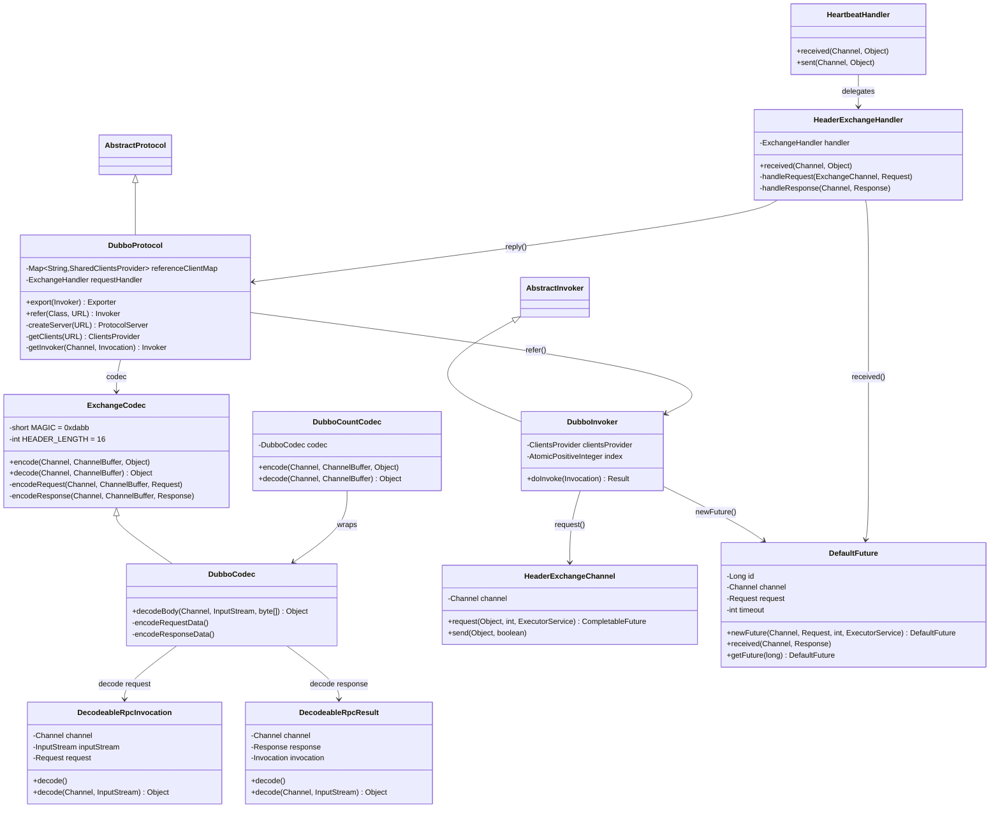

### 整体架构分层

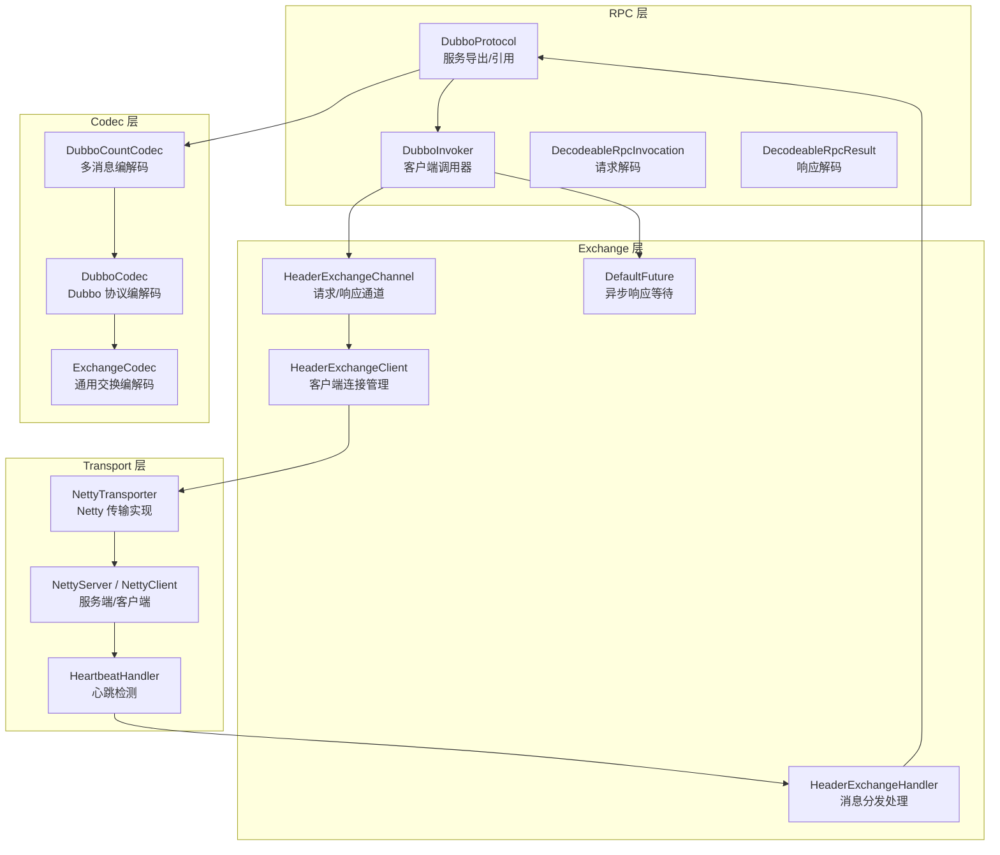

---

## 二、Dubbo 协议帧格式

### 2.1 协议头结构（16 字节）

Dubbo 协议采用定长 16 字节 Header + 变长 Body 的帧格式：

```
 0                   1                   2                   3
 0 1 2 3 4 5 6 7 8 9 0 1 2 3 4 5 6 7 8 9 0 1 2 3 4 5 6 7 8 9 0 1
+-+-+-+-+-+-+-+-+-+-+-+-+-+-+-+-+-+-+-+-+-+-+-+-+-+-+-+-+-+-+-+-+
|       Magic Number (0xdabb)    |  Flag  |  Status  | RequestID |
|       (2 bytes)                | (1 B)  |  (1 B)   |  (8 B)    |
|                               |        |          |           |
+-+-+-+-+-+-+-+-+-+-+-+-+-+-+-+-+-+-+-+-+-+-+-+-+-+-+-+-+-+-+-+-+
|                        Data Length (4 bytes)                   |
+-+-+-+-+-+-+-+-+-+-+-+-+-+-+-+-+-+-+-+-+-+-+-+-+-+-+-+-+-+-+-+-+
|                                                               |
|                    Body (variable length)                      |
|                                                               |
+-+-+-+-+-+-+-+-+-+-+-+-+-+-+-+-+-+-+-+-+-+-+-+-+-+-+-+-+-+-+-+-+
```

**字段详解：**

| 偏移 | 长度 | 字段 | 说明 |
|------|------|------|------|
| 0 | 2 bytes | Magic Number | 魔数 `0xdabb`，用于协议识别 |
| 2 | 1 byte | Flag | 标志位：bit7=请求/响应, bit6=双向/单向, bit5=事件, bit0-4=序列化ID |
| 3 | 1 byte | Status | 响应状态码（仅响应有效） |
| 4 | 8 bytes | Request ID | 请求唯一ID，用于请求-响应匹配 |
| 12 | 4 bytes | Data Length | Body 长度（字节） |
| 16 | variable | Body | 序列化后的消息体 |

### 2.2 Flag 标志位

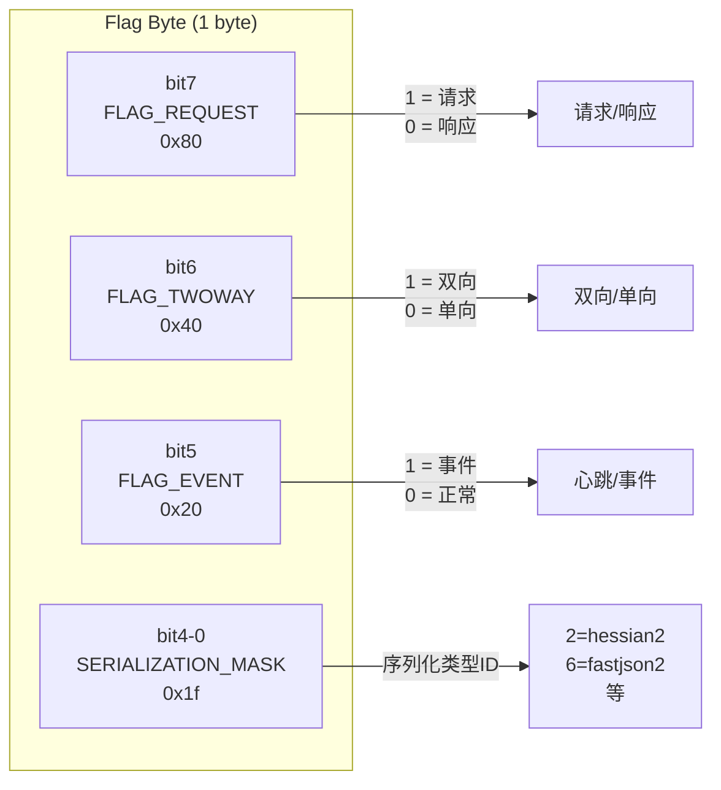

源码定义在 [`ExchangeCodec`](file:///d:/workspace/java_projects/source_projects/dubbo/dubbo-remoting/dubbo-remoting-api/src/main/java/org/apache/dubbo/remoting/exchange/codec/ExchangeCodec.java)：

```java
protected static final short MAGIC = (short) 0xdabb;
protected static final int HEADER_LENGTH = 16;
protected static final byte FLAG_REQUEST = (byte) 0x80;   // 请求标记
protected static final byte FLAG_TWOWAY = (byte) 0x40;    // 双向标记
protected static final byte FLAG_EVENT = (byte) 0x20;     // 事件标记（心跳等）
protected static final int SERIALIZATION_MASK = 0x1f;     // 序列化掩码
```

### 2.3 协议帧编码流程

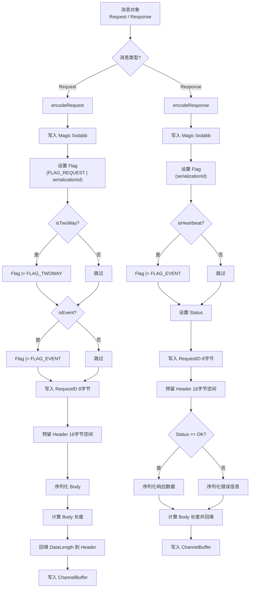

---

## 三、编解码实现详解

### 3.1 编解码器层次结构

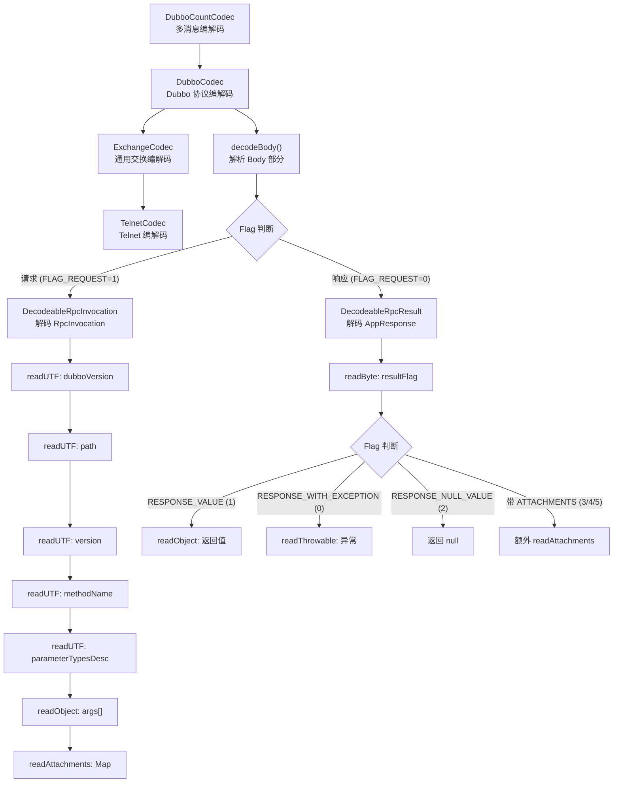

### 3.2 DubboCountCodec — 多消息编解码

[`DubboCountCodec`](file:///d:/workspace/java_projects/source_projects/dubbo/dubbo-rpc/dubbo-rpc-dubbo/src/main/java/org/apache/dubbo/rpc/protocol/dubbo/DubboCountCodec.java) 是对 `DubboCodec` 的包装，支持在一次 TCP 读取中解析多条消息（TCP 粘包场景）：

```java
public Object decode(Channel channel, ChannelBuffer buffer) throws IOException {
    int save = buffer.readerIndex();
    MultiMessage result = MultiMessage.create();
    do {
        Object obj = codec.decode(channel, buffer);
        if (Codec2.DecodeResult.NEED_MORE_INPUT == obj) {
            buffer.readerIndex(save);
            break;
        } else {
            result.addMessage(obj);
            save = buffer.readerIndex();
        }
    } while (true);
    if (result.isEmpty()) return Codec2.DecodeResult.NEED_MORE_INPUT;
    if (result.size() == 1) return result.get(0);
    return result;
}
```

### 3.3 ExchangeCodec.decode() — 协议头解析

[`ExchangeCodec.decode()`](file:///d:/workspace/java_projects/source_projects/dubbo/dubbo-remoting/dubbo-remoting-api/src/main/java/org/apache/dubbo/remoting/exchange/codec/ExchangeCodec.java) 核心流程：

1. **魔数校验**：检查前 2 字节是否为 `0xdabb`，不是则降级到 Telnet 协议
2. **长度检查**：可读字节 < 16，返回 `NEED_MORE_INPUT`
3. **读取 DataLength**：从 offset 12 读取 4 字节大端 int
4. **完整帧检查**：可读字节 < 16 + DataLength，返回 `NEED_MORE_INPUT`
5. **调用 decodeBody()** 解析 Body

### 3.4 DubboCodec.decodeBody() — Body 解析

[`DubboCodec.decodeBody()`](file:///d:/workspace/java_projects/source_projects/dubbo/dubbo-rpc/dubbo-rpc-dubbo/src/main/java/org/apache/dubbo/rpc/protocol/dubbo/DubboCodec.java) 根据 Flag 区分请求/响应：

**请求解码**：创建 `DecodeableRpcInvocation`，支持**延迟解码**（可在 IO 线程或业务线程解码）

**响应解码**：创建 `DecodeableRpcResult`，通过 `getRequestData()` 从 `DefaultFuture` 获取原始请求的 `Invocation` 对象，用于确定返回值类型。

### 3.5 响应结果标志位

[`DecodeableRpcResult`](file:///d:/workspace/java_projects/source_projects/dubbo/dubbo-rpc/dubbo-rpc-dubbo/src/main/java/org/apache/dubbo/rpc/protocol/dubbo/DecodeableRpcResult.java) 解码响应 Body 时，第一个字节是结果类型标志：

| Flag | 常量 | 含义 |
|------|------|------|
| 0 | `RESPONSE_WITH_EXCEPTION` | 异常响应 |
| 1 | `RESPONSE_VALUE` | 正常返回值 |
| 2 | `RESPONSE_NULL_VALUE` | 返回 null |
| 3 | `RESPONSE_WITH_EXCEPTION_WITH_ATTACHMENTS` | 异常 + 附件 |
| 4 | `RESPONSE_VALUE_WITH_ATTACHMENTS` | 返回值 + 附件 |
| 5 | `RESPONSE_NULL_VALUE_WITH_ATTACHMENTS` | null + 附件 |

---

## 四、客户端调用流程

### 4.1 完整调用时序图

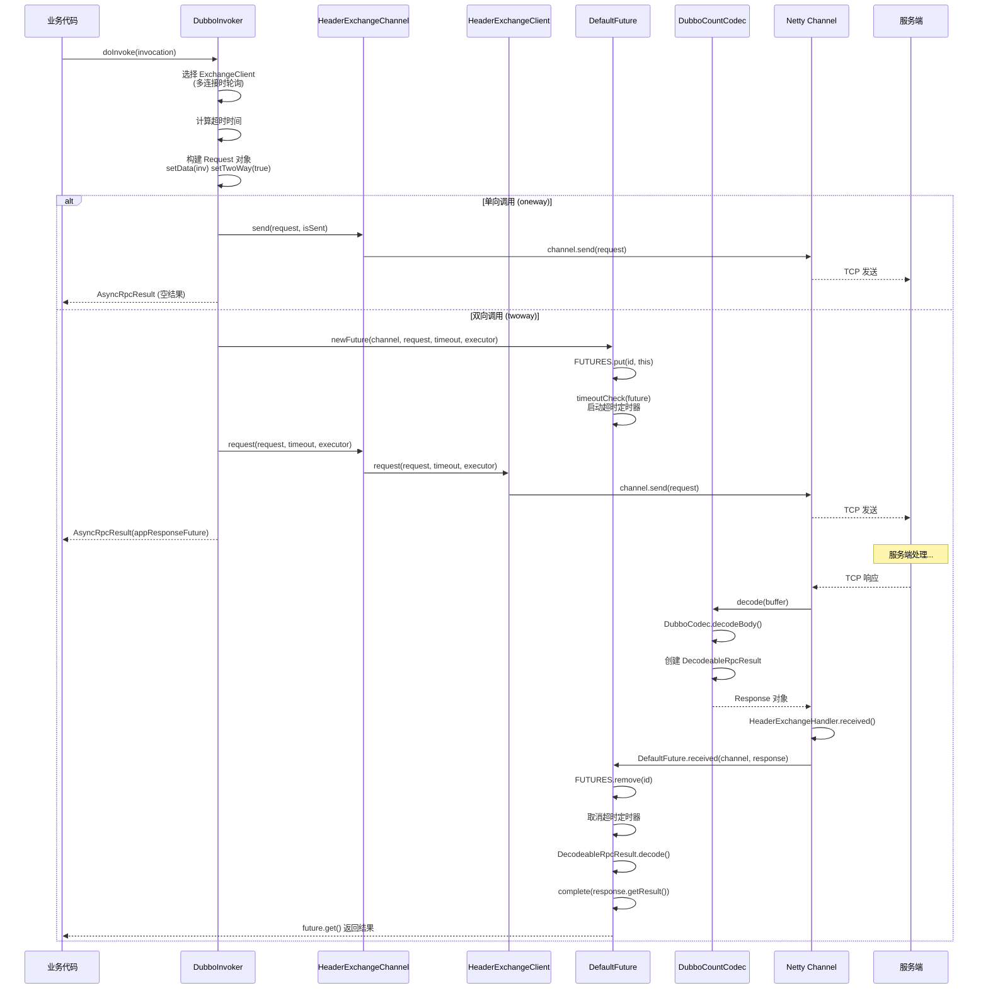

### 4.2 DubboInvoker.doInvoke() 详解

[`DubboInvoker.doInvoke()`](file:///d:/workspace/java_projects/source_projects/dubbo/dubbo-rpc/dubbo-rpc-dubbo/src/main/java/org/apache/dubbo/rpc/protocol/dubbo/DubboInvoker.java) 是客户端调用核心：

```java
protected Result doInvoke(final Invocation invocation) throws Throwable {
    RpcInvocation inv = (RpcInvocation) invocation;
    inv.setAttachment(PATH_KEY, getUrl().getPath());
    inv.setAttachment(VERSION_KEY, version);

    // 1. 选择连接（多连接时轮询）
    ExchangeClient currentClient;
    List<? extends ExchangeClient> exchangeClients = clientsProvider.getClients();
    if (exchangeClients.size() == 1) {
        currentClient = exchangeClients.get(0);
    } else {
        currentClient = exchangeClients.get(index.getAndIncrement() % exchangeClients.size());
    }

    // 2. 构建 Request
    Request request = new Request();
    request.setData(inv);
    request.setVersion(Version.getProtocolVersion());

    if (isOneway) {
        // 3a. 单向调用：发送即返回
        request.setTwoWay(false);
        currentClient.send(request, isSent);
        return AsyncRpcResult.newDefaultAsyncResult(invocation);
    } else {
        // 3b. 双向调用：发送并等待响应
        request.setTwoWay(true);
        ExecutorService executor = getCallbackExecutor(getUrl(), inv);
        CompletableFuture<AppResponse> appResponseFuture =
                currentClient.request(request, timeout, executor)
                        .thenApply(AppResponse.class::cast);
        AsyncRpcResult result = new AsyncRpcResult(appResponseFuture, inv);
        result.setExecutor(executor);
        return result;
    }
}
```

### 4.3 连接管理

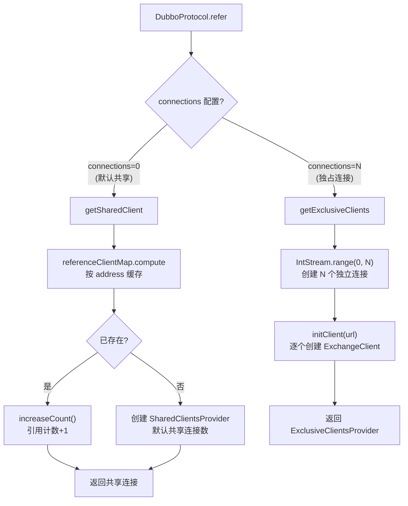

### 4.4 DefaultFuture — 异步响应等待

[`DefaultFuture`](file:///d:/workspace/java_projects/source_projects/dubbo/dubbo-remoting/dubbo-remoting-api/src/main/java/org/apache/dubbo/remoting/exchange/support/DefaultFuture.java) 是 Dubbo 协议异步响应的核心机制：

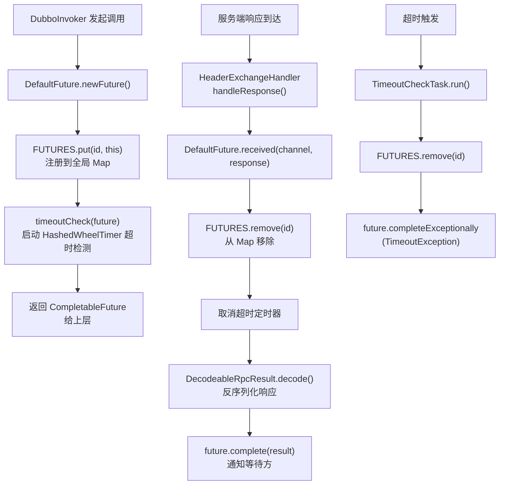

核心源码：

```java
// 发送请求时创建 Future
public static DefaultFuture newFuture(Channel channel, Request request, int timeout, ExecutorService executor) {
    final DefaultFuture future = new DefaultFuture(channel, request, timeout);
    future.setExecutor(executor);
    timeoutCheck(future);  // 启动超时检测
    return future;
}

// 收到响应时通知 Future
public static void received(Channel channel, Response response) {
    DefaultFuture future = FUTURES.remove(response.getId());
    if (future != null) {
        future.doReceived(response);
    }
}

private void doReceived(Response res) {
    if (timeoutCheckTask != null) {
        timeoutCheckTask.cancel();  // 取消超时检测
    }
    // 在业务线程池中解码并完成 Future
    executor.execute(() -> {
        // 解码响应
        decodeResponse(res);
        // 完成 CompletableFuture
        complete(res.getResult());
    });
}
```

---

## 五、服务端处理流程

### 5.1 服务端启动

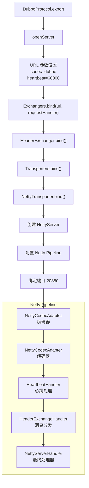

### 5.2 服务端请求处理

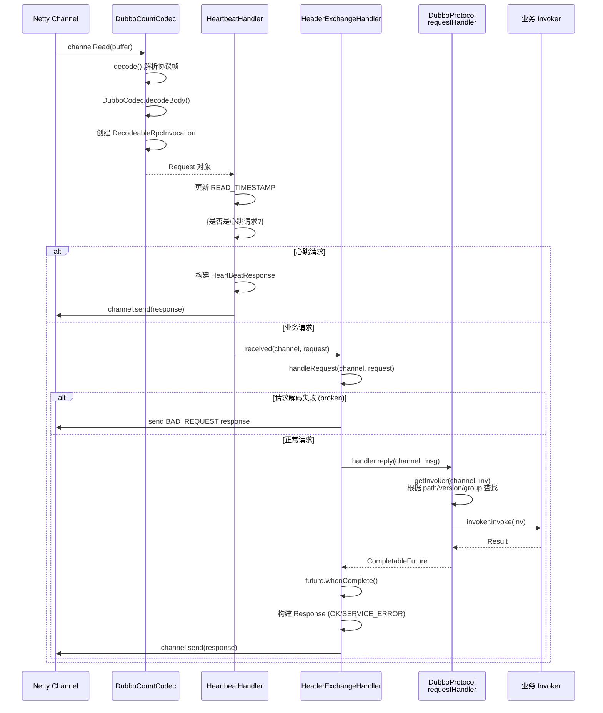

### 5.3 DubboProtocol.requestHandler — 核心请求处理器

[`DubboProtocol`](file:///d:/workspace/java_projects/source_projects/dubbo/dubbo-rpc/dubbo-rpc-dubbo/src/main/java/org/apache/dubbo/rpc/protocol/dubbo/DubboProtocol.java) 内部定义了 `ExchangeHandlerAdapter`：

```java
requestHandler = new ExchangeHandlerAdapter(frameworkModel) {
    @Override
    public CompletableFuture<Object> reply(ExchangeChannel channel, Object message) {
        Invocation inv = (Invocation) message;
        // 1. 根据 channel + invocation 查找 Invoker
        Invoker<?> invoker = inv.getInvoker() == null 
            ? getInvoker(channel, inv) 
            : inv.getInvoker();
        
        // 2. 设置 TCCL
        Thread.currentThread().setContextClassLoader(
            invoker.getUrl().getServiceModel().getClassLoader());
        
        // 3. 设置远程地址
        RpcContext.getServiceContext().setRemoteAddress(channel.getRemoteAddress());
        
        // 4. 调用业务 Invoker
        Result result = invoker.invoke(inv);
        return result.thenApply(Function.identity());
    }
};
```

### 5.4 Invoker 查找逻辑

[`DubboProtocol.getInvoker()`](file:///d:/workspace/java_projects/source_projects/dubbo/dubbo-rpc/dubbo-rpc-dubbo/src/main/java/org/apache/dubbo/rpc/protocol/dubbo/DubboProtocol.java#L290-L320) 通过 `serviceKey` 从 `exporterMap` 中查找：

```java
Invoker<?> getInvoker(Channel channel, Invocation inv) throws RemotingException {
    int port = channel.getLocalAddress().getPort();
    String path = (String) inv.getObjectAttachmentWithoutConvert(PATH_KEY);
    
    // 回调服务特殊处理
    boolean isCallBackServiceInvoke = isClientSide(channel) && !isStubServiceInvoke;
    if (isCallBackServiceInvoke) {
        path += "." + inv.getObjectAttachmentWithoutConvert(CALLBACK_SERVICE_KEY);
    }
    
    // 构建 serviceKey: {group}/{path}:{version}:{port}
    String serviceKey = serviceKey(port, path, 
        (String) inv.getObjectAttachmentWithoutConvert(VERSION_KEY),
        (String) inv.getObjectAttachmentWithoutConvert(GROUP_KEY));
    
    DubboExporter<?> exporter = (DubboExporter<?>) exporterMap.get(serviceKey);
    if (exporter == null) {
        throw new RemotingException("Not found exported service: " + serviceKey);
    }
    return exporter.getInvoker();
}
```

---

## 六、心跳机制

### 6.1 心跳流程

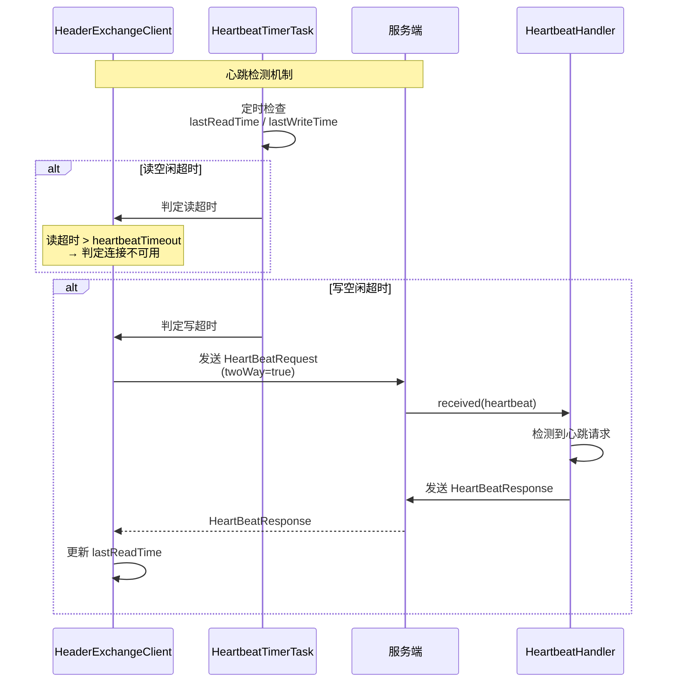

### 6.2 HeartbeatHandler 实现

[`HeartbeatHandler`](file:///d:/workspace/java_projects/source_projects/dubbo/dubbo-remoting/dubbo-remoting-api/src/main/java/org/apache/dubbo/remoting/exchange/support/header/HeartbeatHandler.java) 拦截所有消息：

```java
public void received(Channel channel, Object message) throws RemotingException {
    setReadTimestamp(channel);  // 更新读时间戳
    
    if (isHeartbeatRequest(message)) {
        HeartBeatRequest req = (HeartBeatRequest) message;
        if (req.isTwoWay()) {
            // 双向心跳：回复 HeartBeatResponse
            HeartBeatResponse res = new HeartBeatResponse(req.getId(), req.getVersion());
            res.setEvent(HEARTBEAT_EVENT);
            channel.send(res);
        }
        return;  // 心跳不向下传递
    }
    if (isHeartbeatResponse(message)) {
        return;  // 心跳响应不向下传递
    }
    handler.received(channel, message);  // 业务消息向下传递
}

public void sent(Channel channel, Object message) throws RemotingException {
    setWriteTimestamp(channel);  // 更新写时间戳
    handler.sent(channel, message);
}
```

### 6.3 心跳定时任务

`HeaderExchangeClient` 启动两个定时任务：

- **HeartbeatTimerTask**：检测写空闲，发送心跳请求
- **ReconnectTimerTask**：检测读空闲，触发重连

---

## 七、完整通信流程总结

### 7.1 端到端数据流

```mermaid
flowchart LR
    subgraph "客户端"
        A[业务调用] --> B[DubboInvoker]
        B --> C[构建 Request<br/>setData + setTwoWay]
        C --> D[HeaderExchangeChannel.request]
        D --> E[DefaultFuture.newFuture<br/>注册 + 超时检测]
        E --> F[Netty 发送]
    end
    
    subgraph "网络"
        F -->|TCP| G
    end
    
    subgraph "服务端"
        G[Netty 接收] --> H[DubboCountCodec.decode]
        H --> I[ExchangeCodec.decode<br/>魔数校验 + 帧解析]
        I --> J[DubboCodec.decodeBody<br/>Flag 判断]
        J --> K[DecodeableRpcInvocation<br/>反序列化参数]
        K --> L[HeartbeatHandler<br/>心跳过滤]
        L --> M[HeaderExchangeHandler<br/>handleRequest]
        M --> N[DubboProtocol.requestHandler<br/>查找 Invoker]
        N --> O[业务 Invoker.invoke]
        O --> P[构建 Response]
        P --> Q[ExchangeCodec.encodeResponse]
        Q --> R[Netty 发送]
    end
    
    subgraph "网络"
        R -->|TCP| S
    end
    
    subgraph "客户端"
        S[Netty 接收] --> T[DubboCountCodec.decode]
        T --> U[DubboCodec.decodeBody<br/>Flag 判断]
        U --> V[DecodeableRpcResult<br/>反序列化结果]
        V --> W[HeaderExchangeHandler<br/>handleResponse]
        W --> X[DefaultFuture.received<br/>匹配 Request ID]
        X --> Y[future.complete<br/>通知调用方]
        Y --> Z[业务获取结果]
    end
```

### 7.2 关键设计特点总结

| 特性 | 实现方式 |
|------|----------|
| **传输协议** | TCP 长连接 + Netty NIO |
| **协议格式** | 16 字节定长 Header + 变长 Body |
| **魔数** | `0xdabb`，用于协议识别 |
| **请求-响应匹配** | 8 字节 Request ID（AtomicLong 自增） |
| **异步响应** | `DefaultFuture`（CompletableFuture + HashedWheelTimer 超时） |
| **序列化** | Flag 低 5 位标识序列化类型（hessian2=2, fastjson2=6 等） |
| **心跳** | `HeartbeatHandler` + `HeartbeatTimerTask`，读写时间戳检测 |
| **连接管理** | 共享连接（引用计数）+ 独占连接两种模式 |
| **多消息解码** | `DubboCountCodec` 支持 TCP 粘包场景 |
| **延迟解码** | `DecodeableRpcInvocation`/`DecodeableRpcResult` 支持 IO 线程或业务线程解码 |
| **调用模式** | 双向（twoway）+ 单向（oneway） |
| **默认端口** | 20880 |

### 7.3 与 Triple 协议对比

| 维度 | Dubbo 协议 | Triple 协议 |
|------|-----------|-------------|
| 传输层 | TCP 长连接 | HTTP/2 |
| 协议格式 | 自定义二进制 16B Header | gRPC 兼容帧格式 |
| 多路复用 | 单连接串行（Request ID 匹配） | HTTP/2 Stream 原生多路复用 |
| 流式调用 | 不支持 | 支持（4 种模式） |
| 序列化 | hessian2/fastjson2 等 | Protobuf + Dubbo 序列化 |
| 跨语言 | 仅 Java | 支持（兼容 gRPC） |
| 端口 | 20880 | 50051 |
| 心跳 | 自定义双向心跳 | HTTP/2 PING 帧 |

---

## 八、核心源码文件索引

| 文件 | 职责 |
|------|------|
| `DubboProtocol.java` | 协议入口，服务导出/引用，连接管理，请求处理 |
| `DubboInvoker.java` | 客户端调用器，发起 RPC 调用 |
| `DubboCodec.java` | Dubbo 协议编解码，Body 解析 |
| `DubboCountCodec.java` | 多消息编解码包装器 |
| `DecodeableRpcInvocation.java` | 请求反序列化（延迟解码） |
| `DecodeableRpcResult.java` | 响应反序列化（延迟解码） |
| `ExchangeCodec.java` | 通用交换编解码，协议头解析 |
| `HeaderExchangeHandler.java` | 消息分发处理（请求/响应/事件） |
| `HeaderExchangeChannel.java` | Exchange 通道，request/send 封装 |
| `HeaderExchangeClient.java` | 客户端连接管理，心跳/重连定时器 |
| `DefaultFuture.java` | 异步响应等待，超时检测 |
| `HeartbeatHandler.java` | 心跳检测与处理 |
| `Request.java` | 请求模型（ID、版本、双向标记） |
| `Response.java` | 响应模型（状态码、结果、错误信息） |
| `DubboWireProtocol.java` | 端口统一复用时的 Dubbo 协议配置 |
| `DubboDetector.java` | Dubbo 协议检测器 |
| `ReferenceCountExchangeClient.java` | 引用计数连接客户端 |
| `SharedClientsProvider.java` | 共享连接提供者 |
| `CallbackServiceCodec.java` | 回调服务编解码 |
