# Dubbo 底层原理深度源码分析

> 本文档基于 Dubbo 3.3 源码（apache/dubbo 3.3 分支），系统性地剖析 Dubbo 框架的底层实现原理，覆盖整体架构、SPI 机制、Remoting 通信层、协议层、序列化、注册中心、服务导出与引用、集群容错与负载均衡等核心子系统。所有流程图、时序图、架构图均以 mermaid 呈现。
>
> 已有的专题文档（独立成文）：
> - `Dubbo协议源码分析.md`：Dubbo TCP 协议（dubbo-rpc-dubbo）的协议头、编解码、调用时序、心跳机制
> - `Triple协议源码分析.md`：Triple/HTTP2 协议（dubbo-rpc-triple）的 gRPC 帧、流式调用、Pipeline 配置
> - `Dubbo时间轮实现原理分析.md`：HashedWheelTimer 实现
> - `Dubbo消费方订阅Nacos实例源码分析.md`：Nacos 订阅实例细节
>
> 本文档重点分析上述文档未覆盖的架构层、通信层、集群层、注册中心层、序列化层及端到端调用流程。

---

## 目录

- [一、整体分层架构](#一整体分层架构)
- [二、核心抽象模型](#二核心抽象模型)
- [三、SPI 扩展机制源码深入](#三spi-扩展机制源码深入)
- [四、Filter 链机制](#四filter-链机制)
- [五、Remoting 底层通信层](#五remoting-底层通信层)
- [六、序列化机制](#六序列化机制)
- [七、注册中心机制](#七注册中心机制)
- [八、服务导出与引用流程](#八服务导出与引用流程)
- [九、集群容错与负载均衡](#九集群容错与负载均衡)
- [十、Injvm 协议与协议对比](#十injvm-协议与协议对比)
- [十一、端到端调用全链路](#十一端到端调用全链路)
- [十二、核心源码文件索引](#十二核心源码文件索引)

---

## 一、整体分层架构

Dubbo 采用经典的分层架构设计，各模块职责清晰、依赖方向明确，实现高内聚低耦合。从上至下分为：配置层、RPC 抽象层、通信抽象层、集群治理层、注册中心层、序列化层，每层都有对应的 SPI 抽象与具体实现。

### 1.1 各层职责详解

| 模块 | 职责 |
|------|------|
| `dubbo-common` | 基础模型层：URL 配置载体、ExtensionLoader 扩展加载器、Bean 工具类、ScopeModel 作用域模型 |
| `dubbo-rpc/dubbo-rpc-api` | RPC 抽象层：定义 Protocol、Invoker、Invocation、Result、ProxyFactory、Filter 等核心抽象 |
| `dubbo-remoting/dubbo-remoting-api` | 通信抽象层：Client、Server、Channel、Endpoint、Transporter、Exchanger、Codec2 等抽象 |
| `dubbo-cluster` | 集群治理层：Cluster、Directory、Router、LoadBalance、容错策略 |
| `dubbo-registry/dubbo-registry-api` | 注册中心抽象层：RegistryFactory、Registry、RegistryService、RegistryProtocol 集成 |
| `dubbo-config/dubbo-config-api` | 配置层：ServiceConfig、ReferenceConfig、DubboBootstrap、ConfigManager |
| `dubbo-serialization` | 序列化层：Serialization SPI、ObjectInput/ObjectOutput 抽象，多算法实现 |

### 1.2 分层架构图

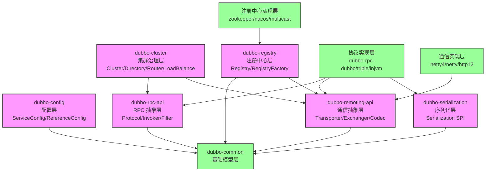

### 1.3 一次 RPC 调用的分层视角

```mermaid
graph LR
    subgraph Consumer[消费端]
        Proxy[动态代理] --> CF[Consumer Filter 链]
        CF --> CI[ClusterInvoker]
        CI --> LB[LoadBalance]
        LB --> DI[DubboInvoker/TripleInvoker]
        DI --> CC[ExchangeClient]
        CC --> NC[NettyClient]
    end
    subgraph Network[网络]
        NC -.TCP/HTTP2.-> NS
    end
    subgraph Provider[提供端]
        NS[NettyServer] --> DC[DecodeHandler]
        DC --> HE[HeaderExchangeHandler]
        HE --> PF[Provider Filter 链]
        PF --> PI[ProxyInvoker]
        PI --> BIZ[业务实现]
    end
```

---

## 二、核心抽象模型

Dubbo RPC 的核心抽象集中在 `dubbo-rpc-api` 模块，由 URL、Invoker、Invocation、Protocol、ProxyFactory、Result 六个核心接口构成整个 RPC 调用的骨架。

### 2.1 URL —— 配置与寻址载体

URL 是 Dubbo 中最重要的配置传递载体，几乎所有组件的配置都通过 URL 流转。它将协议、地址、参数统一为一个不可变对象，使整个框架具备统一的配置语义。

```java
// dubbo-common/src/main/java/org/apache/dubbo/common/URL.java
public class URL implements Serializable {
    private final String protocol;       // 协议：dubbo、triple、injvm、registry
    private final String username;
    private final String password;
    private final String host;           // 主机
    private final int port;              // 端口
    private final String path;           // 服务接口全类名
    private final URLParam parameters;  // 参数键值对（Dubbo 3.x 拆分为 URLParam 优化内存）
    private final URLAddress address;    // 地址抽象（缓存复用）

    public String getParameter(String key);
    public String getParameter(String key, String defaultValue);
    public URL addParameter(String key, String value);
    public URL addParameterIfAbsent(String key, String value);
    public ScopeModel getScopeModel();
}
```

**关键设计点**：
- Dubbo 3.x 将 URL 拆分为 `URLAddress`（host:port）和 `URLParam`（参数表），相同地址的 URL 可以复用 address 实例，大幅降低内存占用。
- URL 是不可变对象，任何 `addParameter` 都会生成新实例，避免并发修改问题。
- URL 是 SPI 自适应扩展的"数据源"：`@Adaptive` 注解修饰的方法通过 URL 参数动态选择扩展实现。

### 2.2 Invoker —— 可执行调用抽象

`Invoker<T>` 是 Dubbo 最核心的抽象，代表"一个可执行的服务端点"。无论是本地服务、远程服务还是集群代理，最终都抽象为 `Invoker<T>`。

```java
// dubbo-rpc/dubbo-rpc-api/src/main/java/org/apache/dubbo/rpc/Invoker.java
public interface Invoker<T> extends Node {
    Class<T> getInterface();
    Result invoke(Invocation invocation) throws RpcException;
}
```

**Invoker 的多种形态**：

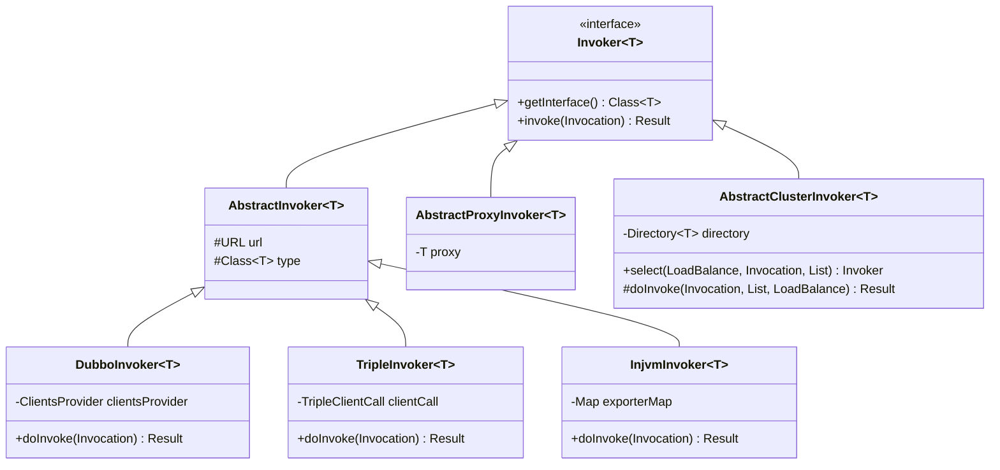

- **提供端**：`AbstractProxyInvoker` 包装业务实现类，将 Java 对象转为 Invoker。
- **消费端**：`DubboInvoker`、`TripleInvoker`、`InjvmInvoker` 等具体协议 Invoker。
- **集群端**：`AbstractClusterInvoker` 及其子类（FailoverClusterInvoker 等）包装多个 Invoker 提供容错。

### 2.3 Invocation —— 调用上下文

`Invocation` 封装一次 RPC 调用的上下文：方法名、参数类型、参数值、附件（attachment）等。

```java
// dubbo-rpc/dubbo-rpc-api/src/main/java/org/apache/dubbo/rpc/Invocation.java
public interface Invocation {
    String getMethodName();
    Class<?>[] getParameterTypes();
    Object[] getArguments();
    Map<String, String> getAttachments();
    String getAttachment(String key);
    String getAttachment(String key, String defaultValue);
    Object put(String key, Object value);
    Object get(String key);
    // ...
}
```

**RpcInvocation** 是其标准实现。Invocation 在序列化层被编码为协议 Body，在反序列化端被重建。

### 2.4 Protocol —— 协议 SPI 接口

`Protocol` 是 RPC 协议的 SPI 接口，定义了服务暴露（export）与引用（refer）的标准契约。

```java
// dubbo-rpc/dubbo-rpc-api/src/main/java/org/apache/dubbo/rpc/Protocol.java
@SPI(value = "dubbo", scope = ExtensionScope.FRAMEWORK)
public interface Protocol {
    int getDefaultPort();

    @Adaptive
    <T> Exporter<T> export(Invoker<T> invoker) throws RpcException;

    @Adaptive
    <T> Invoker<T> refer(Class<T> type, URL url) throws RpcException;

    void destroy();

    default List<ProtocolServer> getServers() { return Collections.emptyList(); }
}
```

- `export()`：提供端调用，将 Invoker 暴露为可远程访问的服务（启动 Netty Server、注册到注册中心）。
- `refer()`：消费端调用，根据 URL 创建一个远程 Invoker。
- `@Adaptive`：运行时根据 URL 的 `protocol` 参数选择 DubboProtocol、TripleProtocol、InjvmProtocol 等具体实现。

### 2.5 ProxyFactory —— 代理工厂 SPI

`ProxyFactory` 是 Invoker 与业务接口之间的桥梁：

```java
// dubbo-rpc/dubbo-rpc-api/src/main/java/org/apache/dubbo/rpc/ProxyFactory.java
@SPI(scope = ExtensionScope.FRAMEWORK)
public interface ProxyFactory {
    @Adaptive({PROXY_KEY})
    <T> T getProxy(Invoker<T> invoker, boolean generic) throws RpcException;

    @Adaptive({PROXY_KEY})
    <T> Invoker<T> getInvoker(T proxy, Class<T> type, URL url) throws RpcException;
}
```

- **消费端** `getProxy(invoker)`：把 Invoker 包装为业务接口的动态代理（JavassistProxyFactory / JdkProxyFactory）。
- **提供端** `getInvoker(proxy, type, url)`：把业务实现类包装为 Invoker，便于框架调用。

### 2.6 Result —— 调用结果

```java
// dubbo-rpc/dubbo-rpc-api/src/main/java/org/apache/dubbo/rpc/Result.java
public interface Result extends Serializable {
    Object getValue();
    Throwable getException();
    boolean hasException();
    Map<String, String> getAttachments();
    void setAttachments(Map<String, String> map);
    // ...
}
```

`AsyncRpcResult` 是 Dubbo 3.x 的默认实现，内部持有 `CompletableFuture`，使整个 RPC 调用全链路异步化。

### 2.7 核心抽象的关系图


---

## 三、SPI 扩展机制源码深入

Dubbo SPI 是 Java SPI 的增强版，支持自适应扩展（@Adaptive）、激活扩展（@Activate）、Wrapper 包装机制。核心由 `ExtensionLoader` 实现。

### 3.1 ExtensionLoader 核心字段

```java
// dubbo-common/src/main/java/org/apache/dubbo/common/extension/ExtensionLoader.java
private static final ConcurrentMap<Class<?>, ExtensionLoader<?>> EXTENSION_LOADERS = new ConcurrentHashMap<>();
private static final ConcurrentMap<Class<?>, Object> EXTENSION_INSTANCES = new ConcurrentHashMap<>();

private final Class<?> type;                                   // 扩展接口类型
private final ExtensionDirector director;                      // 扩展目录（按 ScopeModel 隔离）
private final Map<String, Class<?>> extensionClasses;         // name -> 实现类
private final Map<String, Object> singletonObjects;           // name -> 单例实例
private final List<Object> wrapperInstances;                  // Wrapper 实例列表
private final Map<String, Activate> cachedActivates;          // name -> @Activate 元信息
private volatile Class<?> cachedAdaptiveClass;                // @Adaptive 自适应类
```

### 3.2 SPI 配置文件目录

Dubbo 从以下三个目录加载 SPI 配置（优先级从高到低）：
1. `META-INF/dubbo/internal/`：框架内部扩展（如 `org.apache.dubbo.rpc.Protocol`）
2. `META-INF/dubbo/`：用户自定义扩展
3. `META-INF/services/`：标准 Java SPI 兼容

配置文件格式为 `name=实现类全类名`，例如 `META-INF/dubbo/internal/org.apache.dubbo.rpc.Protocol`：
```
dubbo=org.apache.dubbo.rpc.protocol.dubbo.DubboProtocol
injvm=org.apache.dubbo.rpc.protocol.injvm.InjvmProtocol
triple=org.apache.dubbo.rpc.protocol.triple.TripleProtocol
```

### 3.3 getExtension 加载流程

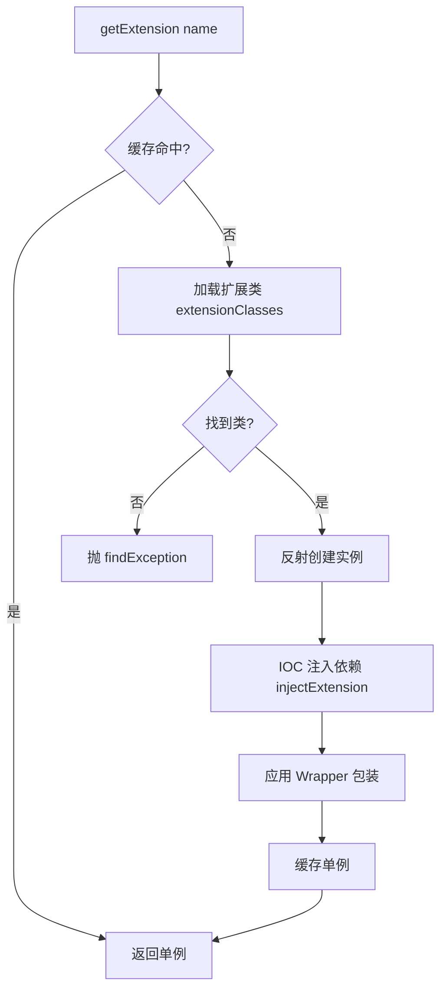

### 3.4 自适应扩展 @Adaptive

`@Adaptive` 注解修饰方法时，ExtensionLoader 会通过 `AdaptiveClassCodeGenerator` 动态生成字节码，生成一个根据 URL 参数动态选择扩展的自适应类。

以 Protocol 为例，生成的 `Protocol$Adaptive` 大致等价于：

```java
public class Protocol$Adaptive implements Protocol {
    public <T> Exporter<T> export(Invoker<T> arg0) throws RpcException {
        if (arg0 == null) throw new IllegalArgumentException("invoker == null");
        URL url = arg0.getUrl();
        String extName = url.getParameter("protocol", "dubbo");
        Protocol extension = (Protocol) ScopeModelUtil
            .getOrDefault(url.getScopeModel(), Protocol.class)
            .getExtensionLoader(Protocol.class)
            .getExtension(extName);
        return extension.export(arg0);
    }
    // refer、destroy 同理
}
```

通过 `url.getParameter("protocol", "dubbo")` 动态决定使用 `DubboProtocol` 还是 `TripleProtocol`，使整个框架具备"配置驱动"的扩展能力。

### 3.5 Activate 激活扩展 @Activate

`@Activate` 用于按条件激活一组扩展（典型场景：Filter 链）。

```java
@Activate(group = CommonConstants.CONSUMER, order = -10000)
public class ConsumerContextFilter implements Filter { ... }

@Activate(group = CommonConstants.PROVIDER, order = -11000)
public class ContextFilter implements Filter { ... }
```

- `group`：消费端 / 提供端
- `value`：URL 中需包含的 key
- `order`：执行顺序，越小越先执行

`getActivateExtension(url, key, group)` 返回按 order 排序后的扩展列表。

### 3.6 Wrapper 包装机制

当扩展实现类的构造函数只有一个参数且为扩展接口类型时，ExtensionLoader 将其识别为 Wrapper，自动包装在扩展实例外层（AOP 风格）。

典型例子：`ProtocolFilterWrapper`、`ProtocolListenerWrapper` 都包装 `Protocol`：

```java
public class ProtocolFilterWrapper implements Protocol {
    private final Protocol protocol;  // 被包装的原始 Protocol

    public ProtocolFilterWrapper(Protocol protocol) {
        this.protocol = protocol;
    }

    @Override
    public <T> Exporter<T> export(Invoker<T> invoker) {
        // 在 export 前构建 Filter 链
        FilterChainBuilder builder = getFilterChainBuilder(invoker.getUrl());
        return protocol.export(builder.buildInvokerChain(invoker, SERVICE_FILTER_KEY, PROVIDER));
    }
}
```

### 3.7 ExtensionFactory 与 SpringExtensionFactory

ExtensionLoader 支持 IOC 注入，注入依赖通过 `ExtensionFactory` SPI 获取：

```java
@SPI
public interface ExtensionFactory {
    <T> T getExtension(Class<T> type, String name);
}
```

- `SpiExtensionFactory`：从 Dubbo SPI 获取
- `SpringExtensionFactory`：从 Spring ApplicationContext 获取 Bean

Dubbo 扩展实例中 `setApplicationContext(...)` 这种 setter 会被 `injectExtension` 自动调用，注入 Spring Bean。

### 3.8 SPI 加载流程时序图

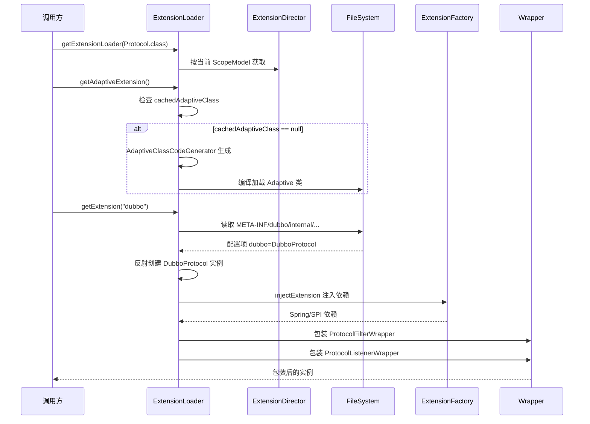

---

## 四、Filter 链机制

Filter 是 Dubbo 的核心扩展点之一，提供请求前后的拦截能力（如鉴权、监控、链路追踪、限流）。Filter 链由 `ProtocolFilterWrapper` 在 `export` / `refer` 时构建。

### 4.1 ProtocolFilterWrapper

```java
// dubbo-cluster/src/main/java/org/apache/dubbo/rpc/cluster/filter/ProtocolFilterWrapper.java
@Activate(order = 100)
public class ProtocolFilterWrapper implements Protocol {
    private final Protocol protocol;

    @Override
    public <T> Exporter<T> export(Invoker<T> invoker) throws RpcException {
        if (UrlUtils.isRegistry(invoker.getUrl())) {
            return protocol.export(invoker);  // Registry 类型不包装 Filter
        }
        FilterChainBuilder builder = getFilterChainBuilder(invoker.getUrl());
        return protocol.export(builder.buildInvokerChain(invoker, SERVICE_FILTER_KEY, PROVIDER));
    }

    @Override
    public <T> Invoker<T> refer(Class<T> type, URL url) throws RpcException {
        if (UrlUtils.isRegistry(url)) {
            return protocol.refer(type, url);
        }
        FilterChainBuilder builder = getFilterChainBuilder(url);
        return builder.buildInvokerChain(protocol.refer(type, url), REFERENCE_FILTER_KEY, CONSUMER);
    }
}
```

### 4.2 Filter SPI 接口

```java
// dubbo-rpc/dubbo-rpc-api/src/main/java/org/apache/dubbo/rpc/Filter.java
@SPI
public interface Filter extends BaseFilter {
    Result invoke(Invoker<?> invoker, Invocation invocation) throws RpcException;

    interface Listener {
        void onResponse(Result appResponse, Invoker<?> invoker, Invocation invocation);
        void onError(Throwable t, Invoker<?> invoker, Invocation invocation);
    }
}
```

`Filter` 支持 `onResponse` / `onError` 回调（双向拦截），通过 `CallbackRegistrationInvoker` 统一注册回调。

### 4.3 Filter 链构建源码

```java
// dubbo-cluster/src/main/java/org/apache/dubbo/rpc/cluster/filter/DefaultFilterChainBuilder.java
@Override
public <T> Invoker<T> buildInvokerChain(final Invoker<T> originalInvoker, String key, String group) {
    Invoker<T> last = originalInvoker;
    URL url = originalInvoker.getUrl();
    // 获取所有激活的 Filter，按 order 排序
    List<Filter> filters = ScopeModelUtil.getExtensionLoader(Filter.class, null)
            .getActivateExtension(url, key, group);

    if (!CollectionUtils.isEmpty(filters)) {
        // 倒序构建链：最后一个 Filter 最先执行
        for (int i = filters.size() - 1; i >= 0; i--) {
            final Filter filter = filters.get(i);
            final Invoker<T> next = last;
            last = new CopyOfFilterChainNode<>(originalInvoker, next, filter);
        }
        return new CallbackRegistrationInvoker<>(last, filters);
    }
    return last;
}
```

### 4.4 Filter 链结构图


### 4.5 内置 Filter 一览

| Filter | group | 作用 |
|--------|-------|------|
| `ConsumerContextFilter` | consumer | 设置 RpcContext、attachment、local address |
| `ContextFilter` | provider | 接收并恢复 RpcContext |
| `ExceptionFilter` | provider | 异常分级与转换 |
| `TimeoutFilter` | provider | 记录超时警告 |
| `AccessLogFilter` | provider | 访问日志 |
| `TpsLimitFilter` | provider | 限流（基于 TPSLimiter） |
| `TokenFilter` | provider | Token 鉴权 |
| `MetricsFilter` | both | 指标采集 |
| `TracingFilter` | both | 链路追踪 |
| `FutureFilter` | consumer | 异步回调通知 |
| `GenericFilter` | provider | 泛化调用支持 |

---

## 五、Remoting 底层通信层

Remoting 是 Dubbo 的底层通信骨架，位于 `dubbo-remoting/dubbo-remoting-api`，独立于具体协议。它将"网络传输"抽象为 Transporter 层、"请求-响应模式"抽象为 Exchange 层、"二进制编解码"抽象为 Codec 层。dubbo 协议与 triple 协议（除 HTTP/2 传输外）都构建在其上。

### 5.1 Remoting 分层架构

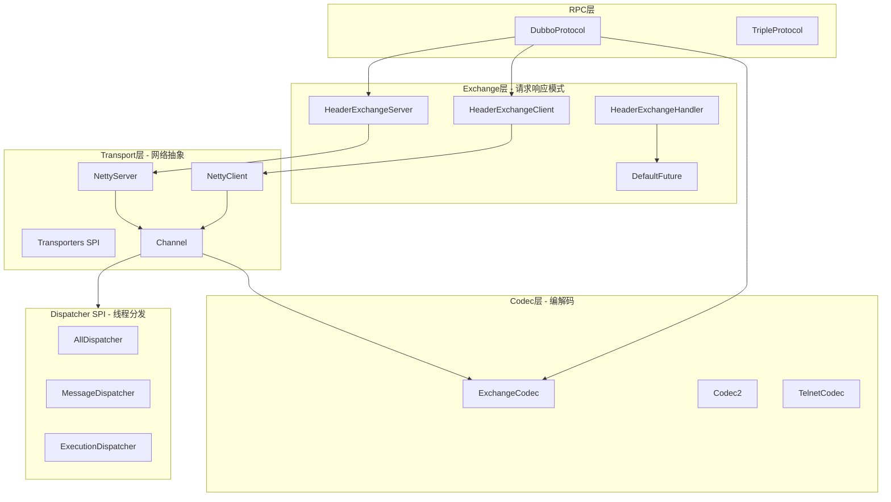

### 5.2 核心抽象接口

#### 5.2.1 Endpoint / Channel / ChannelHandler

```java
// dubbo-remoting-api/src/main/java/org/apache/dubbo/remoting/Endpoint.java
public interface Endpoint extends Node {
    URL getUrl();
    ChannelHandler getChannelHandler();
    InetSocketAddress getLocalAddress();
    void send(Object message) throws RemotingException;
    void send(Object message, boolean sent) throws RemotingException;
    void close();
    void close(int timeout);
    void startClose();
    boolean isClosed();
}

// Channel.java
public interface Channel extends Endpoint {
    InetSocketAddress getRemoteAddress();
    boolean isConnected();
    boolean hasAttribute(String key);
    Object getAttribute(String key);
    void setAttribute(String key, Object value);
    void removeAttribute(String key);
}

// ChannelHandler.java - 事件回调接口
public interface ChannelHandler {
    void connected(Channel channel) throws RemotingException;
    void disconnected(Channel channel) throws RemotingException;
    void sent(Channel channel, Object message) throws RemotingException;
    void received(Channel channel, Object message) throws RemotingException;
    void caught(Channel channel, Throwable exception) throws RemotingException;
}
```

#### 5.2.2 Transporter SPI

`Transporter` 是网络传输的 SPI 入口，提供 `bind`（服务端）和 `connect`（客户端）两个方法。

```java
// dubbo-remoting-api/src/main/java/org/apache/dubbo/remoting/Transporter.java
@SPI("netty4")
public interface Transporter {
    @Adaptive({SERVER_TRANSPORTER_KEY})
    RemotingServer bind(URL url, ChannelHandler handler) throws RemotingException;

    @Adaptive({CLIENT_TRANSPORTER_KEY})
    Client connect(URL url, ChannelHandler handler) throws RemotingException;
}
```

- 默认实现 `netty4`（`NettyTransporter`），还支持 `netty`（3.x）、`mina`、`grizzly` 等。
- 通过 `Transporters.bind(url, handler)` 门面调用，自动加载自适应扩展。

```java
// dubbo-remoting-api/src/main/java/org/apache/dubbo/remoting/Transporters.java
public static RemotingServer bind(URL url, ChannelHandler... handlers) throws RemotingException {
    ChannelHandler handler;
    if (handlers.length == 1) {
        handler = handlers[0];
    } else {
        handler = new ChannelHandlerDispatcher(handlers);
    }
    return getTransporter(url).bind(url, handler);  // SPI 自适应
}
```

#### 5.2.3 Exchanger / ExchangeChannel / ExchangeHandler

Exchange 层在 Transport 之上封装"请求-响应模式"，把 `Channel#send` 升级为 `ExchangeChannel#request`（带返回值）。

```java
// dubbo-remoting-api/src/main/java/org/apache/dubbo/remoting/exchange/Exchanger.java
@SPI(HeaderExchanger.NAME)
public interface Exchanger {
    @Adaptive({Constants.EXCHANGER_KEY})
    ExchangeServer bind(URL url, ExchangeHandler handler) throws RemotingException;

    @Adaptive({Constants.EXCHANGER_KEY})
    ExchangeClient connect(URL url, ExchangeHandler handler) throws RemotingException;
}
```

- 默认实现 `HeaderExchanger`，生成 `HeaderExchangeServer` 和 `HeaderExchangeClient`。
- `Exchangers.bind(url, handler)` 是门面方法，默认给 URL 加 `codec=exchange` 参数。

```java
// dubbo-remoting-api/src/main/java/org/apache/dubbo/remoting/exchange/Exchangers.java
public static ExchangeServer bind(URL url, ExchangeHandler handler) throws RemotingException {
    url = url.addParameterIfAbsent(Constants.CODEC_KEY, "exchange");
    return getExchanger(url).bind(url, handler);
}
```

#### 5.2.4 Codec2 SPI

```java
// dubbo-remoting-api/src/main/java/org/apache/dubbo/remoting/Codec2.java
@SPI
public interface Codec2 {
    void encode(Channel channel, ChannelBuffer buffer, Object message) throws IOException;
    Object decode(Channel channel, ChannelBuffer buffer) throws IOException;

    enum DecodeResult {
        NEED_MORE_INPUT, SKIP_SOME_INPUT
    }
}
```

`Codec2` 是编解码 SPI，默认 `exchange` 实现（`ExchangeCodec`）。`Decodeable` 接口允许对象懒解码（在业务线程解码，减少 IO 线程阻塞）。

### 5.3 Netty4 实现深入

#### 5.3.1 NettyTransporter

```java
// dubbo-remoting-netty4/.../NettyTransporter.java
public class NettyTransporter implements Transporter {
    public static final String NAME = "netty4";

    @Override
    public RemotingServer bind(URL url, ChannelHandler handler) {
        return new NettyServer(url, handler);
    }

    @Override
    public Client connect(URL url, ChannelHandler handler) {
        return new NettyClient(url, handler);
    }
}
```

#### 5.3.2 NettyServer 启动流程

```java
// dubbo-remoting-netty4/.../NettyServer.java:doOpen()
protected void doOpen() throws Throwable {
    bossGroup = createBossGroup();                       // 1 个 Accept 线程
    workerGroup = createWorkerGroup();                  // 默认 CPU+1 个 IO 线程
    final NettyServerHandler nettyServerHandler = createNettyServerHandler();
    channels = nettyServerHandler.getChannels();
    initServerBootstrap(nettyServerHandler);
    bootstrap.bind(getBindAddress()).syncUninterruptibly();  // 绑定端口
}

protected void initServerBootstrap(NettyServerHandler nettyServerHandler) {
    bootstrap
        .group(bossGroup, workerGroup)
        .channel(NettyEventLoopFactory.serverSocketChannelClass())
        .option(ChannelOption.SO_REUSEADDR, Boolean.TRUE)
        .childOption(ChannelOption.TCP_NODELAY, Boolean.TRUE)
        .childOption(ChannelOption.SO_KEEPALIVE, keepalive)
        .childOption(ChannelOption.ALLOCATOR, PooledByteBufAllocator.DEFAULT)
        .childHandler(new ChannelInitializer<SocketChannel>() {
            @Override
            protected void initChannel(SocketChannel ch) {
                NettyCodecAdapter adapter = new NettyCodecAdapter(getCodec(), getUrl(), NettyServer.this);
                ch.pipeline()
                    .addLast("negotiation", new SslServerTlsHandler(getUrl()))   // TLS
                    .addLast("decoder", adapter.getDecoder())                     // 解码器
                    .addLast("encoder", adapter.getEncoder())                     // 编码器
                    .addLast("server-idle-handler", new IdleStateHandler(0, 0, closeTimeout))
                    .addLast("handler", nettyServerHandler);                      // 业务 Handler
            }
        });
}
```

#### 5.3.3 NettyServerHandler / NettyClientHandler

它们是 Netty 的 `ChannelDuplexHandler`，把 Netty 事件桥接为 Dubbo 的 `ChannelHandler` 回调：

```java
@Sharable
public class NettyServerHandler extends ChannelDuplexHandler {
    private final Map<String, Channel> channels = new ConcurrentHashMap<>();  // 活跃连接
    private final ChannelHandler handler;  // Dubbo ChannelHandler（实际是 ChannelEventHandler 链）

    @Override
    public void channelActive(ChannelHandlerContext ctx) {
        NettyChannel channel = NettyChannel.getOrAddChannel(ctx.channel(), url, handler);
        channels.put(channel.toString(), channel);
        handler.connected(channel);  // 转发到 Dubbo 链
    }

    @Override
    public void channelRead(ChannelHandlerContext ctx, Object msg) {
        NettyChannel channel = NettyChannel.getOrAddChannel(ctx.channel(), url, handler);
        handler.received(channel, msg);  // 解码后的消息转发到 Dubbo 链
    }
}
```

#### 5.3.4 NettyChannel -- Channel 适配

`NettyChannel` 实现 Dubbo `Channel` 接口，内部持有 Netty `io.netty.channel.Channel`，把 Dubbo 的 `send` 转为 Netty 的 `writeAndFlush`：

```java
public void send(Object message, boolean sent) throws RemotingException {
    if (!isConnected()) throw new RemotingException(...);
    boolean success = true;
    int timeout = 0;
    try {
        ChannelFuture future = channel.writeAndFlush(message);
        if (sent) {  // 同步等待发送完成
            success = future.await(timeout);
        }
        // ...
    } catch (Throwable e) { ... }
}
```

#### 5.3.5 Netty Pipeline 与 ChannelHandler 链对照

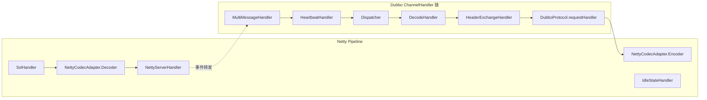

### 5.4 Exchange 层实现

#### 5.4.1 HeaderExchangeServer / HeaderExchangeClient

`HeaderExchangeServer` 持有底层 `RemotingServer`，启动时通过 `startIdleCheckTask` 开启心跳检查：

```java
// dubbo-remoting-api/.../HeaderExchangeServer.java
private static final GlobalResourceInitializer<Timer> IDLE_CHECK_TIMER = new GlobalResourceInitializer<>(
    () -> new HashedWheelTimer(new NamedThreadFactory("dubbo-server-idleCheck", true), 1, SECONDS, TICKS_PER_WHEEL),
    HashedWheelTimer::stop);

public HeaderExchangeServer(RemotingServer server) {
    this.server = server;
    startIdleCheckTask(getUrl());   // 启动心跳定时任务
}

public void close(int timeout) {
    if (getUrl().getParameter(Constants.CHANNEL_SEND_READONLYEVENT_KEY, true)) {
        sendChannelEvent(READONLY_EVENT);   // 通知消费端只读
    }
    while (isRunning() && System.currentTimeMillis() - start < timeout) {
        Thread.sleep(10);  // 等待在途请求处理完
    }
    doClose();
    server.close(timeout);
}
```

#### 5.4.2 HeaderExchangeHandler -- 请求处理核心

```java
// dubbo-remoting-api/.../HeaderExchangeHandler.java
void handleRequest(final ExchangeChannel channel, Request req) throws RemotingException {
    Response res = new Response(req.getId(), req.getVersion());
    if (req.isBroken()) {
        res.setStatus(Response.BAD_REQUEST);
        res.setErrorMessage("Fail to decode request due to: " + req.getData());
        channel.send(res);
        return;
    }
    Object msg = req.getData();
    try {
        // 调用业务 handler.reply（DubboProtocol.requestHandler.reply）
        CompletionStage<Object> future = handler.reply(channel, msg);
        future.whenComplete((appResult, t) -> {
            if (t == null) {
                res.setStatus(Response.OK);
                res.setResult(appResult);
            } else {
                res.setStatus(Response.SERVICE_ERROR);
                res.setErrorMessage(StringUtils.toString(t));
            }
            channel.send(res);  // 异步发送响应
        });
    } catch (Throwable e) {
        res.setStatus(Response.SERVICE_ERROR);
        res.setErrorMessage(StringUtils.toString(e));
        channel.send(res);
    }
}

@Override
public void received(Channel channel, Object message) {
    if (message instanceof Request) {
        handleRequest(channel, (Request) message);    // 请求处理
    } else if (message instanceof Response) {
        handleResponse(channel, (Response) message);   // 响应处理 -> 唤醒 DefaultFuture
    } else if (message instanceof RpcInvocation) { ... }
    // ...
}
```

#### 5.4.3 DefaultFuture -- 异步响应等待

`DefaultFuture` 是 Exchange 层"请求-响应"的核心，它继承 `CompletableFuture<Object>`，把同步等待转化为异步回调。

```java
// dubbo-remoting-api/.../support/DefaultFuture.java
public class DefaultFuture extends CompletableFuture<Object> {
    // 三个全局 Map：按 request id 索引
    private static final Map<Long, Channel> CHANNELS = new ConcurrentHashMap<>();   // 在途请求的 Channel
    private static final Map<Long, DefaultFuture> FUTURES = new ConcurrentHashMap<>();  // 在途请求的 Future

    // 超时检查时间轮
    private static final GlobalResourceInitializer<Timer> TIME_OUT_TIMER = new GlobalResourceInitializer<>(
        () -> new HashedWheelTimer(new NamedThreadFactory("dubbo-future-timeout", true), 30, MILLISECONDS),
        DefaultFuture::destroy);

    private final Long id;            // Request id
    private final Channel channel;
    private final Request request;
    private final int timeout;
    private final long start = System.currentTimeMillis();
    private volatile long sent;
    private Timeout timeoutCheckTask;

    private DefaultFuture(Channel channel, Request request, int timeout) {
        this.channel = channel;
        this.id = request.getId();
        this.timeout = timeout > 0 ? timeout : channel.getUrl().getPositiveParameter(TIMEOUT_KEY, DEFAULT_TIMEOUT);
        FUTURES.put(id, this);     // 注册到全局 Map
        CHANNELS.put(id, channel);
    }

    public static DefaultFuture newFuture(Channel channel, Request request, int timeout, ExecutorService executor) {
        final DefaultFuture future = new DefaultFuture(channel, request, timeout);
        future.setExecutor(executor);
        timeoutCheck(future);       // 注册超时检查任务
        return future;
    }

    // 服务端响应到达时调用
    public static void received(Channel channel, Response response, boolean timeout) {
        DefaultFuture future = FUTURES.remove(response.getId());   // 移除在途记录
        if (future != null) {
            if (!timeout) future.timeoutCheckTask.cancel();
            future.doReceived(response);   // CompletableFuture.complete 触发回调
            shutdownExecutorIfNeeded(future);
        }
        CHANNELS.remove(response.getId());
    }
}
```

**关键设计点**：
- 全局 `FUTURES` Map 以 Request.id 为 key，服务端响应到达时通过 id 找到对应 Future。
- `TIME_OUT_TIMER` 是基于 Dubbo 时间轮（HashedWheelTimer）实现的超时检查器，每 30ms tick 一次。
- 当超时到达，`TimeoutCheckTask` 把 Future 标记为超时完成，避免无限等待。
- Channel 关闭时 `closeChannel` 会主动把在途请求标记为 `CHANNEL_INACTIVE`。

### 5.5 编解码体系

#### 5.5.1 ExchangeCodec -- 16 字节协议头编解码

`ExchangeCodec` 是 Dubbo 协议头的编解码实现（MAGIC = 0xdabb），结构由它定义：

```java
// dubbo-remoting-api/.../exchange/codec/ExchangeCodec.java
protected static final short MAGIC = (short) 0xdabb;
protected static final byte MAGIC_HIGH = Bytes.short2byte(MAGIC, 0);
protected static final byte MAGIC_LOW = Bytes.short2byte(MAGIC, 1);
protected static final int HEADER_LENGTH = 16;

// flag 位定义
protected static final byte FLAG_REQUEST = (byte) 0x80;
protected static final byte FLAG_TWOWAY = (byte) 0x40;
protected static final byte FLAG_EVENT = (byte) 0x20;
protected static final int SERIALIZATION_MASK = 0x1f;
```

**16 字节协议头布局**：

```
偏移   长度   字段
0      2     Magic Number (0xdabb)
2      1     Flag (Req/Res, TwoWay, Event, SerializationId 低 5 位)
3      1     Status (仅响应有效: OK=20, SERVICE_ERROR=70, ...)
4      8     Request ID
12     4     Body Length
```

**解码流程**：

```java
protected Object decode(Channel channel, ChannelBuffer buffer, int readable, byte[] header) {
    // 1. 读 Magic，匹配协议
    // 2. 读 Body Length，检查可读字节是否足够
    if (readable < HEADER_LENGTH) return DecodeResult.NEED_MORE_INPUT;
    int len = Bytes.bytes2int(header, 12);
    Object obj = finishRespWhenOverPayload(channel, len, header);  // 超过 payload 上限直接返回错误
    if (null != obj) return obj;
    int tt = len + HEADER_LENGTH;
    if (readable < tt) return DecodeResult.NEED_MORE_INPUT;  // 半包，等待更多数据

    ChannelBufferInputStream is = new ChannelBufferInputStream(buffer, len);
    return decodeBody(channel, is, header);   // 子类实现 Body 解码（DubboCodec）
}

protected Object decodeBody(Channel channel, InputStream is, byte[] header) throws IOException {
    byte flag = header[2], proto = (byte) (flag & SERIALIZATION_MASK);
    long id = Bytes.bytes2long(header, 4);
    if ((flag & FLAG_REQUEST) == 0) {
        // 解码 Response
        Response res = new Response(id);
        if ((flag & FLAG_EVENT) != 0) res.setEvent(true);
        byte status = header[3];
        res.setStatus(status);
        // 使用 proto 选择 Serialization 反序列化
        // ...
    }
    // ...
}
```

#### 5.5.2 DubboCodec -- Body 编解码

`DubboCodec`（在 dubbo-rpc-dubbo 模块）继承 `ExchangeCodec`，实现 `decodeBody` 和 `encodeRequestData` / `encodeResponseData`，详细分析见独立的 `Dubbo协议源码分析.md`。

#### 5.5.3 Codec2 与 ExchangeCodec 适配

`TransportCodec` 实现 `Codec2` 接口，内部委派给 `ExchangeCodec`。Netty 通过 `NettyCodecAdapter` 把 Dubbo 的 Codec2 包装为 Netty 的 `MessageToByteEncoder` / `ByteToMessageDecoder`：

```java
// dubbo-remoting-netty4/.../NettyCodecAdapter.java
private class InternalEncoder extends MessageToByteEncoder {
    public void encode(ChannelHandlerContext ctx, Object msg, ByteBuf out) {
        ChannelBuffer buffer = new NettyBackedChannelBuffer(out);
        Channel ch = NettyChannel.getOrAddChannel(ctx.channel(), url, handler);
        codec.encode(ch, buffer, msg);  // 委派给 ExchangeCodec
    }
}

private class InternalDecoder extends ByteToMessageDecoder {
    public void decode(ChannelHandlerContext ctx, ByteBuf input, List<Object> out) {
        ChannelBuffer message = new NettyBackedChannelBuffer(input);
        Channel ch = NettyChannel.getOrAddChannel(ctx.channel(), url, handler);
        codec.decode(ch, message);  // 委派给 ExchangeCodec
    }
}
```

### 5.6 心跳机制

#### 5.6.1 心跳设计

Dubbo 协议默认开启心跳，服务端/客户端各维护一个时间轮定时器：
- 客户端：每 `heartbeat`（默认 60s）发送 `HeartBeatRequest`，若 `idle`（默认 180s）未收到任何数据则关闭连接。
- 服务端：每 `heartbeat` 检查，若 `idle` 内未收到数据则关闭连接。

#### 5.6.2 HeartbeatHandler

`HeartbeatHandler` 包装在 ChannelHandler 链中，处理心跳消息：

```java
// dubbo-remoting-api/.../transport/heartbeat/HeartbeatHandler.java
@Override
public void received(Channel channel, Object message) throws RemotingException {
    setReadTimestamp(channel);   // 更新最后读时间
    if (message instanceof HeartbeatRequest) {
        HeartbeatResponse resp = new HeartbeatResponse();
        resp.setId(((HeartbeatRequest) message).getId());
        channel.send(resp);       // 心跳请求 -> 心跳响应
        return;
    }
    if (message instanceof HeartbeatResponse) {
        return;                   // 心跳响应直接忽略
    }
    handler.received(channel, message);  // 业务消息继续传播
}
```

#### 5.6.3 心跳定时任务

`HeaderExchangeClient` 和 `HeaderExchangeServer` 各自启动 `HeartbeatTimerTask`：

```java
// dubbo-remoting-api/.../HeaderExchangeClient.java
private void startHeartBeatTask(URL url) {
    long heartbeat = url.getParameter(Constants.HEARTBEAT_KEY, Constants.DEFAULT_HEARTBEAT);
    long heartbeatTimeout = url.getParameter(Constants.HEARTBEAT_TIMEOUT_KEY, heartbeat * 3);
    HeartbeatTimerTask task = new HeartbeatTimerTask(HEARTBEAT_TIMER, channel, heartbeat, heartbeatTimeout);
    HEARTBEAT_TIMER.get().newTimeout(task, heartbeat, TimeUnit.MILLISECONDS);
}
```

### 5.7 Dispatcher SPI -- 线程分发策略

`Dispatcher` 决定 ChannelHandler 事件在哪个线程执行（IO 线程 or 业务线程池）。默认 `all`。

```java
@SPI("all")
public interface Dispatcher {
    @Adaptive({Constants.DISPATCHER_KEY, "channel.handler"})
    ChannelHandler dispatch(ChannelHandler handler, URL url);
}
```

| 名称 | 实现类 | 策略 |
|------|--------|------|
| `all` | AllChannelHandler | 所有事件都进线程池（默认） |
| `direct` | DirectChannelHandler | 所有事件在 IO 线程直接执行 |
| `message` | MessageChannelHandler | 仅消息事件进线程池 |
| `execution` | ExecutionChannelHandler | 仅 Request 进线程池 |
| `connection` | ConnectionChannelHandler | 仅连接事件进线程池 |

#### AllChannelHandler 实现示例

```java
public class AllChannelHandler extends WrappedChannelHandler {
    @Override
    public void received(Channel channel, Object message) {
        ExecutorService executor = getExecutorService();
        executor.execute(new ChannelEventRunnable(channel, handler, ChannelState.RECEIVED, message));
    }
    @Override
    public void connected(Channel channel) {
        executor.execute(new ChannelEventRunnable(channel, handler, ChannelState.CONNECTED));
    }
    @Override
    public void caught(Channel channel, Throwable exception) {
        executor.execute(new ChannelEventRunnable(channel, handler, ChannelState.CAUGHT, exception));
    }
}
```

### 5.8 请求-响应完整时序图

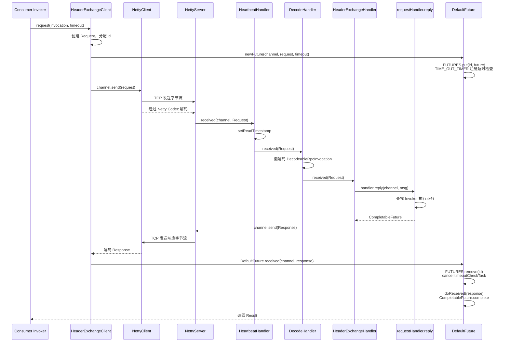

### 5.9 ChannelHandler 链完整结构

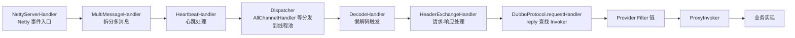

---

## 六、序列化机制

序列化是 RPC 的核心：把 Invocation 对象转为字节流通过网络发送，并在对端重建。Dubbo 把序列化抽象为 SPI（`dubbo-serialization` 模块），支持 Hessian2（默认）、Fastjson2、Kryo、Protobuf、FST、JDK 等多种算法。

### 6.1 序列化架构总览

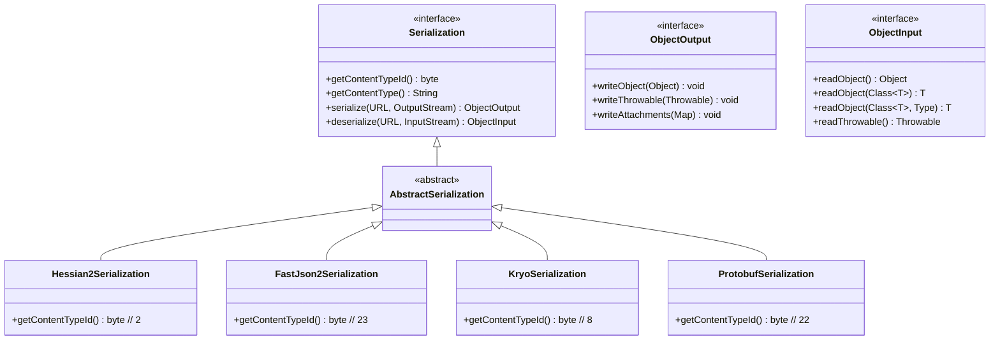

### 6.2 Serialization SPI 接口

```java
// dubbo-serialization-api/.../serialize/Serialization.java
@SPI
public interface Serialization {
    byte getContentTypeId();   // 序列化类型 ID，写入协议头 flag 低 5 位
    String getContentType();

    ObjectOutput serialize(URL url, OutputStream output) throws IOException;
    ObjectInput deserialize(URL url, InputStream input) throws IOException;
}
```

### 6.3 序列化类型 ID 常量

```java
// dubbo-serialization-api/.../serialize/Constants.java
byte HESSIAN2_SERIALIZATION_ID     = 2;
byte KRYO_SERIALIZATION_ID         = 8;
byte FST_SERIALIZATION_ID          = 9;
byte NATIVE_JAVA_SERIALIZATION_ID  = 7;
byte PROTOBUF_SERIALIZATION_ID     = 22;
byte FASTJSON2_SERIALIZATION_ID    = 23;
```

协议头第 2 个字节（flag）的低 5 位就是这些 ID，解码端据此选择 `Serialization` 实现。

### 6.4 CodecSupport -- 序列化注册中心

`CodecSupport` 在静态初始化时把所有 SPI 实现按 ID 缓存：

```java
// dubbo-remoting-api/.../transport/CodecSupport.java
public class CodecSupport {
    private static final Map<Byte, Serialization> ID_SERIALIZATION_MAP = new HashMap<>();

    static {
        ExtensionLoader<Serialization> extensionLoader =
            FrameworkModel.defaultModel().getExtensionLoader(Serialization.class);
        Set<String> supportedExtensions = extensionLoader.getSupportedExtensions();
        for (String name : supportedExtensions) {
            Serialization serialization = extensionLoader.getExtension(name);
            byte idByte = serialization.getContentTypeId();
            ID_SERIALIZATION_MAP.put(idByte, serialization);
        }
    }

    public static Serialization getSerialization(Byte id) {
        Serialization serialization = ID_SERIALIZATION_MAP.get(id);
        return serialization;
    }

    public static Serialization deserialize(URL url, InputStream is, Byte id) throws IOException {
        Serialization s = getSerialization(id);
        return s.deserialize(url, is);
    }
}
```

### 6.5 Hessian2 序列化（默认）

```java
// dubbo-serialization-hessian2/.../Hessian2Serialization.java
public class Hessian2Serialization implements Serialization {
    @Override
    public byte getContentTypeId() { return HESSIAN2_SERIALIZATION_ID; }   // 2

    @Override
    public String getContentType() { return "x-application/hessian2"; }

    @Override
    public ObjectOutput serialize(URL url, OutputStream out) {
        Hessian2FactoryManager factoryManager = getFactoryManager(url);
        return new Hessian2ObjectOutput(out, factoryManager);
    }

    @Override
    public ObjectInput deserialize(URL url, InputStream is) {
        Hessian2FactoryManager factoryManager = getFactoryManager(url);
        return new Hessian2ObjectInput(is, factoryManager);
    }
}
```

### 6.6 序列化白名单与安全机制

Dubbo 内置序列化安全检查器 `DefaultSerializeClassChecker`，防止恶意类反序列化攻击：

```java
// dubbo-common/.../utils/DefaultSerializeClassChecker.java
public class DefaultSerializeClassChecker implements AllowClassNotifyListener {
    public Class<?> loadClass(ClassLoader classLoader, String className) throws ClassNotFoundException {
        Class<?> aClass = ClassUtils.forName(className, classLoader);
        // 1. 必须实现 Serializable
        if (!aClass.isPrimitive() && !Serializable.class.isAssignableFrom(aClass)) {
            throw new IllegalArgumentException("Serialized class " + className + " must implement java.io.Serializable");
        }
        // 2. 检查 STIRET 模式下的白名单
        if (checkStatus == SerializeCheckStatus.STRICT) {
            if (!isInAllowList(className)) {
                throw new IllegalArgumentException("Serialized class " + className + " is not in allow list");
            }
        }
        // 3. 检查黑名单
        if (isInDisAllowList(className)) {
            throw new IllegalArgumentException("Serialized class " + className + " is in disallow list");
        }
        return aClass;
    }
}
```

**Hessian2 集成安全检查**：通过自定义 `Hessian2SerializerFactory` 重写 `loadSerializedClass`：

```java
public class Hessian2SerializerFactory extends SerializerFactory {
    private final DefaultSerializeClassChecker defaultSerializeClassChecker;

    @Override
    public Class<?> loadSerializedClass(String className) throws ClassNotFoundException {
        return defaultSerializeClassChecker.loadClass(getClassLoader(), className);
    }
}
```

### 6.7 反序列化安全流程图

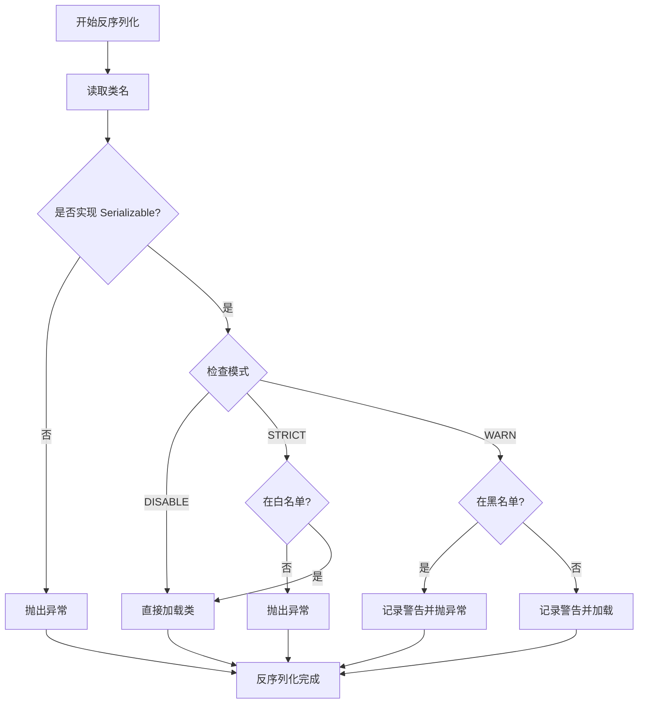

### 6.8 协议层集成

编码时通过 `getSerialization(channel.getUrl())` 获取 SPI，解码时通过协议头 flag 低 5 位的 ID 反查 Serialization：

```java
// dubbo-remoting-api/.../ExchangeCodec.java 编码请求
protected void encodeRequest(Channel channel, ChannelBuffer buffer, Request request) throws IOException {
    Serialization serialization = CodecSupport.getSerialization(channel.getUrl());
    byte proto = serialization.getContentTypeId();   // 序列化类型 ID
    byte flag = FLAG_REQUEST;
    if (request.isTwoWay()) flag |= FLAG_TWOWAY;
    if (request.isEvent()) flag |= FLAG_EVENT;
    buffer.writeByte(flag);                            // flag 包含序列化 ID
    // ...
    ObjectOutput out = serialization.serialize(channel.getUrl(), bos);
    out.writeObject(request.getData());
}

// 解码时
protected Object decodeBody(Channel channel, InputStream is, byte[] header) {
    byte flag = header[2], proto = (byte) (flag & SERIALIZATION_MASK);   // 取低 5 位
    Serialization s = CodecSupport.getSerialization(proto);              // 按 ID 查 SPI
    ObjectInput in = s.deserialize(channel.getUrl(), is);
    // ...
}
```

### 6.9 各序列化对比

| 序列化 | ID | 类型 | 优点 | 缺点 |
|--------|----|----|------|------|
| Hessian2 | 2 | 二进制 | 默认、跨语言、紧凑 | 比二进制专有序列慢 |
| Fastjson2 | 23 | JSON/JSONB | 高性能、可读性好 | 体积比二进制大 |
| Kryo | 8 | 二进制 | 高性能、紧凑 | Java 专用 |
| Protobuf | 22 | 二进制 | 跨语言、强类型 | 需 .proto 文件，主要用于 Triple |
| FST | 9 | 二进制 | 高性能 | Java 专用 |
| JDK | 7 | 二进制 | 兼容性好 | 体积大、性能低 |

---

## 七、注册中心机制

注册中心负责服务地址的注册与发现。Dubbo 把注册中心抽象为 `RegistryFactory` / `Registry` SPI，支持 Zookeeper、Nacos、Multicast、Redis 等多种实现。`RegistryProtocol` 把注册中心与具体协议桥接起来。

### 7.1 注册中心整体架构

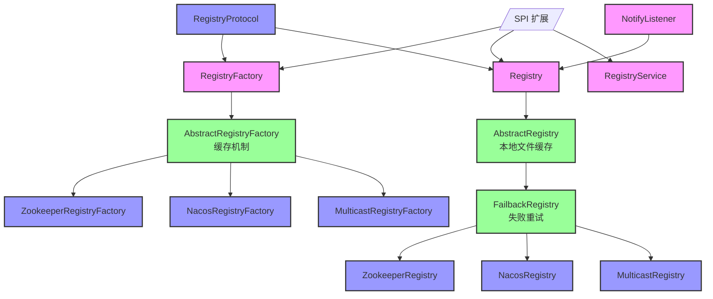

### 7.2 核心 SPI 接口

#### 7.2.1 RegistryFactory

```java
// dubbo-registry-api/.../RegistryFactory.java
@SPI(scope = APPLICATION)
public interface RegistryFactory {
    @Adaptive({PROTOCOL_KEY})
    Registry getRegistry(URL url);   // 按 URL.protocol 选 ZookeeperRegistryFactory 等
}
```

#### 7.2.2 Registry / RegistryService

```java
// dubbo-registry-api/.../RegistryService.java
public interface RegistryService {
    void register(URL url);
    void unregister(URL url);
    void subscribe(URL url, NotifyListener listener);
    void unsubscribe(URL url, NotifyListener listener);
    List<URL> lookup(URL url);
}

// dubbo-registry-api/.../Registry.java
public interface Registry extends Node, RegistryService {
    default int getDelay() { return 5000; }
    default boolean isServiceDiscovery() { return false; }
    default void reExportRegister(URL url) { register(url); }
    default void reExportUnregister(URL url) { unregister(url); }
}
```

### 7.3 注册中心数据模型

Dubbo 注册中心维护四类 URL，通过 `category` 参数区分：

| Category | 内容 | 写入方 |
|----------|------|--------|
| `providers` | 服务提供者 URL（含协议、IP、端口、参数） | Provider 启动时写入 |
| `consumers` | 服务消费者 URL | Consumer 启动时写入 |
| `routers` | 路由规则 URL | 治理端动态下发 |
| `configurators` | 配置覆盖规则 URL | 治理端动态下发 |

URL 示例：
```
dubbo://192.168.1.10:20880/com.example.UserService?version=1.0.0&category=providers&serialization=hessian2
```

### 7.4 AbstractRegistryFactory -- 注册中心缓存

```java
// dubbo-registry-api/.../support/AbstractRegistryFactory.java
public Registry getRegistry(URL url) {
    String key = createRegistryCacheKey(url);
    registryManager.getRegistryLock().lock();
    try {
        Registry registry = registryManager.getRegistry(key);
        if (registry != null) return registry;       // 缓存命中
        registry = createRegistry(url);              // SPI 子类创建
        if (registry != null) {
            registryManager.putRegistry(key, registry);
        }
    } finally {
        registryManager.getRegistryLock().unlock();
    }
    return registry;
}

protected abstract Registry createRegistry(URL url);
```

### 7.5 AbstractRegistry -- 本地文件缓存

`AbstractRegistry` 提供本地文件缓存能力，在注册中心不可用时仍能从本地恢复：

```java
protected AbstractRegistry(URL url) {
    setUrl(url);
    localCacheEnabled = url.getParameter(REGISTRY_LOCAL_FILE_CACHE_ENABLED, true);
    String filename = url.getParameter(FILE_KEY, defaultFilename);
    this.file = new File(filename);
    loadProperties();   // 启动时加载本地缓存
    registryCacheExecutor.schedule(
        () -> doSaveProperties(lastCacheChanged.incrementAndGet()),
        DEFAULT_INTERVAL_SAVE_PROPERTIES, TimeUnit.MILLISECONDS);
}

protected void notify(URL url, NotifyListener listener, List<URL> urls) {
    Map<String, List<URL>> result = new HashMap<>();
    for (URL u : urls) {
        String category = u.getCategory(DEFAULT_CATEGORY);
        result.computeIfAbsent(category, k -> new ArrayList<>()).add(u);
    }
    Map<String, List<URL>> categoryNotified = notified.computeIfAbsent(url, u -> new ConcurrentHashMap<>());
    for (Map.Entry<String, List<URL>> entry : result.entrySet()) {
        categoryNotified.put(entry.getKey(), entry.getValue());
        listener.notify(entry.getValue());
        saveProperties(url);   // 持久化到本地文件
    }
}
```

### 7.6 FailbackRegistry -- 失败重试

`FailbackRegistry` 用 Dubbo 时间轮（HashedWheelTimer）实现失败操作的异步重试：

```java
public FailbackRegistry(URL url) {
    super(url);
    this.retryPeriod = url.getParameter(REGISTRY_RETRY_PERIOD_KEY, DEFAULT_REGISTRY_RETRY_PERIOD);
    this.retryTimer = new HashedWheelTimer(
        new NamedThreadFactory("DubboRegistryRetryTimer", true), retryPeriod, TimeUnit.MILLISECONDS, 128);
}

@Override
public void register(URL url) {
    super.register(url);
    removeFailedRegistered(url);
    try {
        doRegister(url);
    } catch (Exception e) {
        if (check || skipFailback) throw new IllegalStateException("Failed to register " + url, e);
        addFailedRegistered(url);   // 加入失败重试队列
    }
}

private void addFailedRegistered(URL url) {
    FailedRegisteredTask newTask = new FailedRegisteredTask(url, this);
    failedRegistered.putIfAbsent(url, newTask);
    retryTimer.newTimeout(newTask, retryPeriod, TimeUnit.MILLISECONDS);
}
```

### 7.7 FailbackRegistry 重试流程图

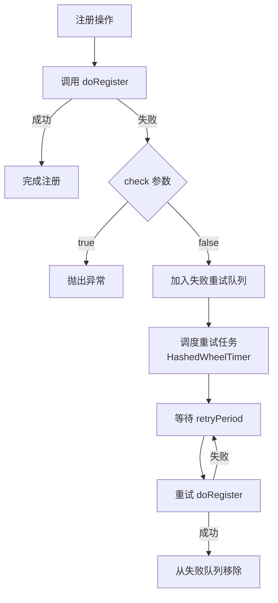

### 7.8 ZookeeperRegistry

#### 7.8.1 客户端与节点结构

```java
// dubbo-registry-zookeeper/.../ZookeeperRegistry.java
public ZookeeperRegistry(URL url, ZookeeperClientManager zookeeperClientManager) {
    super(url);
    this.root = group;
    this.zkClient = zookeeperClientManager.connect(url);
    this.zkClient.addStateListener((state) -> {
        if (state == StateListener.RECONNECTED) {
            fetchLatestAddresses();      // 重连后重新拉取地址
        } else if (state == StateListener.NEW_SESSION_CREATED) {
            recover();                    // 会话重建后恢复临时节点
        }
    });
}

@Override
public void doRegister(URL url) {
    zkClient.create(toUrlPath(url), url.getParameter(DYNAMIC_KEY, true), true);  // ephemeral 临时节点
}
```

ZK 节点结构：

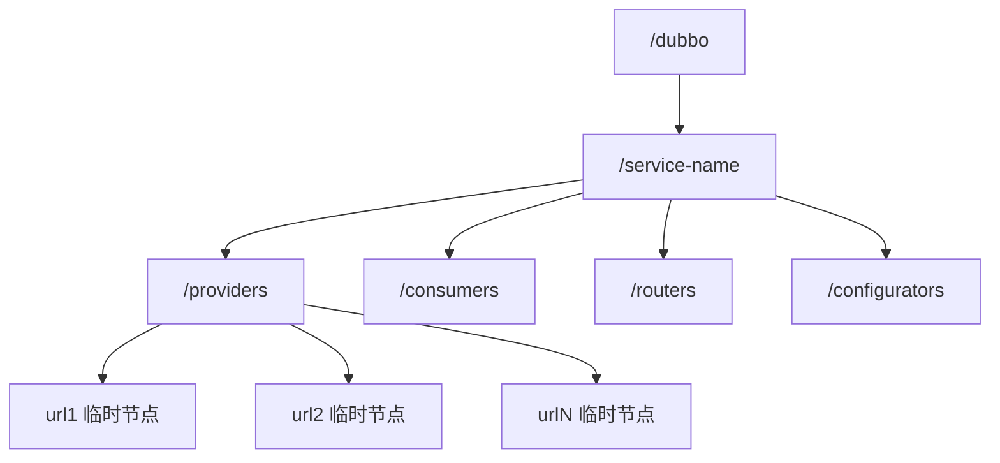

#### 7.8.2 订阅机制

```java
// ZookeeperRegistry.subscribe 核心
ChildListener zkListener = new RegistryChildListenerImpl(url, k, latch);
zkClient.addChildListener(path, zkListener);
// ZK 节点变化时触发 childChanged -> notify
```

- 使用 ZK 的 `ChildListener` 监听 `/dubbo/service/providers` 子节点变化。
- 节点变化触发 `childChanged`，最终调用 `NotifyListener.notify` 把新 URL 列表推给消费端。

### 7.9 RegistryProtocol -- 注册中心与协议的桥接

`RegistryProtocol` 是 RPC 协议与注册中心的集成层，在 `export` 和 `refer` 中协调两者。

#### 7.9.1 Provider 注册时序图

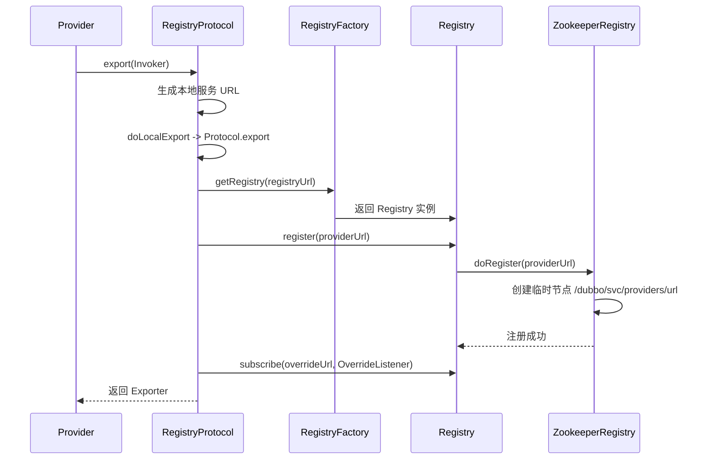

#### 7.9.2 Consumer 订阅时序图

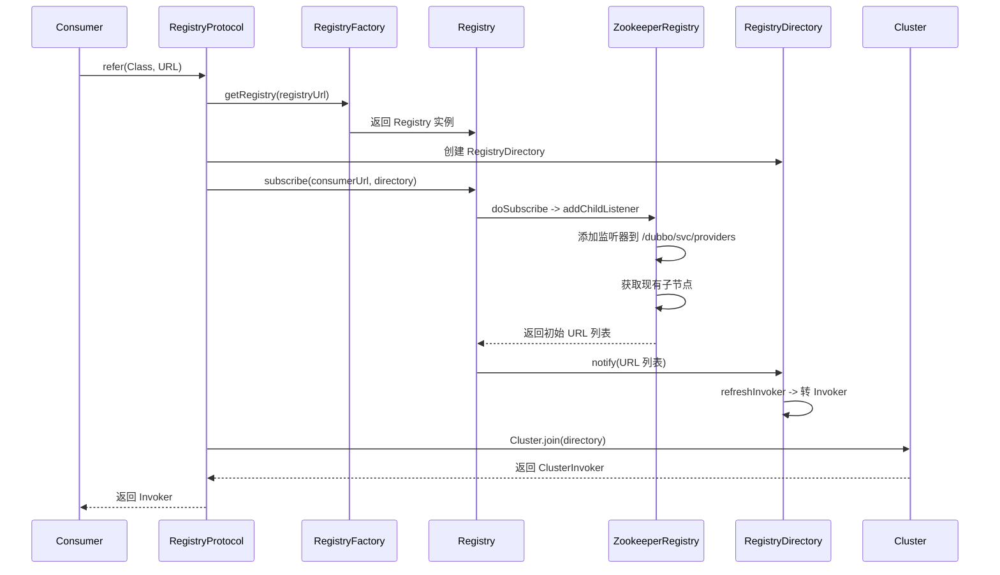

### 7.10 注册中心对比

| 特性 | Zookeeper | Nacos | Multicast |
|------|-----------|-------|-----------|
| 一致性模型 | CP（ZAB） | AP/CP 可选 | 无 |
| 节点存储 | 树形临时节点 | 实例 + 元数据 | UDP 广播 |
| 路由/配置 | 节点分类 | 配置服务 | 不支持 |
| 临时节点 | 会话失效自动删除 | 心跳保活 | N/A |
| 适用规模 | 中小规模 | 中大规模 | 开发测试 |

---

## 八、服务导出与引用流程

服务导出（export）和引用（refer）是 Dubbo 与业务代码的核心入口，由 `dubbo-config-api` 模块的 `ServiceConfig` / `ReferenceConfig` 完成，最终通过 `RegistryProtocol` 与具体 `Protocol` 协同工作。

### 8.1 配置体系

#### 8.1.1 核心配置类

| 配置类 | 职责 |
|--------|------|
| `ApplicationConfig` | 应用级配置（应用名、注册中心列表等） |
| `RegistryConfig` | 注册中心配置（地址、协议、用户名密码） |
| `ProtocolConfig` | 协议配置（dubbo、triple、端口、序列化） |
| `ServiceConfig` | 服务导出配置（接口、实现类、版本、分组） |
| `ReferenceConfig` | 服务引用配置（接口、版本、分组、检查） |
| `MethodConfig` | 方法级配置（重试次数、超时） |
| `DubboBootstrap` | 统一启动器，单例 |
| `ConfigManager` | 配置实例统一管理 |

#### 8.1.2 ScopeModel 作用域模型

Dubbo 3.x 引入三级作用域模型，使多应用、多模块共存成为可能：

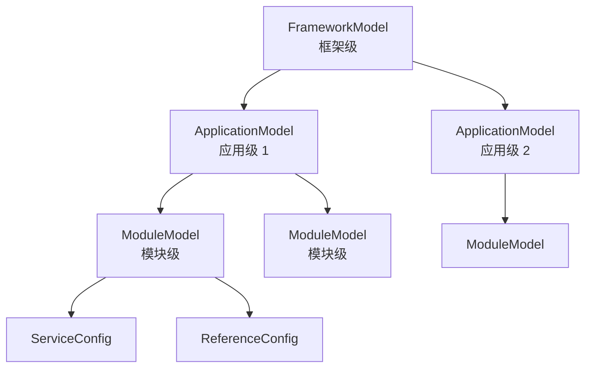

- **FrameworkModel**：框架级，所有扩展 SPI 的根。
- **ApplicationModel**：应用级，单 JVM 可同时运行多个 Dubbo 应用。
- **ModuleModel**：模块级，同一应用可分多模块隔离服务。

### 8.2 DubboBootstrap 启动流程

```java
// dubbo-config-api/.../bootstrap/DubboBootstrap.java
public class DubboBootstrap {
    private static final DubboBootstrap INSTANCE = new DubboBootstrap();

    public void start() {
        if (awaited.compareAndSet(false, true)) {
            initialize();    // 1. 初始化配置、注册中心、协议
            if (logger.isInfoEnabled()) logger.info(...);
        }
        // 2. 导出所有服务
        for (Exporter exporter : exportAsync()) { }
        // 3. 引用所有服务
        referAsync();
    }

    public void initialize() {
        initializeApplication();
        // 启动 ConfigManager、加载外部配置
        startConfigCenter();
        // 加载注册中心、元数据中心
        initFrameworkExts();
        // 启动各种扩展（监控、日志、指标）
    }
}
```

### 8.3 ServiceConfig.export() -- 服务导出流程

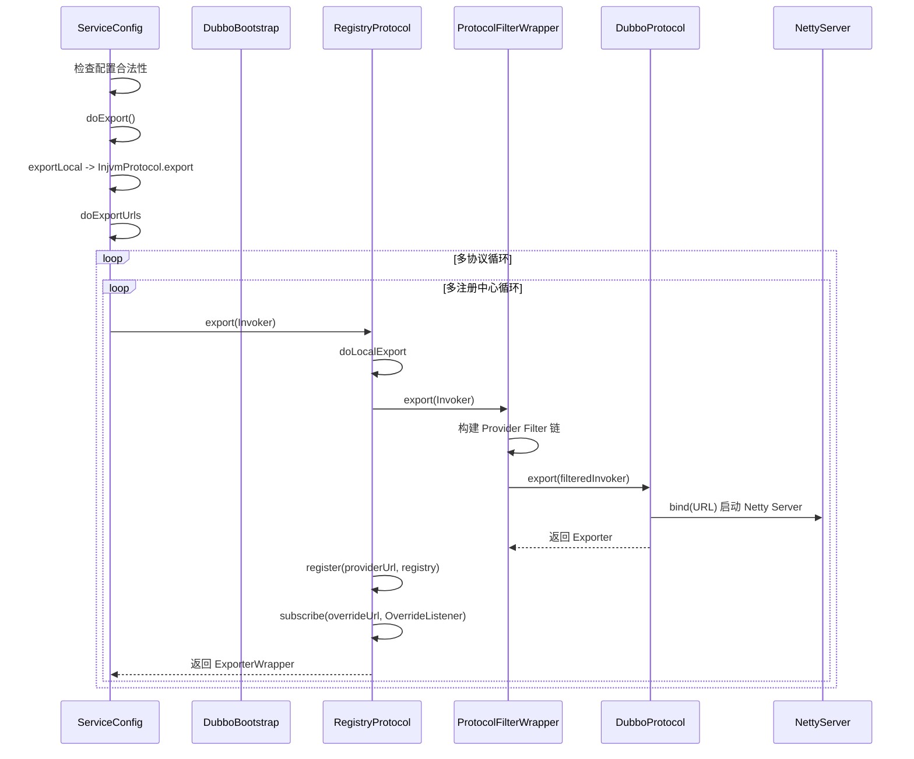

#### 8.3.1 多协议多注册中心导出

Dubbo 支持一个服务同时通过多个协议暴露、注册到多个注册中心：

```java
private void doExportUrls() {
    List<RegistryConfig> registries = loadRegistries(true);
    List<ProtocolConfig> protocols = loadProtocols();
    for (ProtocolConfig protocol : protocols) {
        for (RegistryConfig registry : registries) {
            doExportUrlsForProtocolAndRegistry(protocol, registry);
        }
    }
}
```

#### 8.3.2 本地导出 InjvmProtocol

```java
private void exportLocal() {
    if (shouldExportLocal()) {
        InjvmProtocol protocol = InjvmProtocol.getInjvmProtocol();
        Exporter<?> exporter = protocol.export(getInvoker());
        localExporters.add(exporter);
    }
}
```

同 JVM 内的调用直接走 InjvmProtocol，零网络开销。

#### 8.3.3 Invoker 包装链

```mermaid
graph LR
    A[业务实现 Service Bean] -->|ProxyFactory.getInvoker| B[AbstractProxyInvoker]
    B -->|ProtocolFilterWrapper| C[Provider Filter 链包装]
    C -->|RegistryProtocol.doLocalExport| D[DubboProtocol.export]
    D -->|启动 NettyServer| E[Exporter]
    style A fill:#f9f,stroke:#333,stroke-width:2px
    style E fill:#9f9,stroke:#333,stroke-width:2px
```

### 8.4 ReferenceConfig.get() -- 服务引用流程

```mermaid
sequenceDiagram
    participant U as 用户
    participant RC as ReferenceConfig
    participant RP as RegistryProtocol
    participant CL as Cluster
    participant PFW as ProtocolFilterWrapper
    participant DUB as DubboProtocol
    participant PF as ProxyFactory

    U->>RC: get()
    RC->>RC: 检查缓存
    alt 缓存不存在
        RC->>RC: createProxy
        loop 多注册中心循环
            RC->>RP: refer(type, url)
            RP->>RP: getRegistry + subscribe
            RP->>RP: 创建 RegistryDirectory
            RP->>RP: subscribe -> registry.notify
            RP->>CL: Cluster.join(directory)
            CL-->>RP: 返回 ClusterInvoker
        end
        RC->>PF: getProxy(invoker)
        PF-->>RC: 动态代理
        RC->>RC: 缓存代理
    end
    RC-->>U: 返回代理
```

#### 8.4.1 Consumer 启动链路（Spring 集成）

```mermaid
sequenceDiagram
    participant SC as Spring 容器
    participant RABPP as ReferenceAnnotationBeanPostProcessor
    participant RC as ReferenceConfig
    participant RP as RegistryProtocol
    participant CL as Cluster
    participant PF as ProxyFactory

    SC->>RABPP: postProcessPropertyValues
    RABPP->>RC: get()
    RC->>RP: refer
    RP->>RP: subscribe providers
    RP->>CL: Cluster.join
    CL-->>RP: ClusterInvoker
    RP-->>RC: Invoker
    RC->>PF: getProxy
    PF-->>RC: 动态代理
    RC-->>SC: 注入到字段
    SC-->>U: 用户拿到代理对象
```

#### 8.4.2 消费端 Invoker 包装链

从 `RegistryProtocol.refer` 到最终可调用的代理，Invoker 经过多层包装：

```mermaid
graph LR
    R[RegistryProtocol.refer] --> J[Cluster.join]
    J --> MCW[MockClusterWrapper<br/>服务降级]
    MCW --> RAC[RegistryAwareCluster<br/>多注册中心感知]
    RAC --> CI[具体 ClusterInvoker<br/>如 FailoverClusterInvoker]
    CI --> DI[DubboInvoker<br/>真实远程调用]
    DI --> PFW2[Consumer Filter 链]
    PFW2 --> PF[ProxyFactory.getProxy]
    PF --> U[业务代理对象]
    style U fill:#f9f,stroke:#333,stroke-width:2px
```

### 8.5 RegistryProtocol 核心

`RegistryProtocol` 把"协议暴露/引用"和"注册中心注册/订阅"两个动作串联起来，是 Provider 和 Consumer 启动的核心协调器。

#### 8.5.1 export 实现

```java
// dubbo-registry-api/.../integration/RegistryProtocol.java
public <T> Exporter<T> export(final Invoker<T> originInvoker) throws RpcException {
    URL registryUrl = getRegistryUrl(originInvoker);
    URL providerUrl = getProviderUrl(originInvoker);
    final Registry registry = getRegistry(registryUrl);
    final URL registeredProviderUrl = customizeURL(providerUrl, registryUrl);
    // 1. 本地暴露（启动 Netty Server）
    final ExporterChangeableWrapper<T> exporter = doLocalExport(originInvoker, providerUrl);
    // 2. 注册到注册中心
    register(registry, registeredProviderUrl);
    // 3. 订阅 override 配置变更
    final URL overrideSubscribeUrl = getSubscribedOverrideUrl(providerUrl);
    final OverrideListener overrideSubscribeListener = new OverrideListener(overrideSubscribeUrl, originInvoker);
    registry.subscribe(overrideSubscribeUrl, overrideSubscribeListener);
    return new OverrideExporter<>(exporter, originInvoker);
}
```

#### 8.5.2 refer 实现

```java
public <T> Invoker<T> refer(Class<T> type, URL url) throws RpcException {
    URL registryUrl = getRegistryUrl(url);
    Registry registry = getRegistry(registryUrl);
    URL consumerUrl = url.addParameter(SIDE_KEY, CONSUMER);
    // 创建 RegistryDirectory
    RegistryDirectory<T> directory = new RegistryDirectory<>(type, consumerUrl);
    directory.setRegistry(registry);
    directory.setProtocol(protocol);
    // 订阅 providers + routers + configurators
    registry.subscribe(consumerUrl, directory);
    // 集群 join：把多个 Invoker 包装为 ClusterInvoker
    Cluster cluster = getCluster(url);
    Invoker<T> invoker = cluster.join(directory, true);
    return invoker;
}
```

---

## 九、集群容错与负载均衡

集群层位于 `dubbo-cluster` 模块，负责将注册中心返回的多个 Provider Invoker 组织成一个可容错的逻辑 Invoker。核心组件：Cluster（容错策略）、Directory（服务目录）、Router（路由链）、LoadBalance（负载均衡）。

### 9.1 集群层整体架构

```mermaid
graph TD
    Consumer[消费端代理] --> ClusterInvoker[ClusterInvoker]

    subgraph 集群层核心
    ClusterInvoker --> ACI[AbstractClusterInvoker]
    ACI --> FailoverCI[FailoverClusterInvoker<br/>默认失败重试]
    ACI --> FailfastCI[FailfastClusterInvoker]
    ACI --> FailsafeCI[FailsafeClusterInvoker]
    ACI --> FailbackCI[FailbackClusterInvoker]
    ACI --> ForkingCI[ForkingClusterInvoker]
    ACI --> BroadcastCI[BroadcastClusterInvoker]
    ACI --> MergeableCI[MergeableClusterInvoker]
    ACI --> ZoneAwareCI[ZoneAwareClusterInvoker]
    end

    ACI --> Directory[Directory]
    ACI --> LoadBalance[LoadBalance]

    Directory --> StaticDir[StaticDirectory]
    Directory --> RegistryDir[RegistryDirectory]

    Directory --> RouterChain[RouterChain]
    RouterChain --> CondRouter[ConditionRouter]
    RouterChain --> TagRouter[TagRouter]

    LoadBalance --> ALB[AbstractLoadBalance]
    ALB --> RandomLB[RandomLoadBalance<br/>默认]
    ALB --> RoundRobinLB[RoundRobinLoadBalance]
    ALB --> LeastActiveLB[LeastActiveLoadBalance]
    ALB --> ConsistentHashLB[ConsistentHashLoadBalance]
    ALB --> ShortestRespLB[ShortestResponseLoadBalance]
```

### 9.2 核心 SPI 接口

#### 9.2.1 Cluster

```java
// dubbo-cluster/.../Cluster.java
@SPI(Cluster.DEFAULT)
public interface Cluster {
    String DEFAULT = "failover";

    @Adaptive
    <T> Invoker<T> join(Directory<T> directory, boolean buildFilterChain) throws RpcException;
}
```

#### 9.2.2 Directory

```java
public interface Directory<T> extends Node {
    Class<T> getInterface();
    List<Invoker<T>> list(Invocation invocation) throws RpcException;   // 列出可用 Invoker
    List<Invoker<T>> getAllInvokers();
    URL getConsumerUrl();
    boolean isDestroyed();
}
```

#### 9.2.3 Router / RouterChain

```java
@SPI
public interface Router extends Comparable<Router> {
    <T> List<Invoker<T>> route(List<Invoker<T>> invokers, URL url, Invocation invocation) throws RpcException;
    URL getUrl();
    boolean isForce();
    boolean isRuntime();
}

public class RouterChain<T> {
    private final List<Router> routers = new CopyOnWriteArrayList<>();

    public List<Invoker<T>> route(List<Invoker<T>> invokers, URL url, Invocation invocation) {
        List<Invoker<T>> result = invokers;
        for (Router router : routers) {
            result = router.route(result, url, invocation);
            if (CollectionUtils.isEmpty(result)) break;
        }
        return result;
    }
}
```

#### 9.2.4 LoadBalance

```java
@SPI
public interface LoadBalance {
    <T> Invoker<T> select(List<Invoker<T>> invokers, URL url, Invocation invocation) throws RpcException;
}
```

### 9.3 容错策略对比

| 策略 | 实现类 | 适用场景 | 行为 |
|------|--------|---------|------|
| **失败重试** | FailoverClusterInvoker | 默认，幂等接口 | 失败切换服务器重试，默认 2 次 |
| 快速失败 | FailfastClusterInvoker | 非幂等操作 | 立即抛异常，不重试 |
| 失败忽略 | FailsafeClusterInvoker | 日志、监控 | 忽略异常返回空结果 |
| 后台重试 | FailbackClusterInvoker | 消息通知 | 失败放入时间轮后台重试 |
| 并行调用 | ForkingClusterInvoker | 实时性高 | 并行调用 N 个，一个成功即返回 |
| 广播调用 | BroadcastClusterInvoker | 缓存刷新 | 调用所有提供者 |
| 结果合并 | MergeableClusterInvoker | 多源聚合 | 调用多个并合并结果 |
| 可用检查 | AvailableClusterInvoker | 快速过滤 | 遍历直到找到可用节点 |
| 区域感知 | ZoneAwareClusterInvoker | 多区域部署 | 优先同区域 |
| 服务降级 | MockClusterInvoker | mock / 降级 | 调用本地 Mock 实现 |

### 9.4 FailoverClusterInvoker -- 默认容错策略源码

```java
// dubbo-cluster/.../support/FailoverClusterInvoker.java
@Override
public Result doInvoke(Invocation invocation, final List<Invoker<T>> invokers, LoadBalance loadbalance) throws RpcException {
    List<Invoker<T>> copyInvokers = invokers;
    String methodName = RpcUtils.getMethodName(invocation);
    int len = calculateInvokeTimes(methodName);   // 计算重试次数（默认 3 次）
    RpcException le = null;
    List<Invoker<T>> invoked = new ArrayList<>(copyInvokers.size());
    Set<String> providers = new HashSet<>(len);

    for (int i = 0; i < len; i++) {
        if (i > 0) {                           // 重试前重新拉取最新 Invoker 列表
            checkWhetherDestroyed();
            copyInvokers = list(invocation);
            checkInvokers(copyInvokers, invocation);
        }
        Invoker<T> invoker = select(loadbalance, invocation, copyInvokers, invoked);  // 负载均衡选择
        invoked.add(invoker);
        RpcContext.getServiceContext().setInvokers((List) invoked);
        boolean success = false;
        try {
            Result result = invokeWithContext(invoker, invocation);
            success = true;
            return result;
        } catch (RpcException e) {
            if (e.isBiz()) throw e;            // 业务异常不重试
            le = e;                            // 系统异常记录后继续重试
        } catch (Throwable e) {
            le = new RpcException(e.getMessage(), e);
        } finally {
            if (!success) providers.add(invoker.getUrl().getAddress());
        }
    }
    throw new RpcException("Failed to invoke method " + methodName + ", providers: " + providers, le);
}

private int calculateInvokeTimes(String methodName) {
    int len = getUrl().getMethodParameter(methodName, RETRIES_KEY, DEFAULT_RETRIES) + 1;  // 默认 2+1=3
    RpcContext rpcContext = RpcContext.getClientAttachment();
    Object retry = rpcContext.getObjectAttachment(RETRIES_KEY);
    if (retry instanceof Number) {
        len = ((Number) retry).intValue() + 1;
        rpcContext.removeAttachment(RETRIES_KEY);
    }
    return Math.max(len, 1);
}
```

**核心要点**：
- 重试次数从 URL 的 `retries` 参数读取（方法级配置），默认 2 次，加上首次共 3 次。
- 业务异常（`isBiz()`）立即抛出，不重试；网络异常等系统异常才重试。
- 重试前重新调用 `list(invocation)` 拉取最新 Invoker 列表，适应服务动态变化。
- `select` 排除已调用过的 Invoker，避免重复调用同一失败节点。

### 9.5 Failover 调用时序图

```mermaid
sequenceDiagram
    participant C as Consumer
    participant CI as FailoverClusterInvoker
    participant D as Directory
    participant RC as RouterChain
    participant LB as LoadBalance
    participant DI as DubboInvoker

    C->>CI: invoke
    CI->>CI: calculateInvokeTimes 重试次数=3
    loop 重试循环
        CI->>D: list(invocation)
        D->>RC: route(invokers, url, inv)
        RC-->>D: 过滤后 invokers
        D-->>CI: invokers 列表
        CI->>LB: select(invokers, url, inv, invoked)
        LB-->>CI: 选中的 Invoker
        CI->>DI: invokeWithContext
        alt 业务异常
            DI-->>CI: RpcException (isBiz=true)
            CI-->>C: 抛出异常
        else 网络异常
            DI-->>CI: RpcException (isBiz=false)
            CI->>CI: 记录异常，继续循环
        else 成功
            DI-->>CI: Result
            CI-->>C: 返回 Result
        end
    end
```

### 9.6 RegistryDirectory -- 动态服务目录

`RegistryDirectory` 是消费端基于注册中心的动态服务目录，通过 `notify` 接收注册中心推送并刷新 Invoker 列表。

```java
// dubbo-registry-api/.../integration/RegistryDirectory.java
@Override
public synchronized void notify(List<URL> urls) {
    // 按类别分类
    Map<String, List<URL>> categoryUrls = urls.stream()
        .filter(Objects::nonNull)
        .filter(this::isValidCategory)
        .filter(this::isNotCompatibleFor26x)
        .collect(Collectors.groupingBy(this::judgeCategory));

    // 处理 configurators
    List<URL> configuratorURLs = categoryUrls.getOrDefault(CONFIGURATORS_CATEGORY, emptyList());
    this.configurators = Configurator.toConfigurators(configuratorURLs).orElse(this.configurators);

    // 处理 routers
    List<URL> routerURLs = categoryUrls.getOrDefault(ROUTERS_CATEGORY, emptyList());
    toRouters(routerURLs).ifPresent(this::addRouters);

    // 处理 providers
    List<URL> providerURLs = categoryUrls.getOrDefault(PROVIDERS_CATEGORY, emptyList());
    refreshOverrideAndInvoker(providerURLs);
}

private void refreshInvoker(List<URL> invokerUrls) {
    if (invokerUrls.size() == 1 && EMPTY_PROTOCOL.equals(invokerUrls.get(0).getProtocol())) {
        this.forbidden = true;
        destroyAllInvokers();   // 注册中心通知为空，销毁所有 Invoker
        return;
    }
    this.forbidden = false;
    Map<URL, Invoker<T>> newUrlInvokerMap = toInvokers(oldUrlInvokerMap, invokerUrls);
    List<Invoker<T>> newInvokers = Collections.unmodifiableList(new ArrayList<>(newUrlInvokerMap.values()));
    refreshRouter(new BitList<>(newInvokers).clone(), () -> this.setInvokers(new BitList<>(newInvokers)));
    destroyUnusedInvokers(oldUrlInvokerMap, newUrlInvokerMap);  // 销毁失效 Invoker
}

private Map<URL, Invoker<T>> toInvokers(Map<URL, Invoker<T>> oldUrlInvokerMap, List<URL> urls) {
    for (URL providerUrl : urls) {
        URL url = mergeUrl(providerUrl);
        Invoker<T> invoker = oldUrlInvokerMap.remove(url);
        if (invoker == null) {
            invoker = protocol.refer(serviceType, url);   // 新增 Invoker
        }
        newUrlInvokerMap.put(url, invoker);
    }
    return newUrlInvokerMap;
}
```

**核心要点**：
- `notify` 接收注册中心推送的四类 URL，分类处理。
- `refreshInvoker` 把新 URL 转 Invoker，复用旧的、销毁失效的。
- `toInvokers` 内部调用 `protocol.refer` 创建新 Invoker（DubboProtocol.refer -> DubboInvoker）。

### 9.7 路由链执行流程

```mermaid
sequenceDiagram
    participant ACI as AbstractClusterInvoker
    participant Dir as Directory
    participant RC as RouterChain
    participant CR as ConditionRouter
    participant TR as TagRouter
    participant AppR as AppRouter

    ACI->>Dir: list(invocation)
    Dir->>Dir: 获取当前 invokers
    Dir->>RC: route(invokers, url, inv)
    RC->>CR: route
    CR-->>RC: 过滤后列表 1
    RC->>TR: route(列表 1)
    TR-->>RC: 过滤后列表 2
    RC->>AppR: route(列表 2)
    AppR-->>RC: 最终列表
    RC-->>Dir: 返回
    Dir-->>ACI: 可用 invokers
```

### 9.8 LoadBalance 负载均衡实现

#### 9.8.1 抽象基类

```java
public abstract class AbstractLoadBalance implements LoadBalance {
    @Override
    public <T> Invoker<T> select(List<Invoker<T>> invokers, URL url, Invocation invocation) {
        if (CollectionUtils.isEmpty(invokers)) throw new RpcException("No provider available");
        if (invokers.size() == 1) return invokers.get(0);   // 只有一个直接返回
        return doSelect(invokers, url, invocation);
    }

    protected abstract <T> Invoker<T> doSelect(List<Invoker<T>> invokers, URL url, Invocation invocation);

    protected int getWeight(Invoker<?> invoker, Invocation invocation) {
        int weight = invoker.getUrl().getMethodParameter(..., WEIGHT_KEY, DEFAULT_WEIGHT);
        if (weight > 0) {
            long timestamp = invoker.getUrl().getParameter(TIMESTAMP_KEY, 0L);
            if (timestamp > 0L) {
                long uptime = System.currentTimeMillis() - timestamp;
                int warmup = invoker.getUrl().getParameter(WARMUP_KEY, DEFAULT_WARMUP);
                if (uptime > 0 && uptime < warmup) {
                    weight = calculateWarmUpWeight((int) uptime, weight, warmup);  // 预热期权重衰减
                }
            }
        }
        return Math.max(weight, 0);
    }
}
```

**预热机制**：服务刚启动时（uptime < warmup，默认 10 分钟），权重按 `uptime / warmup` 比例衰减，避免新启动节点被流量压垮。

#### 9.8.2 RandomLoadBalance（默认加权随机）

```java
protected <T> Invoker<T> doSelect(List<Invoker<T>> invokers, URL url, Invocation invocation) {
    int length = invokers.size();
    if (!needWeightLoadBalance(invokers, invocation)) {
        return invokers.get(ThreadLocalRandom.current().nextInt(length));   // 无权重直接随机
    }

    boolean sameWeight = true;
    int[] weights = new int[length];
    int totalWeight = 0;
    for (int i = 0; i < length; i++) {
        int weight = getWeight(invokers.get(i), invocation);
        totalWeight += weight;
        weights[i] = totalWeight;    // 累加权重
        if (sameWeight && totalWeight != weight * (i + 1)) sameWeight = false;
    }

    if (totalWeight > 0 && !sameWeight) {
        int offset = ThreadLocalRandom.current().nextInt(totalWeight);
        // 二分查找第一个 weights[i] > offset 的位置
        int i = Arrays.binarySearch(weights, offset);
        if (i < 0) i = -i - 1;
        else while (weights[i + 1] == offset) i++;
        return invokers.get(i);
    }
    return invokers.get(ThreadLocalRandom.current().nextInt(length));
}
```

**算法**：
1. 计算每个 Invoker 的累计权重 `[w1, w1+w2, w1+w2+w3, ...]`。
2. 在 `[0, totalWeight)` 范围内生成随机数 `offset`。
3. 二分查找第一个累计权重 > offset 的位置。
4. 全部权重相同时直接随机。

#### 9.8.3 各负载均衡算法

| 算法 | 实现类 | 原理 |
|------|--------|------|
| 加权随机 | RandomLoadBalance | 默认，按权重比例随机 |
| 加权轮询 | RoundRobinLoadBalance | 平滑加权轮询 |
| 最少活跃数 | LeastActiveLoadBalance | 选 active 最小者 |
| 一致性哈希 | ConsistentHashLoadBalance | 同一参数路由到同一节点 |
| 最短响应 | ShortestResponseLoadBalance | 选最近响应时间最短者 |
| P2C | P2CLoadBalance | Power of Two Choice，随机抽 2 个选更优 |

### 9.9 ClusterInvoker 包装链

从 `RegistryProtocol.refer` 到最终 ClusterInvoker，Invoker 经过多层包装：

```mermaid
sequenceDiagram
    participant RP as RegistryProtocol
    participant CL as Cluster.join
    participant MCW as MockClusterWrapper
    participant RAC as RegistryAwareCluster
    participant ACI as AbstractClusterInvoker
    participant Dir as Directory

    RP->>CL: join(directory)
    CL->>MCW: 包装 MockClusterInvoker
    MCW->>RAC: 包装 RegistryAwareClusterInvoker
    RAC->>ACI: 创建具体 FailoverClusterInvoker
    ACI->>Dir: 引用 directory
```

**包装层职责**：
- `MockClusterWrapper`：最外层，提供 Mock 降级。
- `RegistryAwareCluster`：多注册中心场景下选注册中心。
- 具体 `ClusterInvoker`（Failover 等）：核心容错策略。

---

## 十、Injvm 协议与协议对比

### 10.1 InjvmProtocol 定位

`InjvmProtocol`（`dubbo-rpc-injvm`）是 Dubbo 内置的本地调用协议，所有调用在 JVM 进程内完成，**零网络、零序列化、零 Filter 链**，是性能最优的调用方式。

### 10.2 InjvmProtocol.export

```java
// dubbo-rpc-injvm/.../InjvmProtocol.java
@Override
public <T> Exporter<T> export(Invoker<T> invoker) throws RpcException {
    return new InjvmExporter<>(invoker, invoker.getUrl().getServiceKey(), exporterMap);
}

// InjvmExporter 构造时直接 put 到 exporterMap
InjvmExporter(Invoker<T> invoker, String key, Map<String, Exporter<?>> exporterMap) {
    super(invoker);
    this.key = key;
    this.exporterMap = exporterMap;
    exporterMap.put(key, this);   // 内存注册表
}

@Override
public void afterUnExport() {
    exporterMap.remove(key);
}
```

### 10.3 InjvmInvoker -- 本地直调

```java
// dubbo-rpc-injvm/.../InjvmInvoker.java
@Override
protected Result doInvoke(Invocation invocation) throws Throwable {
    Exporter<?> exporter = InjvmProtocol.getExporter(exporterMap, getUrl());
    if (exporter == null) {
        throw new RpcException("Service not found: " + getUrl().getServiceKey());
    }
    Invoker<?> invoker = exporter.getInvoker();
    // 可选的参数深拷贝（解决跨类加载器问题）
    Invocation copiedInvocation = recreateInvocation(invocation, invoker, desc);
    return invoker.invoke(copiedInvocation);   // 直接调用，无网络
}
```

### 10.4 isInjvmRefer -- 自动本地调用判断

```java
public boolean isInjvmRefer(URL url) {
    String scope = url.getParameter(SCOPE_KEY);
    if (SCOPE_LOCAL.equals(scope) || url.getParameter(LOCAL_PROTOCOL, false)) {
        return true;       // 显式声明本地
    } else if (SCOPE_REMOTE.equals(scope)) {
        return false;      // 显式声明远程
    } else if (url.getParameter(GENERIC_KEY, false)) {
        return false;      // 泛化调用不本地
    } else if (getExporter(exporterMap, url) != null) {
        if (BROADCAST_CLUSTER.equalsIgnoreCase(url.getParameter(CLUSTER_KEY))) return false;
        return true;       // 同 JVM 已有导出，自动本地
    } else {
        return false;
    }
}
```

### 10.5 Injvm 调用时序图

```mermaid
sequenceDiagram
    participant C as Consumer
    participant CI as Consumer Invoker
    participant II as InjvmInvoker
    participant EM as exporterMap
    participant IE as InjvmExporter
    participant SI as Service Invoker
    participant P as Provider 实现

    C->>CI: 调用方法
    CI->>II: invoke(invocation)
    II->>EM: 按 serviceKey 查找
    EM-->>II: 返回 InjvmExporter
    II->>IE: 获取 Invoker
    IE->>SI: 直接调用
    SI->>P: 反射调用业务方法
    P-->>SI: 返回结果
    SI-->>II: 返回 Result
    II-->>CI: 返回
```

### 10.6 三大协议对比

```mermaid
graph TD
    A[Dubbo 协议<br/>dubbo-rpc-dubbo] -->|传输| B[TCP + 自定义二进制协议]
    A -->|序列化| C[Hessian2/Fastjson2 等]
    A -->|Filter| D[完整 Filter 链]

    E[Triple 协议<br/>dubbo-rpc-triple] -->|传输| F[HTTP/2 + gRPC 帧]
    E -->|序列化| G[Protobuf 为主]
    E -->|Filter| H[完整 Filter 链]
    E -->|多语言| I[支持 Go/Python/Node 等]

    J[Injvm 协议<br/>dubbo-rpc-injvm] -->|传输| K[无网络]
    J -->|序列化| L[可选深拷贝]
    J -->|Filter| M[部分 Filter]
    J -->|场景| N[同 JVM 调用]
```

| 特性 | Dubbo（TCP） | Triple（HTTP/2） | Injvm（本地） |
|------|--------------|------------------|--------------|
| 传输 | TCP/IP 长连接 | HTTP/2 多路复用 | JVM 内存 |
| 协议头 | 16 字节自定义 | HTTP/2 标准 + gRPC 帧 | 无 |
| 默认序列化 | Hessian2 | Protobuf | 可选深拷贝 |
| 调用模式 | 同步/异步 | Unary/Server-Stream/Client-Stream/Bidi-Stream | 同步 |
| 多语言支持 | 有限 | 全面 | 仅 Java |
| 心跳机制 | 自定义心跳 | HTTP/2 PING | 无 |
| 适用场景 | 兼容老版本、传统 RPC | 云原生、跨语言 | 同 JVM 优化 |
| 性能 | 高 | 较高（gRPC 同级） | 极高（无 IO） |

---

## 十一、端到端调用全链路

### 11.1 Provider 启动全链路

```mermaid
sequenceDiagram
    participant S as Spring 容器
    participant DB as DubboBootstrap
    participant SC as ServiceConfig
    participant RP as RegistryProtocol
    participant PFW as ProtocolFilterWrapper
    participant DUB as DubboProtocol
    participant EX as Exchangers
    participant TPS as Transporters
    participant NS as NettyServer
    participant R as Registry
    participant ZK as Zookeeper

    S->>DB: start
    DB->>DB: initialize 配置加载
    DB->>SC: export
    SC->>SC: 检查 + doExport
    SC->>SC: exportLocal InjvmProtocol
    SC->>RP: export(Invoker)
    RP->>RP: doLocalExport
    RP->>PFW: export
    PFW->>PFW: 构建 Provider Filter 链
    PFW->>DUB: export(filteredInvoker)
    DUB->>EX: bind(URL, requestHandler)
    EX->>TPS: bind
    TPS->>NS: NettyTransporter.bind
    NS->>NS: 启动 Netty Boss/Worker
    NS-->>DUB: 返回 RemotingServer
    DUB->>DUB: 包装 HeaderExchangeServer
    DUB-->>PFW: 返回 Exporter
    RP->>R: register(providerUrl)
    R->>ZK: doRegister 创建临时节点
    RP->>R: subscribe(overrideUrl)
    RP-->>SC: 返回 ExporterWrapper
```

### 11.2 Consumer 启动全链路

```mermaid
sequenceDiagram
    participant S as Spring
    participant RABPP as ReferenceAnnotationBeanPostProcessor
    participant RC as ReferenceConfig
    participant RP as RegistryProtocol
    participant R as Registry
    participant ZK as Zookeeper
    participant RD as RegistryDirectory
    participant CL as Cluster
    participant MCW as MockClusterWrapper
    participant ACI as AbstractClusterInvoker
    participant PFW as ProtocolFilterWrapper
    participant DUB as DubboProtocol
    participant EX as Exchangers
    participant NC as NettyClient
    participant PF as ProxyFactory

    S->>RABPP: 注入字段
    RABPP->>RC: get
    RC->>RC: createProxy
    RC->>RP: refer(type, url)
    RP->>R: getRegistry
    RP->>RD: 创建 RegistryDirectory
    RP->>R: subscribe(consumerUrl, directory)
    R->>ZK: addChildListener(/dubbo/svc/providers)
    ZK-->>R: 返回当前子节点
    R->>RD: notify(URL 列表)
    RD->>RD: refreshInvoker -> toInvokers
    loop 每个 providerUrl
        RD->>PFW: protocol.refer(type, url)
        PFW->>PFW: 构建 Consumer Filter 链
        PFW->>DUB: refer
        DUB->>EX: connect(URL, handler)
        EX->>NC: NettyTransporter.connect
        NC->>NC: 建立 TCP 连接
        NC-->>DUB: 返回 ExchangeClient
        DUB-->>PFW: 返回 DubboInvoker
    end
    RD-->>RP: directory 就绪
    RP->>CL: Cluster.join(directory)
    CL->>MCW: 包装 Mock
    MCW->>ACI: 创建 FailoverClusterInvoker
    ACI-->>RP: 返回 ClusterInvoker
    RP-->>RC: Invoker
    RC->>PF: getProxy(invoker)
    PF-->>RC: Javassist 动态代理
    RC-->>S: 注入字段
```

### 11.3 一次 RPC 调用全链路

```mermaid
sequenceDiagram
    participant U as 业务代码
    participant P as 代理对象
    participant F1 as Consumer Filter 链
    participant CI as FailoverClusterInvoker
    participant LB as RandomLoadBalance
    participant DI as DubboInvoker
    participant CC as ExchangeClient
    participant DF as DefaultFuture
    participant NC as NettyClient
    participant NW as 网络
    participant NS as NettyServer
    participant HEH as HeaderExchangeHandler
    participant F2 as Provider Filter 链
    participant PI as ProxyInvoker
    participant BIZ as 业务实现

    U->>P: proxy.sayHello("world")
    P->>F1: invoke(RpcInvocation)
    F1->>CI: invoke
    CI->>CI: list(invocation) 获取可用 Invoker
    CI->>LB: select(invokers)
    LB-->>CI: 选中 Invoker
    CI->>DI: invokeWithContext
    DI->>CC: request(invocation, timeout)
    CC->>CC: 创建 Request，分配 id
    CC->>DF: newFuture(channel, request, timeout)
    DF->>DF: FUTURES.put(id, future)
    CC->>NC: channel.send(request)
    NC->>NW: TCP 发送字节流
    NW->>NS: 数据到达
    NS->>NS: Netty Codec 解码
    NS->>HEH: received(Request)
    HEH->>HEH: handler.reply
    HEH->>F2: 触发 Provider Filter 链
    F2->>PI: invoke(invocation)
    PI->>BIZ: 反射调用业务方法
    BIZ-->>PI: 返回结果
    PI-->>F2: Result
    F2-->>HEH: Result
    HEH->>NS: channel.send(Response)
    NS->>NW: TCP 发送响应
    NW->>NC: 响应到达
    NC->>NC: 解码 Response
    NC->>DF: DefaultFuture.received(channel, response)
    DF->>DF: FUTURES.remove(id) + complete future
    DF-->>CC: 触发回调
    CC-->>DI: 返回 Result
    DI-->>CI: Result
    CI-->>F1: Result
    F1-->>P: Result
    P-->>U: 返回业务结果
```

### 11.4 异常容错场景

```mermaid
sequenceDiagram
    participant U as 业务
    participant CI as FailoverClusterInvoker
    participant DI1 as DubboInvoker-1
    participant DI2 as DubboInvoker-2
    participant DI3 as DubboInvoker-3

    U->>CI: invoke
    Note over CI: 重试次数=3
    CI->>DI1: 第一次调用
    DI1-->>CI: 网络异常（非 isBiz）
    CI->>CI: 记录失败，继续重试
    CI->>DI2: 第二次调用
    DI2-->>CI: 网络异常
    CI->>CI: 记录失败，继续重试
    CI->>DI3: 第三次调用
    DI3-->>CI: 成功 Result
    CI-->>U: 返回结果
```

### 11.5 服务动态感知场景

```mermaid
sequenceDiagram
    participant ZK as Zookeeper
    participant ZR as ZookeeperRegistry
    participant RD as RegistryDirectory
    participant CI as ClusterInvoker

    Note over ZK: Provider 宕机
    ZK->>ZK: 临时节点删除
    ZK->>ZR: childChanged 回调
    ZR->>RD: notify(新 URL 列表)
    RD->>RD: refreshInvoker
    RD->>RD: destroyUnusedInvokers 销毁失效 Invoker
    RD-->>CI: 下次调用时获取最新列表
```

---

## 十二、核心源码文件索引

### 12.1 整体架构与 SPI

| 文件 | 作用 |
|------|------|
| `dubbo-common/src/main/java/org/apache/dubbo/common/URL.java` | URL 配置载体 |
| `dubbo-common/src/main/java/org/apache/dubbo/common/extension/ExtensionLoader.java` | SPI 加载器 |
| `dubbo-common/src/main/java/org/apache/dubbo/common/extension/ExtensionDirector.java` | 作用域隔离扩展目录 |
| `dubbo-common/src/main/java/org/apache/dubbo/common/extension/factory/SpiExtensionFactory.java` | SPI 注入工厂 |
| `dubbo-common/src/main/java/org/apache/dubbo/common/extension/factory/SpringExtensionFactory.java` | Spring 注入工厂 |
| `dubbo-common/src/main/java/org/apache/dubbo/common/extension/AdaptiveClassCodeGenerator.java` | 自适应类代码生成 |
| `dubbo-rpc/dubbo-rpc-api/src/main/java/org/apache/dubbo/rpc/Invoker.java` | Invoker 抽象 |
| `dubbo-rpc/dubbo-rpc-api/src/main/java/org/apache/dubbo/rpc/Invocation.java` | 调用上下文 |
| `dubbo-rpc/dubbo-rpc-api/src/main/java/org/apache/dubbo/rpc/RpcInvocation.java` | Invocation 默认实现 |
| `dubbo-rpc/dubbo-rpc-api/src/main/java/org/apache/dubbo/rpc/Protocol.java` | Protocol SPI |
| `dubbo-rpc/dubbo-rpc-api/src/main/java/org/apache/dubbo/rpc/ProxyFactory.java` | 代理工厂 SPI |
| `dubbo-rpc/dubbo-rpc-api/src/main/java/org/apache/dubbo/rpc/Result.java` | 调用结果 |
| `dubbo-rpc/dubbo-rpc-api/src/main/java/org/apache/dubbo/rpc/AsyncRpcResult.java` | 异步结果实现 |

### 12.2 Filter 链

| 文件 | 作用 |
|------|------|
| `dubbo-cluster/src/main/java/org/apache/dubbo/rpc/cluster/filter/ProtocolFilterWrapper.java` | Protocol 包装入口 |
| `dubbo-cluster/src/main/java/org/apache/dubbo/rpc/cluster/filter/DefaultFilterChainBuilder.java` | Filter 链构建器 |
| `dubbo-cluster/src/main/java/org/apache/dubbo/rpc/cluster/filter/FilterChainBuilder.java` | Filter 链构建接口 |
| `dubbo-rpc/dubbo-rpc-api/src/main/java/org/apache/dubbo/rpc/Filter.java` | Filter SPI 接口 |
| `dubbo-rpc/dubbo-rpc-api/src/main/java/org/apache/dubbo/rpc/filter/ContextFilter.java` | 上下文 Filter |
| `dubbo-rpc/dubbo-rpc-api/src/main/java/org/apache/dubbo/rpc/filter/ExceptionFilter.java` | 异常 Filter |
| `dubbo-rpc/dubbo-rpc-api/src/main/java/org/apache/dubbo/rpc/filter/ConsumerContextFilter.java` | 消费端上下文 |

### 12.3 Remoting 通信层

| 文件 | 作用 |
|------|------|
| `dubbo-remoting/dubbo-remoting-api/src/main/java/org/apache/dubbo/remoting/Endpoint.java` | 端点抽象 |
| `dubbo-remoting/dubbo-remoting-api/src/main/java/org/apache/dubbo/remoting/Channel.java` | 通道抽象 |
| `dubbo-remoting/dubbo-remoting-api/src/main/java/org/apache/dubbo/remoting/ChannelHandler.java` | 事件回调 |
| `dubbo-remoting/dubbo-remoting-api/src/main/java/org/apache/dubbo/remoting/Transporter.java` | 传输 SPI |
| `dubbo-remoting/dubbo-remoting-api/src/main/java/org/apache/dubbo/remoting/Transporters.java` | 传输门面 |
| `dubbo-remoting/dubbo-remoting-api/src/main/java/org/apache/dubbo/remoting/exchange/Exchanger.java` | 交换 SPI |
| `dubbo-remoting/dubbo-remoting-api/src/main/java/org/apache/dubbo/remoting/exchange/Exchangers.java` | 交换门面 |
| `dubbo-remoting/dubbo-remoting-api/src/main/java/org/apache/dubbo/remoting/exchange/Request.java` | 请求对象 |
| `dubbo-remoting/dubbo-remoting-api/src/main/java/org/apache/dubbo/remoting/exchange/Response.java` | 响应对象 |
| `dubbo-remoting/dubbo-remoting-api/src/main/java/org/apache/dubbo/remoting/exchange/codec/ExchangeCodec.java` | 协议头编解码 |
| `dubbo-remoting/dubbo-remoting-api/src/main/java/org/apache/dubbo/remoting/exchange/support/DefaultFuture.java` | 异步响应等待 |
| `dubbo-remoting/dubbo-remoting-api/src/main/java/org/apache/dubbo/remoting/exchange/support/header/HeaderExchangeServer.java` | 服务端 Exchange 实现 |
| `dubbo-remoting/dubbo-remoting-api/src/main/java/org/apache/dubbo/remoting/exchange/support/header/HeaderExchangeClient.java` | 客户端 Exchange 实现 |
| `dubbo-remoting/dubbo-remoting-api/src/main/java/org/apache/dubbo/remoting/exchange/support/header/HeaderExchangeHandler.java` | 请求处理核心 |
| `dubbo-remoting/dubbo-remoting-api/src/main/java/org/apache/dubbo/remoting/transport/CodecSupport.java` | 序列化注册中心 |
| `dubbo-remoting/dubbo-remoting-api/src/main/java/org/apache/dubbo/remoting/transport/heartbeat/HeartbeatHandler.java` | 心跳处理 |
| `dubbo-remoting/dubbo-remoting-api/src/main/java/org/apache/dubbo/remoting/Dispatcher.java` | 分发策略 SPI |
| `dubbo-remoting/dubbo-remoting-netty4/src/main/java/org/apache/dubbo/remoting/transport/netty4/NettyTransporter.java` | Netty4 传输实现 |
| `dubbo-remoting/dubbo-remoting-netty4/src/main/java/org/apache/dubbo/remoting/transport/netty4/NettyServer.java` | Netty4 服务端 |
| `dubbo-remoting/dubbo-remoting-netty4/src/main/java/org/apache/dubbo/remoting/transport/netty4/NettyClient.java` | Netty4 客户端 |
| `dubbo-remoting/dubbo-remoting-netty4/src/main/java/org/apache/dubbo/remoting/transport/netty4/NettyServerHandler.java` | Netty4 服务端 Handler |
| `dubbo-remoting/dubbo-remoting-netty4/src/main/java/org/apache/dubbo/remoting/transport/netty4/NettyCodecAdapter.java` | Netty 编解码适配 |

### 12.4 序列化

| 文件 | 作用 |
|------|------|
| `dubbo-serialization/dubbo-serialization-api/src/main/java/org/apache/dubbo/common/serialize/Serialization.java` | 序列化 SPI 接口 |
| `dubbo-serialization/dubbo-serialization-api/src/main/java/org/apache/dubbo/common/serialize/ObjectInput.java` | 反序列化接口 |
| `dubbo-serialization/dubbo-serialization-api/src/main/java/org/apache/dubbo/common/serialize/ObjectOutput.java` | 序列化接口 |
| `dubbo-serialization/dubbo-serialization-api/src/main/java/org/apache/dubbo/common/serialize/Constants.java` | 序列化类型 ID 常量 |
| `dubbo-serialization/dubbo-serialization-hessian2/src/main/java/org/apache/dubbo/common/serialize/hessian2/Hessian2Serialization.java` | Hessian2 实现 |
| `dubbo-serialization/dubbo-serialization-hessian2/src/main/java/org/apache/dubbo/common/serialize/hessian2/Hessian2SerializerFactory.java` | Hessian2 安全工厂 |
| `dubbo-serialization/dubbo-serialization-fastjson2/src/main/java/org/apache/dubbo/common/serialize/fastjson2/FastJson2Serialization.java` | Fastjson2 实现 |
| `dubbo-serialization/dubbo-serialization-kryo/src/main/java/org/apache/dubbo/common/serialize/kryo/KryoSerialization.java` | Kryo 实现 |
| `dubbo-serialization/dubbo-serialization-protobuf/src/main/java/org/apache/dubbo/common/serialize/protobuf/ProtobufSerialization.java` | Protobuf 实现 |
| `dubbo-common/src/main/java/org/apache/dubbo/common/utils/DefaultSerializeClassChecker.java` | 反序列化安全检查 |

### 12.5 注册中心

| 文件 | 作用 |
|------|------|
| `dubbo-registry/dubbo-registry-api/src/main/java/org/apache/dubbo/registry/RegistryFactory.java` | 注册中心工厂 SPI |
| `dubbo-registry/dubbo-registry-api/src/main/java/org/apache/dubbo/registry/Registry.java` | 注册中心 SPI |
| `dubbo-registry/dubbo-registry-api/src/main/java/org/apache/dubbo/registry/RegistryService.java` | 注册中心服务接口 |
| `dubbo-registry/dubbo-registry-api/src/main/java/org/apache/dubbo/registry/NotifyListener.java` | 通知监听器 |
| `dubbo-registry/dubbo-registry-api/src/main/java/org/apache/dubbo/registry/support/AbstractRegistryFactory.java` | 抽象工厂（缓存） |
| `dubbo-registry/dubbo-registry-api/src/main/java/org/apache/dubbo/registry/support/AbstractRegistry.java` | 抽象注册中心（本地缓存） |
| `dubbo-registry/dubbo-registry-api/src/main/java/org/apache/dubbo/registry/support/FailbackRegistry.java` | 失败重试基类 |
| `dubbo-registry/dubbo-registry-zookeeper/src/main/java/org/apache/dubbo/registry/zookeeper/ZookeeperRegistry.java` | Zookeeper 实现 |
| `dubbo-registry/dubbo-registry-nacos/src/main/java/org/apache/dubbo/registry/nacos/NacosRegistry.java` | Nacos 实现 |
| `dubbo-registry/dubbo-registry-api/src/main/java/org/apache/dubbo/registry/integration/RegistryProtocol.java` | 注册中心协议集成 |
| `dubbo-registry/dubbo-registry-api/src/main/java/org/apache/dubbo/registry/integration/RegistryDirectory.java` | 动态服务目录 |

### 12.6 配置层

| 文件 | 作用 |
|------|------|
| `dubbo-config/dubbo-config-api/src/main/java/org/apache/dubbo/config/ServiceConfig.java` | 服务导出配置 |
| `dubbo-config/dubbo-config-api/src/main/java/org/apache/dubbo/config/ReferenceConfig.java` | 服务引用配置 |
| `dubbo-config/dubbo-config-api/src/main/java/org/apache/dubbo/config/AbstractConfig.java` | 配置基类 |
| `dubbo-config/dubbo-config-api/src/main/java/org/apache/dubbo/config/bootstrap/DubboBootstrap.java` | 启动器 |
| `dubbo-config/dubbo-config-api/src/main/java/org/apache/dubbo/config/ConfigManager.java` | 配置管理器 |
| `dubbo-config/dubbo-config-spring/src/main/java/org/apache/dubbo/config/spring/context/annotation/ReferenceAnnotationBeanPostProcessor.java` | Spring 注解集成 |

### 12.7 集群层

| 文件 | 作用 |
|------|------|
| `dubbo-cluster/src/main/java/org/apache/dubbo/rpc/cluster/Cluster.java` | 集群 SPI |
| `dubbo-cluster/src/main/java/org/apache/dubbo/rpc/cluster/Directory.java` | 服务目录接口 |
| `dubbo-cluster/src/main/java/org/apache/dubbo/rpc/cluster/Router.java` | 路由 SPI |
| `dubbo-cluster/src/main/java/org/apache/dubbo/rpc/cluster/RouterChain.java` | 路由链 |
| `dubbo-cluster/src/main/java/org/apache/dubbo/rpc/cluster/LoadBalance.java` | 负载均衡 SPI |
| `dubbo-cluster/src/main/java/org/apache/dubbo/rpc/cluster/support/AbstractClusterInvoker.java` | 集群 Invoker 基类 |
| `dubbo-cluster/src/main/java/org/apache/dubbo/rpc/cluster/support/FailoverClusterInvoker.java` | 默认容错策略 |
| `dubbo-cluster/src/main/java/org/apache/dubbo/rpc/cluster/support/FailfastClusterInvoker.java` | 快速失败 |
| `dubbo-cluster/src/main/java/org/apache/dubbo/rpc/cluster/support/FailsafeClusterInvoker.java` | 失败忽略 |
| `dubbo-cluster/src/main/java/org/apache/dubbo/rpc/cluster/support/FailbackClusterInvoker.java` | 后台重试 |
| `dubbo-cluster/src/main/java/org/apache/dubbo/rpc/cluster/support/ForkingClusterInvoker.java` | 并行调用 |
| `dubbo-cluster/src/main/java/org/apache/dubbo/rpc/cluster/support/BroadcastClusterInvoker.java` | 广播调用 |
| `dubbo-cluster/src/main/java/org/apache/dubbo/rpc/cluster/support/wrapper/MockClusterInvoker.java` | 服务降级 |
| `dubbo-cluster/src/main/java/org/apache/dubbo/rpc/cluster/support/registry/ZoneAwareClusterInvoker.java` | 区域感知 |
| `dubbo-cluster/src/main/java/org/apache/dubbo/rpc/cluster/directory/StaticDirectory.java` | 静态目录 |
| `dubbo-cluster/src/main/java/org/apache/dubbo/rpc/cluster/loadbalance/AbstractLoadBalance.java` | 负载均衡基类 |
| `dubbo-cluster/src/main/java/org/apache/dubbo/rpc/cluster/loadbalance/RandomLoadBalance.java` | 默认加权随机 |
| `dubbo-cluster/src/main/java/org/apache/dubbo/rpc/cluster/loadbalance/RoundRobinLoadBalance.java` | 加权轮询 |
| `dubbo-cluster/src/main/java/org/apache/dubbo/rpc/cluster/loadbalance/LeastActiveLoadBalance.java` | 最少活跃数 |
| `dubbo-cluster/src/main/java/org/apache/dubbo/rpc/cluster/loadbalance/ConsistentHashLoadBalance.java` | 一致性哈希 |
| `dubbo-cluster/src/main/java/org/apache/dubbo/rpc/cluster/loadbalance/ShortestResponseLoadBalance.java` | 最短响应 |

### 12.8 协议实现

| 文件 | 作用 |
|------|------|
| `dubbo-rpc/dubbo-rpc-dubbo/src/main/java/org/apache/dubbo/rpc/protocol/dubbo/DubboProtocol.java` | Dubbo 协议 |
| `dubbo-rpc/dubbo-rpc-dubbo/src/main/java/org/apache/dubbo/rpc/protocol/dubbo/DubboInvoker.java` | Dubbo 客户端 Invoker |
| `dubbo-rpc/dubbo-rpc-dubbo/src/main/java/org/apache/dubbo/rpc/protocol/dubbo/DubboCodec.java` | Dubbo 协议编解码 |
| `dubbo-rpc/dubbo-rpc-triple/src/main/java/org/apache/dubbo/rpc/protocol/triple/TripleProtocol.java` | Triple 协议 |
| `dubbo-rpc/dubbo-rpc-triple/src/main/java/org/apache/dubbo/rpc/protocol/triple/TripleInvoker.java` | Triple 客户端 Invoker |
| `dubbo-rpc/dubbo-rpc-injvm/src/main/java/org/apache/dubbo/rpc/protocol/injvm/InjvmProtocol.java` | Injvm 协议 |
| `dubbo-rpc/dubbo-rpc-injvm/src/main/java/org/apache/dubbo/rpc/protocol/injvm/InjvmInvoker.java` | Injvm Invoker |
| `dubbo-rpc/dubbo-rpc-injvm/src/main/java/org/apache/dubbo/rpc/protocol/injvm/InjvmExporter.java` | Injvm Exporter |
| `dubbo-rpc/dubbo-rpc-injvm/src/main/java/org/apache/dubbo/rpc/protocol/injvm/DefaultParamDeepCopyUtil.java` | 默认参数深拷贝 |

---

## 总结

Dubbo 是一个分层清晰、扩展性极强的 RPC 框架，其底层实现可以归纳为以下核心机制：

1. **统一的 SPI 扩展机制**：通过 `ExtensionLoader` 实现自适应扩展、激活扩展、Wrapper 包装机制，使框架每个环节都可被替换。
2. **URL 作为配置总线**：所有组件的配置都通过 URL 流转，SPI 通过 `@Adaptive` 注解从 URL 参数动态选择实现。
3. **Invoker 抽象贯穿全链路**：从业务代理到具体协议调用，所有节点统一为 `Invoker<T>`，使集群层、Filter 层透明。
4. **Remoting 三层抽象**：Transporter（网络抽象）+ Exchange（请求-响应模式）+ Codec（编解码），各层独立 SPI，可灵活替换。
5. **DefaultFuture 异步等待**：基于 CompletableFuture + 时间轮超时检查实现同步等待转异步回调。
6. **多协议并存**：Dubbo（TCP）、Triple（HTTP/2）、Injvm（本地）三大协议覆盖传统 RPC、云原生、同 JVM 优化场景。
7. **集群层透明化**：Cluster + Directory + Router + LoadBalance 把多 Provider 容错、路由、负载均衡对业务屏蔽。
8. **FailbackRegistry 容错**：基于时间轮的失败重试机制，注册中心不可用时仍可恢复。
9. **序列化安全**：DefaultSerializeClassChecker 白名单/黑名单机制防止反序列化攻击。
10. **全链路异步化**：AsyncRpcResult + CompletableFuture 使整个调用链路支持异步，提升吞吐量。

这些设计使得 Dubbo 既能保持向下兼容（Dubbo 协议），又能拥抱云原生（Triple 协议），是 Apache 顶级开源项目中的 RPC 框架代表。


---


