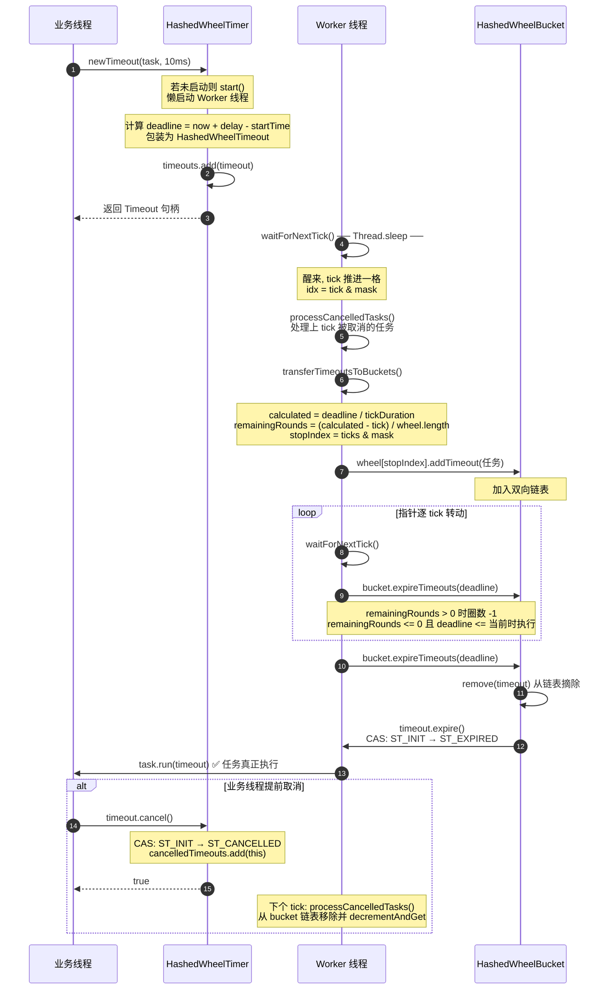

# Dubbo 时间轮（HashedWheelTimer）实现原理源码深度分析

> 源码位置：`dubbo-common/src/main/java/org/apache/dubbo/common/timer/`
> 核心类：`HashedWheelTimer`、`Timer`、`Timeout`、`TimerTask`

---

## 一、时间轮是什么

时间轮（Timing Wheel）是一种高效的定时任务调度数据结构，由 George Varghese 和 Tony Lauck 在论文
《Hashed and Hierarchical Timing Wheels》中提出。其核心思想是：**用一个环形数组（轮）+ 哈希函数来组织大量定时任务，
把"按时查找到期任务"从 O(N) 降为 O(1)**。

可以把它想象成一个时钟表盘：

- 表盘上有 N 个格子（slot / bucket），每个格子存放一个任务链表。
- 指针（tick）按固定时间间隔（tickDuration）顺时针走动，每走一格就把该格里的所有任务取出来执行。
- 任务被加入时，根据其延迟时间计算它应该落在哪个格子；如果延迟超过一圈，则记录"还要转几圈"（remainingRounds），每转一圈减一，减到 0 时该格子被指针扫到即到期。

Dubbo 的时间轮实现 `HashedWheelTimer` 直接 fork 自 Netty 的同名类（源文件头保留了
`Copyright 2012 The Netty Project`），并在其基础上做了少量适配。

---

## 二、核心类图

```mermaid
classDiagram
    direction LR

    class Timer {
        <<interface>>
        +newTimeout(task: TimerTask, delay: long, unit: TimeUnit) Timeout
        +stop() Set~Timeout~
        +isStop() boolean  ☆ Dubbo 新增（Netty 无）
    }

    class Timeout {
        <<interface>>
        +timer() Timer
        +task() TimerTask
        +isExpired() boolean
        +isCancelled() boolean
        +cancel() boolean
    }

    class TimerTask {
        <<interface>>
        +run(timeout: Timeout) void
    }

    class HashedWheelTimer {
        -worker: Worker
        -workerThread: Thread
        -tickDuration: long
        -wheel: HashedWheelBucket[]
        -mask: int
        -startTime: long
        -timeouts: Queue
        -cancelledTimeouts: Queue
        -pendingTimeouts: AtomicLong
        -maxPendingTimeouts: long
        +newTimeout(task, delay, unit) Timeout
        +start() void
        +stop() Set~Timeout~
        +isStop() boolean
    }

    class Worker {
        <<inner>>
        -tick: long
        -unprocessedTimeouts: Set~Timeout~
        +run() void
        -waitForNextTick() long
        -transferTimeoutsToBuckets() void
        -processCancelledTasks() void
    }

    class HashedWheelTimeout {
        <<inner>>
        -timer: HashedWheelTimer
        -task: TimerTask
        -deadline: long
        -state: volatile int
        -remainingRounds: long
        -next: HashedWheelTimeout
        -prev: HashedWheelTimeout
        -bucket: HashedWheelBucket
        +expire() void
        +cancel() boolean
        +remove() void
        +state() int
    }

    class HashedWheelBucket {
        <<inner>>
        -head: HashedWheelTimeout
        -tail: HashedWheelTimeout
        +addTimeout(timeout) void
        +expireTimeouts(deadline) void
        +remove(timeout) HashedWheelTimeout
        +clearTimeouts(set) void
    }

    Timer <|.. HashedWheelTimer : implements
    Timeout <|.. HashedWheelTimeout : implements
    HashedWheelTimer *-- Worker : contains (inner)
    HashedWheelTimer o-- HashedWheelBucket : wheel[]
    HashedWheelBucket ..> HashedWheelTimeout : 双向链表节点 next/prev
    HashedWheelTimeout --> TimerTask : task
    HashedWheelTimeout --> Timer : timer
    Timeout ..> TimerTask : task()
    Timeout ..> Timer : timer()
    Worker ..> HashedWheelBucket : 操作 wheel[]
```



**关系说明**

- `Timer <|.. HashedWheelTimer`：实现关系，`HashedWheelTimer` 实现 `Timer` 接口。
- `Timeout <|.. HashedWheelTimeout`：实现关系，`HashedWheelTimeout` 实现 `Timeout`。
- `HashedWheelTimer *-- Worker`：组合关系，`Worker` 是 `HashedWheelTimer` 的内部类（生命周期由外部类管理）。
- `HashedWheelTimer o-- HashedWheelBucket`：聚合关系，`HashedWheelTimer` 持有 `wheel[]` 数组，每个元素是一个 `HashedWheelBucket`。
- `HashedWheelBucket ..> HashedWheelTimeout`：依赖关系，bucket 内以 `HashedWheelTimeout` 作为双向链表节点（next/prev）。
- `HashedWheelTimeout --> TimerTask / Timer`：关联关系，记录所属 task 与 timer。

### 类职责说明

| 类 / 接口 | 职责 |
|-----------|------|
| `Timer` | 定时器顶层接口，定义 `newTimeout` / `stop` / `isStop`。 |
| `TimerTask` | 用户任务接口，只有一个 `run(Timeout)` 方法。 |
| `Timeout` | 任务句柄接口，可查询到期/取消状态，可 `cancel()`。 |
| `HashedWheelTimer` | `Timer` 的核心实现，持有时间轮数组与工作线程。 |
| `Worker` | `HashedWheelTimer` 的内部类，实现 `Runnable`，是真正驱动指针转动、调度任务的工作线程。 |
| `HashedWheelBucket` | 时间轮上的一个格子，用双向链表存放多个 `HashedWheelTimeout`。 |
| `HashedWheelTimeout` | `Timeout` 的实现，同时是 bucket 链表中的节点（next/prev），记录 deadline、剩余圈数、状态。 |

---

## 三、核心数据结构

### 3.1 时间轮数组 `wheel`

```java
private final HashedWheelBucket[] wheel;
private final int mask;
```

`wheel` 是一个长度为 **2 的幂次方** 的环形数组。`createWheel()` 中通过 `normalizeTicksPerWheel()` 把任意 `ticksPerWheel` 向上取整为最近的 2 的幂（默认 512）：

```java
private static int normalizeTicksPerWheel(int ticksPerWheel) {
    int normalizedTicksPerWheel = ticksPerWheel - 1;
    normalizedTicksPerWheel |= normalizedTicksPerWheel >>> 1;
    normalizedTicksPerWheel |= normalizedTicksPerWheel >>> 2;
    // ... 一直到 >>> 16
    return normalizedTicksPerWheel + 1;
}
```

取 2 的幂的好处是：**可以用位运算代替取模来定位格子**，性能更高：

```java
int idx = (int) (tick & mask);   // 等价于 tick % wheel.length，但更快
```

### 3.2 三个关键队列

```java
// 1. 新提交但还没被分配到格子里的任务（外部线程 add，Worker 线程 poll）
private final Queue<HashedWheelTimeout> timeouts = new LinkedBlockingQueue<>();

// 2. 被取消的任务（外部线程 cancel 时放入，Worker 在 tick 时统一处理）
private final Queue<HashedWheelTimeout> cancelledTimeouts = new LinkedBlockingQueue<>();

// 3. 当前待执行（pending）任务计数，用于限流
private final AtomicLong pendingTimeouts = new AtomicLong(0);
```

使用 `LinkedBlockingQueue` 是为了**外部业务线程与 Worker 工作线程之间的无锁通信**：
- 业务线程调 `newTimeout` → 加入 `timeouts` 队列；
- Worker 线程每个 tick 把 `timeouts` 里的任务搬到对应 bucket；
- 业务线程调 `cancel` → 加入 `cancelledTimeouts`；
- Worker 线程每个 tick 处理一次取消，真正从 bucket 链表移除。

### 3.3 状态机

`HashedWheelTimeout` 用一个 `volatile int state` + `AtomicIntegerFieldUpdater` 记录任务生命周期：

```
ST_INIT(0)  ──cancel()──▶  ST_CANCELLED(1)
     │
   expire()  (CAS)
     ▽
ST_EXPIRED(2)
```

`HashedWheelTimer` 自身也有工作线程状态：`WORKER_STATE_INIT(0)` → `WORKER_STATE_STARTED(1)` → `WORKER_STATE_SHUTDOWN(2)`。

---

## 四、核心流程源码分析

### 4.1 提交任务：`newTimeout`

```java
public Timeout newTimeout(TimerTask task, long delay, TimeUnit unit) {
    // 1. pending 计数 + 限流：超过 maxPendingTimeouts 直接拒绝
    long pendingTimeoutsCount = pendingTimeouts.incrementAndGet();
    if (maxPendingTimeouts > 0 && pendingTimeoutsCount > maxPendingTimeouts) {
        pendingTimeouts.decrementAndGet();
        throw new RejectedExecutionException(...);
    }

    // 2. 懒启动工作线程（首次调用时才 start）
    start();

    // 3. 计算 deadline（相对 startTime 的纳秒值）
    long deadline = System.nanoTime() + unit.toNanos(delay) - startTime;
    if (delay > 0 && deadline < 0) {        // 防溢出
        deadline = Long.MAX_VALUE;
    }

    // 4. 包装成 HashedWheelTimeout，丢进 timeouts 队列（注意：还没进格子！）
    HashedWheelTimeout timeout = new HashedWheelTimeout(this, task, deadline);
    timeouts.add(timeout);
    return timeout;
}
```

**关键点**：`newTimeout` 本身非常轻量——它**不计算落槽、不操作 wheel 数组**，只是把任务丢进一个队列。真正的落槽由 Worker 线程在下一个 tick 完成。这样外部线程提交任务几乎没有阻塞，与 Worker 完全解耦。

`deadline` 是相对 `startTime` 的纳秒偏移量（`startTime` 是 Worker 启动那一刻的 `System.nanoTime()`）。

### 4.2 工作线程主循环：`Worker.run`

这是整个时间轮的心脏：

```java
public void run() {
    // 1. 初始化 startTime，唤醒在 start() 中等待的线程
    startTime = System.nanoTime();
    if (startTime == 0) { startTime = 1; }   // 0 用作"未初始化"标记
    startTimeInitialized.countDown();

    do {
        // 2. 等待下一个 tick 时刻到来
        final long deadline = waitForNextTick();
        if (deadline > 0) {
            int idx = (int) (tick & mask);          // 当前 tick 对应的格子下标
            processCancelledTasks();                 // 2a. 先处理被取消的任务
            HashedWheelBucket bucket = wheel[idx];
            transferTimeoutsToBuckets();             // 2b. 把队列里的新任务搬到格子里
            bucket.expireTimeouts(deadline);         // 2c. 执行当前格子里到期的任务
            tick++;
        }
    } while (WORKER_STATE_UPDATER.get(...) == WORKER_STATE_STARTED);

    // 3. 关闭时：把所有未处理的任务收集起来，供 stop() 返回
    for (HashedWheelBucket bucket : wheel) { bucket.clearTimeouts(unprocessedTimeouts); }
    for (;;) { /* poll timeouts 队列剩余任务 */ }
    processCancelledTasks();
}
```

每个 tick 周期做 4 件事，顺序很重要：

1. **`waitForNextTick()`** —— 睡眠直到下一个 tick 时刻；
2. **`processCancelledTasks()`** —— 处理上一 tick 期间被 cancel 的任务；
3. **`transferTimeoutsToBuckets()`** —— 把新提交的任务从 `timeouts` 队列搬到对应 bucket；
4. **`expireTimeouts(deadline)`** —— 执行当前 bucket 中到期任务。

### 4.3 等待下一个 tick：`waitForNextTick`

```java
private long waitForNextTick() {
    long deadline = tickDuration * (tick + 1);          // 下一个 tick 的目标时刻
    for (;;) {
        final long currentTime = System.nanoTime() - startTime;
        long sleepTimeMs = (deadline - currentTime + 999999) / 1000000;  // 向上取整到毫秒
        if (sleepTimeMs <= 0) {
            return currentTime == Long.MIN_VALUE ? -Long.MAX_VALUE : currentTime;
        }
        if (isWindows()) {
            sleepTimeMs = sleepTimeMs / 10 * 10;        // Windows 下 sleep 精度差，对齐到 10ms
        }
        try {
            Thread.sleep(sleepTimeMs);
        } catch (InterruptedException ignored) {
            if (WORKER_STATE == SHUTDOWN) return Long.MIN_VALUE;  // 被中断且已 shutdown 则退出
        }
    }
}
```

**注意**：Dubbo 用的是 `Thread.sleep` 而非 `LockSupport.parkNanos`，并在 Windows 上做 10ms 对齐——这是为了规避 Windows 早期版本定时器精度问题。这也是时间轮"近似调度"（approximated）的原因：精度受 `tickDuration` 与系统 sleep 精度共同限制。

### 4.4 任务落槽：`transferTimeoutsToBuckets`

```java
private void transferTimeoutsToBuckets() {
    // 每个 tick 最多搬 100000 个，防止提交过快拖垮 Worker
    for (int i = 0; i < 100000; i++) {
        HashedWheelTimeout timeout = timeouts.poll();
        if (timeout == null) break;
        if (timeout.state() == ST_CANCELLED) continue;   // 搬运途中被取消了就跳过

        long calculated = timeout.deadline / tickDuration;          // 该任务理论上应在第几个 tick 到期
        timeout.remainingRounds = (calculated - tick) / wheel.length; // 还要转几圈

        // 不能调度到过去，至少是当前 tick
        final long ticks = Math.max(calculated, tick);
        int stopIndex = (int) (ticks & mask);             // 用位运算定位格子
        wheel[stopIndex].addTimeout(timeout);             // 加入双向链表
    }
}
```

这是时间轮算法的精髓所在：

- `calculated = deadline / tickDuration`：算出任务"应该在第几个 tick 到期"。
- `remainingRounds = (calculated - tick) / wheel.length`：如果到期时间超过一圈，记录剩余圈数。
- `stopIndex = ticks & mask`：用低若干位定位格子。由于 wheel 长度是 2 的幂，每转一圈相同的低比特位会落在同一格子——这正是"圈数 + 槽位"双层定位的本质。

> **为什么不用堆（PriorityQueue）？**
> 堆的插入/删除是 O(log N)，且需要为每个任务维护堆结构；时间轮的落槽是 O(1)，扫格执行也是 O(1)（每格任务数有限）。当任务量极大且对精度要求不高时（典型如大量 I/O 超时检测），时间轮优势显著。

### 4.5 执行到期任务：`HashedWheelBucket.expireTimeouts`

```java
void expireTimeouts(long deadline) {
    HashedWheelTimeout timeout = head;
    while (timeout != null) {
        HashedWheelTimeout next = timeout.next;
        if (timeout.remainingRounds <= 0) {              // 圈数已转完
            next = remove(timeout);                       // 从链表移除
            if (timeout.deadline <= deadline) {
                timeout.expire();                         // 真正执行任务
            } else {
                throw new IllegalStateException("timeout.deadline > deadline"); // 不应发生
            }
        } else if (timeout.isCancelled()) {              // 转完前被取消
            next = remove(timeout);
        } else {
            timeout.remainingRounds--;                    // 还要继续转，圈数 -1
        }
        timeout = next;
    }
}
```

`expire()` 通过 CAS 把状态从 `ST_INIT` 改为 `ST_EXPIRED`，然后回调 `task.run(this)`，并用 try-catch 兜底防止异常打爆 Worker 线程：

```java
public void expire() {
    if (!compareAndSetState(ST_INIT, ST_EXPIRED)) return;  // 已取消/已到期则不执行
    try {
        task.run(this);
    } catch (Throwable t) {
        logger.warn(...);   // 吞掉异常，保证 Worker 不死
    }
}
```

### 4.6 取消任务：`cancel`

```java
public boolean cancel() {
    if (!compareAndSetState(ST_INIT, ST_CANCELLED)) return false;
    // 不立即从 bucket 删除，而是丢进 cancelledTimeouts，下个 tick 由 Worker 统一清理
    timer.cancelledTimeouts.add(this);
    return true;
}
```

**延迟删除**设计：`cancel` 只改状态 + 入队，真正的链表删除延迟到下个 tick 的 `processCancelledTasks` → `remove()` 完成。这样业务线程取消操作也是 O(1) 无锁的，代价是任务最多残留一个 tick 才被 GC（注释里明确说"GC latency of max. 1 tick duration which is good enough"）。

### 4.7 启动与停止

- **懒启动 `start()`**：`newTimeout` 首次调用时通过 CAS 把 `INIT→STARTED`，然后 `workerThread.start()`，并用 `CountDownLatch` 等待 Worker 设置好 `startTime` 才返回，保证 `newTimeout` 计算 `deadline` 时 `startTime` 已就绪。
- **`stop()`**：CAS 切到 `SHUTDOWN`，循环 `interrupt + join(100)` 等待 Worker 退出，最后返回所有未处理的任务句柄。注意 `stop()` 不能在 Worker 线程内调用（否则抛异常）。
- **实例数限制**：静态计数器 `INSTANCE_COUNTER`，超过 64 个实例会打印告警——因为每个 `HashedWheelTimer` 都会创建一个独立线程，滥用会导致线程爆炸。

---

## 五、Dubbo 中的使用场景

Dubbo 把 `HashedWheelTimer` 当作**全局共享的轻量定时器**使用（通过 `GlobalResourceInitializer` 保证单例复用），典型场景：

| 使用方 | tickDuration / wheel | 用途 |
|--------|----------------------|------|
| `DefaultFuture`（remoting-api） | 30ms | RPC 请求超时检测，到期后回写超时异常 |
| `DeadlineFuture`（triple 协议） | 30ms | gRPC/HTTP2 请求超时检测 |
| `FailbackRegistry`（registry-api） | `retryPeriod`，128 格 | 注册失败重试（注册/订阅/取消订阅失败后定时重试） |
| `RegistryProtocol` | — | 注册中心相关重试 |
| `HeaderExchangeClient` / `HeaderExchangeServer` | — | 心跳/重连定时任务（`HeartbeatTimerTask`、`ReconnectTimerTask`、`CloseTimerTask`） |
| `FailbackClusterInvoker`（cluster） | — | 集群调用失败后的延迟重试 |

这些场景共同特点：**任务量大、对精度要求不高（几十 ms 误差可接受）、需要低成本海量超时检测**——正是时间轮的理想战场。

---

## 六、与 Netty 时间轮的区别

Dubbo 的 `HashedWheelTimer` 本质是 **Netty `io.netty.util.HashedWheelTimer` 的 fork**（源文件头部保留 Netty 版权声明），算法与核心数据结构完全一致。区别集中在"适配层"和"少量细节"：

### 6.1 架构与算法层：基本无差异

| 维度 | Netty | Dubbo |
|------|-------|-------|
| 算法 | 单层 Hashed Wheel（Varghese 论文） | 完全相同 |
| 数据结构 | `HashedWheelBucket[]` + 双向链表 | 完全相同 |
| tick 驱动 | `Worker` 线程 + `Thread.sleep` | 完全相同 |
| 落槽公式 | `deadline/tickDuration` + `& mask` | 完全相同 |
| 圈数机制 | `remainingRounds` | 完全相同 |
| 延迟取消 | `cancelledTimeouts` 队列 | 完全相同 |
| 2 的幂对齐 | `normalizeTicksPerWheel` | 完全相同 |
| 实例数告警 | 64 个实例告警 | 完全相同 |

### 6.2 接口与 API 层的区别

| 区别点 | Netty | Dubbo |
|--------|-------|-------|
| `Timer` 接口 | 只有 `newTimeout` / `stop` | **新增 `isStop()` 方法**，方便外部查询状态 |
| 静态 `NAME` 字段 | 无 | 新增 `public static final String NAME = "hashed"`（疑似为 SPI 预留） |

### 6.3 基础设施层的区别（Dubbo 适配）

| 区别点 | Netty | Dubbo |
|--------|-------|-------|
| 日志 | Netty 自带 `InternalLogger` | 改用 Dubbo 的 `ErrorTypeAwareLogger` + `LoggerCodeConstants`（带错误码的日志体系） |
| OS 判断 | Netty 的 `PlatformDependent` | 改用 `SystemPropertyConfigUtils.getSystemProperty(...)` |
| 异常分类 | 普通日志 | `COMMON_ERROR_TOO_MANY_INSTANCES`、`COMMON_ERROR_RUN_THREAD_TASK` 等错误码，便于线上问题定位 |

### 6.4 细节实现差异

1. **`pendingTimeouts` 自增时机**：
   - Dubbo：先 `incrementAndGet()` 再 `start()`；
   - Netty：先 `start()` 再 `incrementAndGet()`。
   实际行为几乎等价，只是顺序略有不同。

2. **`maxPendingTimeouts` 构造重载**：两者都支持，语义一致（0 或负数表示不限）。

3. **`finalize()` 降计数**：两者都在 `finalize` 中把状态置为 `SHUTDOWN` 并 `INSTANCE_COUNTER.decrementAndGet()`，防止对象被 GC 但计数未减导致误报。Netty 后续版本用 `Cleaner`/`PhantomReference` 重构过，Dubbo 仍沿用老的 `finalize` 方式。

### 6.5 一句话总结

> **Dubbo 的时间轮 = Netty 的时间轮算法 + Dubbo 的日志/错误码/OS 工具适配 + `isStop()` 接口增强。**
> 调度原理、性能特征、使用注意事项完全一致——理解了 Netty 的实现就理解了 Dubbo 的，反之亦然。

---

## 七、设计要点总结

1. **近似调度**：时间轮不保证精确按时执行，只在每个 tick 检查"已过期"的任务并批量执行。精度 = `tickDuration`（Dubbo 默认 100ms，超时检测场景用 30ms）。精度越高，tick 越频繁，CPU 开销越大。

2. **单线程 Worker**：所有任务的落槽、取消、执行都在**一个** Worker 线程内完成，因此 bucket 内链表操作无需加锁；跨线程通信靠 `LinkedBlockingQueue`。这也意味着**任务 `run` 必须轻量、不能阻塞**，否则会拖慢整个时间轮。

3. **O(1) 调度**：落槽 `ticks & mask`、扫格执行都是 O(1)，与任务总量无关，适合海量短延迟任务。

4. **无锁化提交/取消**：`newTimeout` 与 `cancel` 仅做队列入队 + CAS 状态，业务线程零阻塞。

5. **共享单例**：每个实例一条线程，Dubbo 强烈建议全局复用（`GlobalResourceInitializer` + 64 实例告警），切勿每连接创建。

6. **延迟删除**：取消不立即摘链表，延迟到下个 tick 清理，换取取消操作的 O(1) 无锁。

7. **优雅停机**：`stop()` 收集所有未执行任务返回给调用方，Worker 循环退出，资源释放干净。

---

## 八、时序图：一次任务的完整生命周期



---

> **参考**
> - Varghese & Lauck, *Hashed and Hierarchical Timing Wheels: data structures to efficiently implement a timer facility*
> - Dubbo 源码 `dubbo-common/.../timer/HashedWheelTimer.java`
> - Netty 源码 `io.netty.util.HashedWheelTimer`