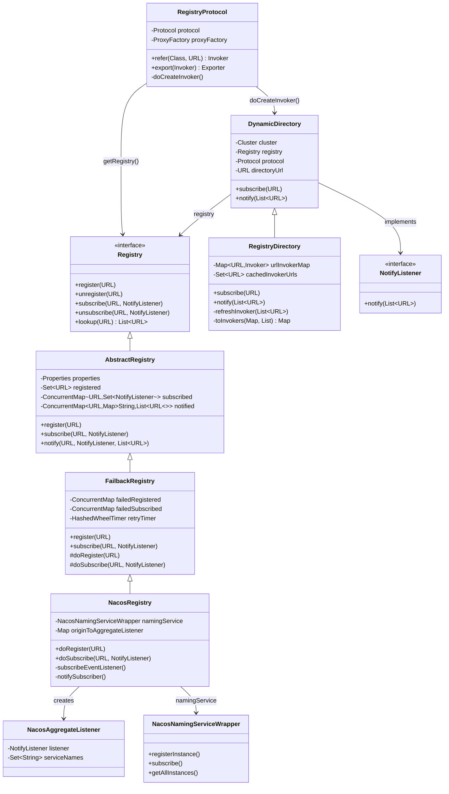
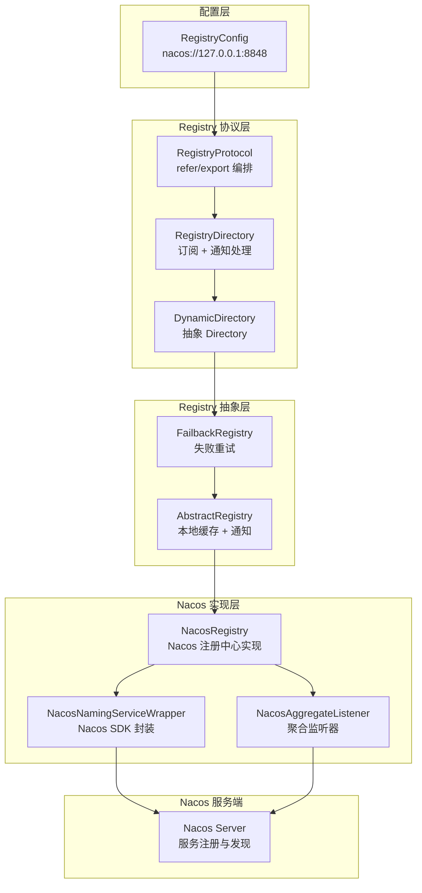
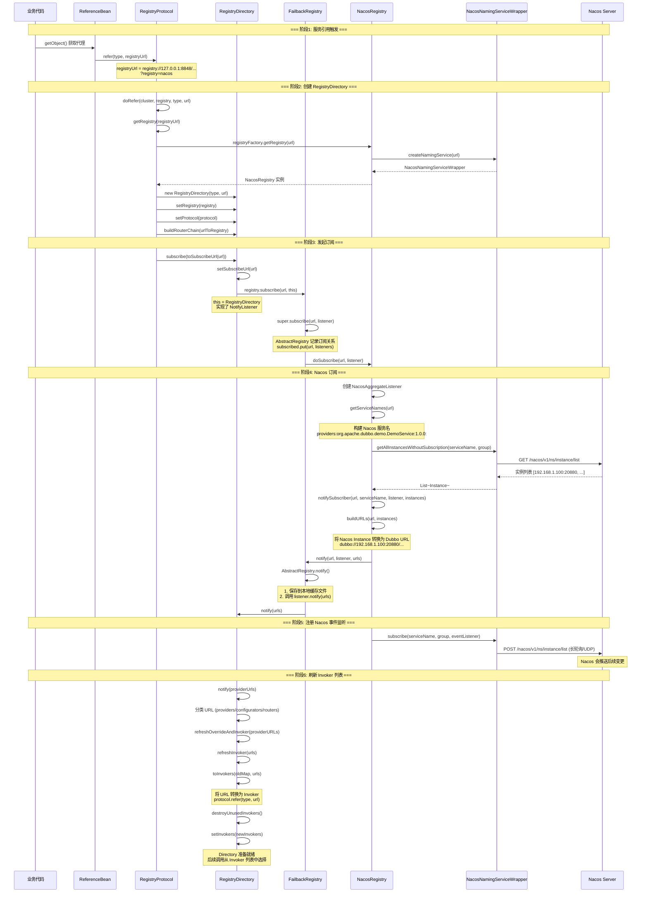
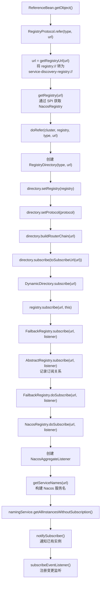
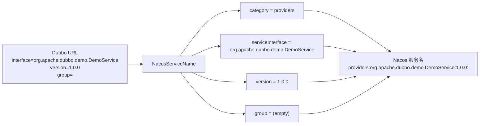
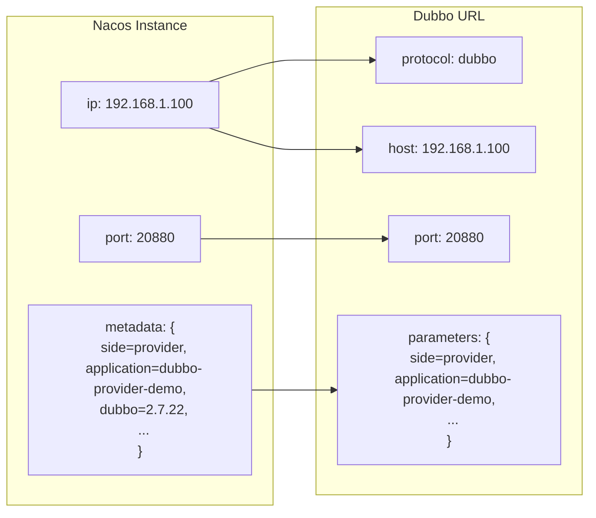
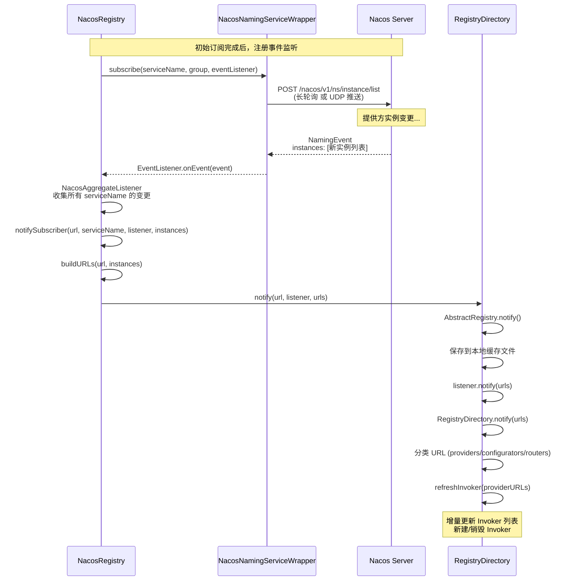
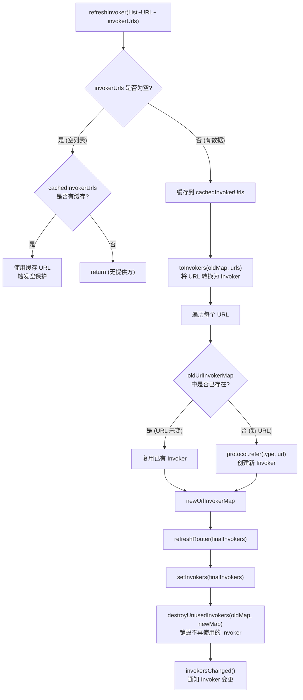
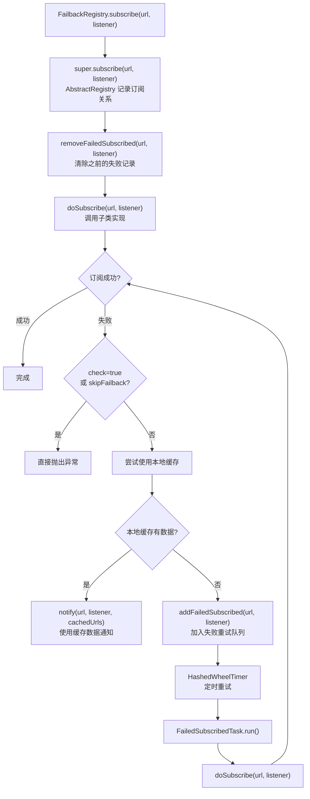
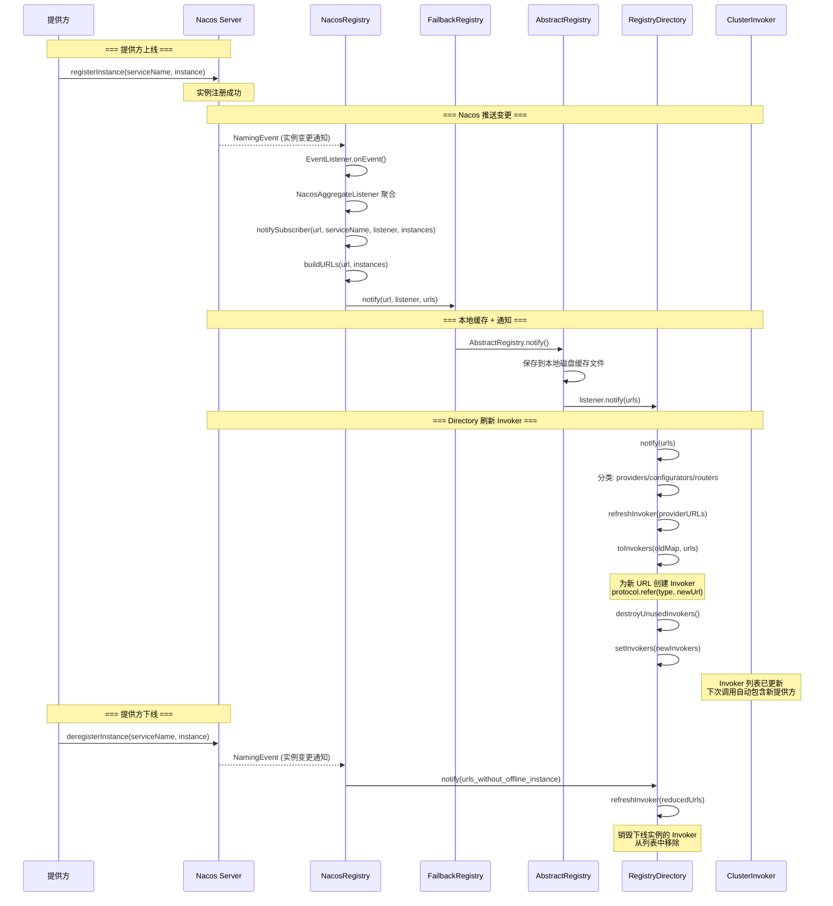

# Dubbo 消费方订阅提供方实例 — 以 Nacos 注册中心为例

## 一、场景设定

以如下典型配置为例，分析 Dubbo 消费方如何通过 Nacos 注册中心订阅提供方实例：

**消费方配置 (consumer)：**
```properties
dubbo.application.name=dubbo-consumer-demo
dubbo.registry.address=nacos://127.0.0.1:8848
```

**提供方配置 (provider)：**
```properties
dubbo.application.name=dubbo-provider-demo
dubbo.registry.address=nacos://127.0.0.1:8848
dubbo.protocol.name=dubbo
dubbo.protocol.port=20880
```

**服务接口：**
```java
public interface DemoService {
    String sayHello(String name);
}
```

---

## 二、整体架构概览

### 2.1 核心模块与类关系



### 2.2 整体架构分层



---

## 三、消费方订阅完整流程

### 3.1 端到端时序图



### 3.2 阶段详解：从 refer 到 subscribe



---

## 四、Nacos 注册中心核心实现

### 4.1 NacosRegistryFactory — 工厂入口

[`NacosRegistryFactory`](file:///d:/workspace/java_projects/source_projects/dubbo/dubbo-registry/dubbo-registry-nacos/src/main/java/org/apache/dubbo/registry/nacos/NacosRegistryFactory.java) 通过 SPI 机制加载（`META-INF/dubbo/internal/org.apache.dubbo.registry.RegistryFactory` 中配置 `nacos=...NacosRegistryFactory`）：

```java
public class NacosRegistryFactory extends AbstractRegistryFactory {
    @Override
    protected Registry createRegistry(URL url) {
        return new NacosRegistry(url, createNamingService(url));
    }
}
```

### 4.2 NacosRegistry.doSubscribe() — 核心订阅逻辑

[`NacosRegistry.doSubscribe()`](file:///d:/workspace/java_projects/source_projects/dubbo/dubbo-registry/dubbo-registry-nacos/src/main/java/org/apache/dubbo/registry/nacos/NacosRegistry.java#L256-L310) 是订阅的核心：

```java
@Override
public void doSubscribe(final URL url, final NotifyListener listener) {
    // 1. 创建聚合监听器（一个 listener 可能对应多个 Nacos serviceName）
    NacosAggregateListener nacosAggregateListener = new NacosAggregateListener(listener);
    originToAggregateListener
            .computeIfAbsent(url, k -> new ConcurrentHashMap<>())
            .put(listener, nacosAggregateListener);

    // 2. 获取 Nacos 服务名列表
    Set<String> serviceNames = getServiceNames(url, nacosAggregateListener);

    // 3. 执行订阅
    doSubscribe(url, nacosAggregateListener, serviceNames);
}

private void doSubscribe(final URL url, final NacosAggregateListener listener, final Set<String> serviceNames) {
    for (String serviceName : serviceNames) {
        // 4. 先全量拉取已有实例
        List<Instance> instances = namingService.getAllInstancesWithoutSubscription(
                serviceName, getUrl().getGroup(Constants.DEFAULT_GROUP));
        // 5. 立即通知订阅方
        notifySubscriber(url, serviceName, listener, instances);
        // 6. 注册 Nacos 事件监听（后续变更推送）
        subscribeEventListener(serviceName, url, listener);
    }
}
```

### 4.3 Nacos 服务名构建

Dubbo 在 Nacos 中的服务名格式为：

```
providers:{interfaceName}:{version}:{group}
```

例如：`providers:org.apache.dubbo.demo.DemoService:1.0.0:`



源码 [`NacosServiceName`](file:///d:/workspace/java_projects/source_projects/dubbo/dubbo-registry/dubbo-registry-nacos/src/main/java/org/apache/dubbo/registry/nacos/NacosServiceName.java)：

```java
public class NacosServiceName {
    private static final String NAME_SEPARATOR = ":";
    
    // 格式: category:interface:version:group
    // 例如: providers:com.xxx.DemoService:1.0.0:
    public static NacosServiceName valueOf(String serviceName) {
        String[] segments = serviceName.split(NAME_SEPARATOR, -1);
        // segments[0] = category (providers/consumers/configurators/routers)
        // segments[1] = interface
        // segments[2] = version
        // segments[3] = group
    }
}
```

### 4.4 Instance 与 URL 的转换



Nacos 的 `Instance.metadata` 中存储了 Dubbo URL 的所有参数，消费方收到 Instance 后重建为 `dubbo://192.168.1.100:20880/org.apache.dubbo.demo.DemoService?...` 格式的 URL。

### 4.5 Nacos 事件监听 — 变更推送



---

## 五、RegistryDirectory — 通知处理与 Invoker 刷新

### 5.1 notify() 方法详解

[`RegistryDirectory.notify()`](file:///d:/workspace/java_projects/source_projects/dubbo/dubbo-registry/dubbo-registry-api/src/main/java/org/apache/dubbo/registry/integration/RegistryDirectory.java#L200-L240) 是消费方收到注册中心通知后的核心处理方法：

```java
@Override
public synchronized void notify(List<URL> urls) {
    // 1. 按 category 分类 URL
    Map<String, List<URL>> categoryUrls = urls.stream()
            .filter(Objects::nonNull)
            .filter(this::isValidCategory)
            .collect(Collectors.groupingBy(this::judgeCategory));

    // 2. 处理 configurators（配置覆盖规则）
    List<URL> configuratorURLs = categoryUrls.getOrDefault(CONFIGURATORS_CATEGORY, ...);
    this.configurators = Configurator.toConfigurators(configuratorURLs).orElse(this.configurators);

    // 3. 处理 routers（路由规则）
    List<URL> routerURLs = categoryUrls.getOrDefault(ROUTERS_CATEGORY, ...);
    toRouters(routerURLs).ifPresent(this::addRouters);

    // 4. 处理 providers（提供方地址列表）
    List<URL> providerURLs = categoryUrls.getOrDefault(PROVIDERS_CATEGORY, ...);
    
    // 5. 扩展点：AddressListener 可以对 URL 做二次处理
    List<AddressListener> supportedListeners = ...;
    for (AddressListener addressListener : supportedListeners) {
        providerURLs = addressListener.notify(providerURLs, getConsumerUrl(), this);
    }
    
    // 6. 刷新 Invoker 列表
    refreshOverrideAndInvoker(providerURLs);
}
```

### 5.2 refreshInvoker() — Invoker 增量更新



核心源码 [`RegistryDirectory.refreshInvoker()`](file:///d:/workspace/java_projects/source_projects/dubbo/dubbo-registry/dubbo-registry-api/src/main/java/org/apache/dubbo/registry/integration/RegistryDirectory.java#L260-L370)：

```java
private void refreshInvoker(List<URL> invokerUrls) {
    // 空保护：如果收到空列表且有缓存，使用缓存
    if (invokerUrls.isEmpty() && CollectionUtils.isNotEmpty(localCachedInvokerUrls)) {
        invokerUrls.addAll(localCachedInvokerUrls);
    }
    
    // URL → Invoker 转换
    Map<URL, Invoker<T>> newUrlInvokerMap = toInvokers(oldUrlInvokerMap, invokerUrls);
    
    // 构建最终 Invoker 列表
    List<Invoker<T>> newInvokers = new ArrayList<>(newUrlInvokerMap.values());
    BitList<Invoker<T>> finalInvokers = new BitList<>(newInvokers);
    
    // 刷新路由链
    refreshRouter(finalInvokers.clone(), () -> this.setInvokers(finalInvokers));
    
    // 更新 URL→Invoker 映射
    this.urlInvokerMap = newUrlInvokerMap;
    
    // 销毁不再使用的 Invoker
    destroyUnusedInvokers(oldUrlInvokerMap, newUrlInvokerMap);
}
```

---

## 六、FailbackRegistry — 失败重试机制

### 6.1 订阅失败重试流程



### 6.2 失败重试核心源码

[`FailbackRegistry.subscribe()`](file:///d:/workspace/java_projects/source_projects/dubbo/dubbo-registry/dubbo-registry-api/src/main/java/org/apache/dubbo/registry/support/FailbackRegistry.java#L345-L385)：

```java
@Override
public void subscribe(URL url, NotifyListener listener) {
    super.subscribe(url, listener);            // 记录订阅关系
    removeFailedSubscribed(url, listener);      // 清除之前的失败记录
    try {
        doSubscribe(url, listener);             // 调用子类实现
    } catch (Exception e) {
        // 尝试使用本地缓存文件
        List<URL> urls = getCacheUrls(url);
        if (CollectionUtils.isNotEmpty(urls)) {
            notify(url, listener, urls);        // 使用缓存通知
        } else {
            // 加入失败重试队列
            addFailedSubscribed(url, listener);
        }
    }
}
```

---

## 七、AbstractRegistry — 本地缓存与通知

### 7.1 本地文件缓存

[`AbstractRegistry`](file:///d:/workspace/java_projects/source_projects/dubbo/dubbo-registry/dubbo-registry-api/src/main/java/org/apache/dubbo/registry/support/AbstractRegistry.java) 提供了本地磁盘缓存能力，在注册中心不可用时仍能使用上次缓存的提供方列表：

```
~/.dubbo/dubbo-registry-{appName}-{registryAddress}.cache
```

```java
// AbstractRegistry.notify() 中保存到本地文件
protected void notify(URL url, NotifyListener listener, List<URL> urls) {
    // 1. 保存到内存 notified Map
    notified.computeIfAbsent(url, k -> new ConcurrentHashMap<>())
            .put(url.toFullString(), urls);
    
    // 2. 保存到本地磁盘文件
    saveProperties(url);
    
    // 3. 回调 listener
    listener.notify(urls);
}
```

### 7.2 空保护机制

当注册中心推送空的提供方列表时，`RegistryDirectory` 会使用本地缓存的 URL 列表，避免因注册中心异常导致服务不可用：

```java
// RegistryDirectory.refreshInvoker()
if (invokerUrls.isEmpty() && CollectionUtils.isNotEmpty(localCachedInvokerUrls)) {
    logger.warn("Service " + serviceKey + " received empty address list, trigger empty protection.");
    invokerUrls.addAll(localCachedInvokerUrls);
}
```

---

## 八、提供方变更 → 消费方感知完整链路



---

## 九、关键设计特点总结

| 特性 | 实现方式 |
|------|----------|
| **注册中心 SPI** | `RegistryFactory` + `Registry` 接口，`nacos=...NacosRegistryFactory` |
| **服务名格式** | `providers:{interface}:{version}:{group}` |
| **订阅方式** | 先全量拉取 + 后事件监听（长轮询/UDP 推送） |
| **失败重试** | `FailbackRegistry` + `HashedWheelTimer` 定时重试 |
| **本地缓存** | `AbstractRegistry` 磁盘文件缓存，注册中心不可用时降级 |
| **空保护** | `RegistryDirectory` 收到空列表时使用缓存 URL |
| **增量更新** | `toInvokers()` 对比新旧 URL，复用已有 Invoker，销毁无用 Invoker |
| **分类通知** | URL 按 `providers`/`configurators`/`routers` 分类处理 |
| **聚合监听** | `NacosAggregateListener` 将多个 Nacos serviceName 聚合为一个 Dubbo listener |
| **引用计数** | `ReferenceCountExchanger` 共享连接管理 |

---

## 十、核心源码文件索引

| 文件 | 职责 |
|------|------|
| `Registry.java` | Registry 接口定义 |
| `AbstractRegistry.java` | 本地缓存、通知机制 |
| `FailbackRegistry.java` | 失败重试模板 |
| `RegistryProtocol.java` | 编排 refer/export 流程 |
| `DynamicDirectory.java` | Directory 抽象基类 |
| `RegistryDirectory.java` | 订阅通知处理、Invoker 刷新 |
| `NacosRegistryFactory.java` | Nacos Registry 工厂 |
| `NacosRegistry.java` | Nacos 注册中心核心实现 |
| `NacosNamingServiceWrapper.java` | Nacos SDK 封装 |
| `NacosAggregateListener.java` | 聚合监听器 |
| `NacosServiceName.java` | Nacos 服务名构建 |
| `NotifyListener.java` | 通知监听器接口 |
| `RegistryNotifier.java` | 通知执行器 |
