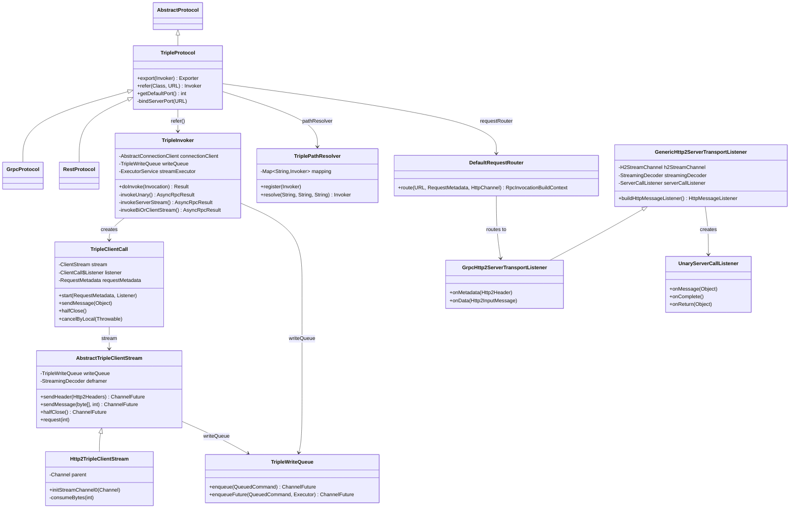
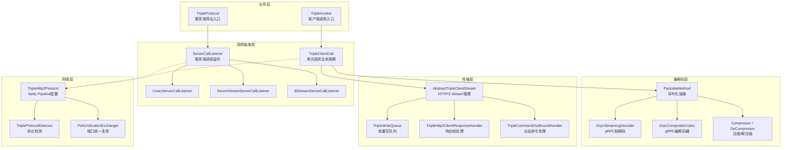
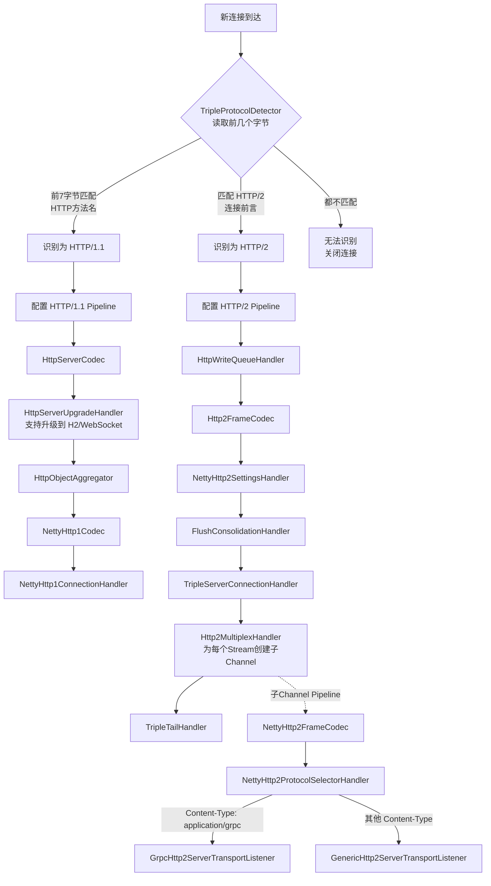
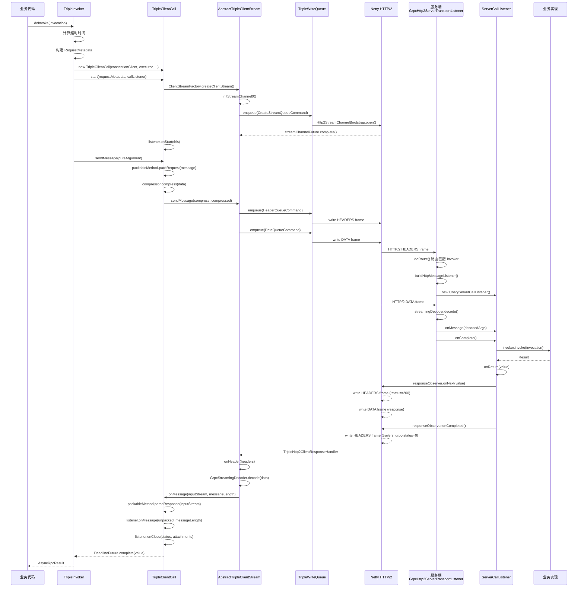
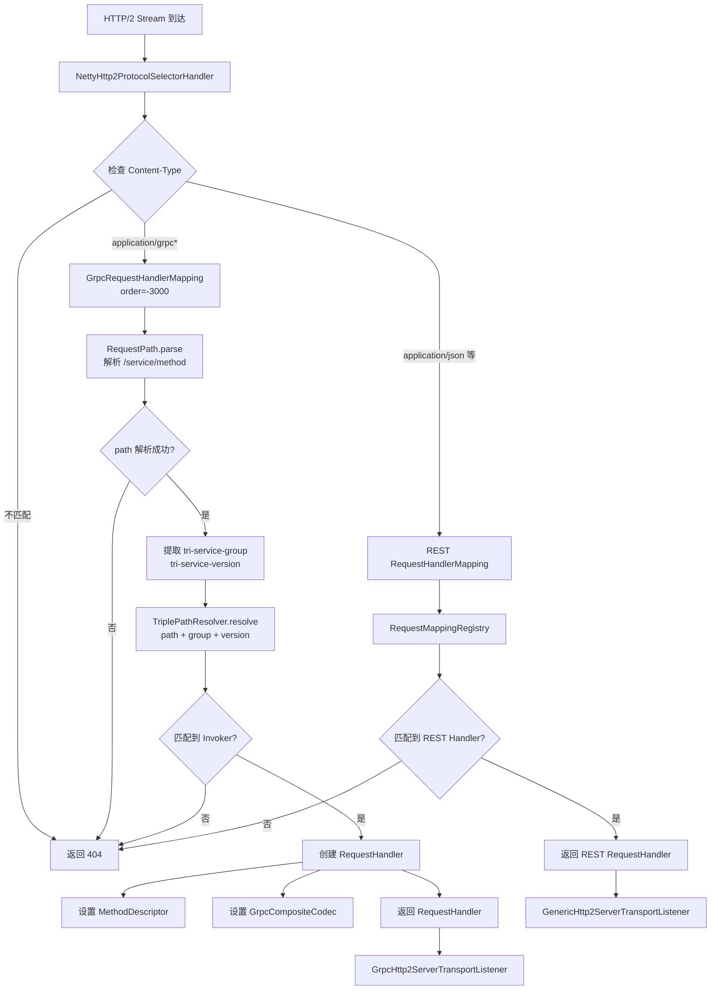
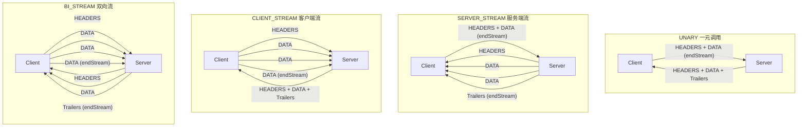

# Dubbo Triple 协议深入源码分析

## 一、模块定位与整体架构

Triple 协议的核心实现位于 `dubbo-rpc/dubbo-rpc-triple` 模块。Triple 是 Dubbo 3 引入的基于 **HTTP/2** 的 RPC 协议，兼容 gRPC，同时支持 REST 和自定义序列化。

核心入口类是 `TripleProtocol`，它继承自 `AbstractProtocol`，`GrpcProtocol` 和 `RestProtocol` 都直接继承 `TripleProtocol`。

### 关键子模块划分

| 子包 | 职责 |
|------|------|
| `call/` | 客户端调用抽象（`ClientCall` 接口 + `TripleClientCall` 实现） |
| `command/` | 写队列命令（Header、Data、CreateStream、Cancel 等） |
| `h12/` | HTTP/1.1 & HTTP/2 的传输监听器（服务端请求处理） |
| `h12/grpc/` | gRPC 协议适配（编解码、Header 处理） |
| `h12/http2/` | HTTP/2 通用传输（客户端 Stream + 服务端 TransportListener） |
| `stream/` | 底层流抽象（`AbstractTripleClientStream`） |
| `transport/` | Netty 传输层（WriteQueue、GoAway、FlowController） |
| `route/` | 请求路由（根据 path/group/version 匹配 Invoker） |
| `observer/` | 流式 Observer 适配器 |
| `compressor/` | 压缩/解压缩支持 |

### 核心类关系



### 整体架构分层



---

## 二、服务端启动流程

### 2.1 协议注册与 Pipeline 配置

`TripleProtocol` 作为 Dubbo SPI 扩展被加载。服务端启动入口是 `export()` 方法：

```java
// TripleProtocol.java L103-148
public <T> Exporter<T> export(Invoker<T> invoker) throws RpcException {
    // 1. 创建 Exporter
    // 2. 注册 Path 映射 (pathResolver.register)
    // 3. 注册 REST 映射 (mappingRegistry.register)
    // 4. 设置健康检查状态
    // 5. 绑定服务端口 (bindServerPort)
}
```

`bindServerPort()` 调用 `PortUnificationExchanger.bind()` 绑定端口。端口统一复用机制通过 **协议检测** 实现——同一个端口可以同时处理 HTTP/1.1 和 HTTP/2 请求。

### 2.2 协议检测流程



### 2.3 协议检测源码 (TripleProtocolDetector)

`TripleProtocolDetector` 通过读取连接的前几个字节判断协议类型：

- **HTTP/1.1**: 检测前 7 字节是否匹配 HTTP 方法名（GET/POST/PUT/DELETE 等）
- **HTTP/2**: 检测是否匹配 HTTP/2 连接前言 `PRI * HTTP/2.0\r\n\r\nSM\r\n\r\n`

```java
// TripleProtocolDetector.java
public Result detect(ChannelBuffer in) {
    // http1 检测
    byte[] magics = new byte[7];
    in.getBytes(in.readerIndex(), magics, 0, 7);
    if (isHttp(magics)) {
        return Result.recognized().setAttribute(HTTP_VERSION, HttpVersion.HTTP1.getVersion());
    }
    // http2 检测
    if (ChannelBuffers.prefixEquals(in, CLIENT_PREFACE_STRING, bytesRead)) {
        return Result.recognized().setAttribute(HTTP_VERSION, HttpVersion.HTTP2.getVersion());
    }
}
```

### 2.3 Netty Pipeline 配置

`TripleHttp2Protocol` 负责配置 Netty Channel Pipeline。

**HTTP/2 服务端 Pipeline：**

```
HttpWriteQueueHandler → Http2FrameCodec → NettyHttp2SettingsHandler
→ FlushConsolidationHandler → TripleServerConnectionHandler
→ Http2MultiplexHandler → TripleTailHandler
```

**HTTP/1.1 服务端 Pipeline（支持升级到 H2/WebSocket）：**

```
HttpServerCodec → HttpServerUpgradeHandler → HttpObjectAggregator
→ NettyHttp1Codec → NettyHttp1ConnectionHandler
```

`Http2MultiplexHandler` 内部为每个 HTTP/2 Stream 创建子 Channel，子 Channel 的 Pipeline：

```
NettyHttp2FrameCodec → NettyHttp2ProtocolSelectorHandler
```

`NettyHttp2ProtocolSelectorHandler` 根据 Content-Type 选择对应的 `Http2TransportListener`：
- `application/grpc` → `GrpcHttp2ServerTransportListener`
- 其他 → `GenericHttp2ServerTransportListener`

---

## 三、客户端调用流程

### 3.1 Invoker 创建

`TripleProtocol.refer()` 创建 `TripleInvoker`：

```java
// TripleProtocol.java L196-L205
public <T> Invoker<T> refer(Class<T> type, URL url) throws RpcException {
    // 1. 优化序列化
    // 2. 创建 StreamExecutor
    // 3. 建立连接 (PortUnificationExchanger.connect 或 Http3Exchanger.connect)
    // 4. 创建 TripleInvoker
}
```

`TripleInvoker` 持有：
- `AbstractConnectionClient` — 底层连接
- `TripleWriteQueue` — 写队列（批量写入，容量 256）
- `PackableMethodFactory` — 序列化工厂
- `ExecutorService streamExecutor` — 流式调用线程池

### 3.2 客户端 Pipeline

`TripleHttp2Protocol.configClientPipeline()` 配置客户端 Pipeline：

```
Http2FrameCodec → Http2MultiplexHandler → TriplePingPongHandler
→ TripleGoAwayHandler → TripleTailHandler
```

---

## 四、一次完整的一元调用（Unary RPC）流程

以最常见的 Unary 调用为例，追踪从客户端发起请求到收到响应的完整链路。

### 4.0 完整调用时序图



### 4.1 客户端发起调用

`TripleInvoker.doInvoke()` → `invokeUnary()`：

```java
// TripleInvoker.java L320-356
AsyncRpcResult invokeUnary(MethodDescriptor, Invocation, ClientCall, ExecutorService) {
    // 1. 计算超时时间
    // 2. 创建 DeadlineFuture（超时控制）
    // 3. 构建 RequestMetadata（包含 path、headers、compressor 等）
    // 4. 创建 ClientCallToObserverAdapter（请求观察者）
    // 5. call.start(request, callListener)  → 启动调用
    // 6. requestObserver.onNext(pureArgument) → 发送请求参数
    // 7. requestObserver.onCompleted() → 发送结束信号
}
```

### 4.2 构建请求元数据

`RequestMetadata.toHeaders()` 构建 HTTP/2 Headers：

```
:method = POST
:scheme = http/https
:authority = {address}
:path = /{serviceInterface}/{methodName}
content-type = application/grpc+proto
te = trailers
grpc-timeout = {timeout}
tri-service-version = {version}
tri-service-group = {group}
tri-consumer-appname = {application}
grpc-accept-encoding = {supported_encodings}
grpc-encoding = {compression}  (if not identity)
+ 用户自定义 attachments
```

```java
// RequestMetadata.java L53-L76
public DefaultHttp2Headers toHeaders() {
    DefaultHttp2Headers header = new DefaultHttp2Headers(false);
    header.scheme(scheme)
            .authority(address)
            .method(HttpMethod.POST.asciiName())
            .path(RequestPath.toFullPath(service, method.getMethodName()))
            .set(HttpHeaderNames.CONTENT_TYPE.getKey(), MediaType.APPLICATION_GRPC_PROTO.getName())
            .set(HttpHeaderNames.TE.getKey(), HttpHeaderValues.TRAILERS);
    setIfNotNull(header, TripleHeaderEnum.TIMEOUT.getKey(), timeout);
    setIfNotNull(header, TripleHeaderEnum.SERVICE_VERSION.getKey(), version);
    setIfNotNull(header, TripleHeaderEnum.SERVICE_GROUP.getKey(), group);
    setIfNotNull(header, TripleHeaderEnum.CONSUMER_APP_NAME_KEY.getKey(), application);
    setIfNotNull(header, TripleHeaderEnum.GRPC_ACCEPT_ENCODING.getKey(), acceptEncoding);
    if (!Identity.MESSAGE_ENCODING.equals(compressor.getMessageEncoding())) {
        setIfNotNull(header, TripleHeaderEnum.GRPC_ENCODING.getKey(), compressor.getMessageEncoding());
    }
    StreamUtils.putHeaders(header, attachments, convertNoLowerHeader);
    return header;
}
```

### 4.3 TripleClientCall.start() — 创建 Stream

`TripleClientCall.start()` 通过 SPI 获取 `ClientStreamFactory`，对于 HTTP/2 场景，使用 `Http2ClientStreamFactory` 创建 `Http2TripleClientStream`。

```java
// TripleClientCall.java L309-L326
public void start(RequestMetadata metadata, ClientCall.Listener responseListener) {
    this.requestMetadata = metadata;
    this.listener = responseListener;
    this.streamingResponse = responseListener.streamingResponse();

    ClientStream stream;
    for (ClientStreamFactory factory : frameworkModel.getActivateExtensions(ClientStreamFactory.class)) {
        stream = factory.createClientStream(connectionClient, frameworkModel, executor, this, writeQueue);
        if (stream != null) {
            this.stream = stream;
            stream.initStream();
            return;
        }
    }
    throw new IllegalStateException("No available ClientStreamFactory");
}
```

### 4.4 创建 HTTP/2 Stream Channel

`Http2TripleClientStream.initStreamChannel0()` 通过 `Http2StreamChannelBootstrap` 在父 Channel 上创建子 Stream Channel：

```java
// Http2TripleClientStream.java L83-L95
protected TripleStreamChannelFuture initStreamChannel0(Channel parent) {
    Http2StreamChannelBootstrap bootstrap = new Http2StreamChannelBootstrap(parent);
    bootstrap.option(AUTO_STREAM_FLOW_CONTROL, false); // 手动流控
    bootstrap.handler(new ChannelInboundHandlerAdapter() {
        public void handlerAdded(ChannelHandlerContext ctx) {
            ctx.channel().pipeline()
                .addLast(new TripleCommandOutBoundHandler())     // 出站：处理 QueuedCommand
                .addLast(new TripleHttp2ClientResponseHandler(..)); // 入站：处理响应帧
        }
    });
    writeQueue.enqueue(CreateStreamQueueCommand.create(bootstrap, streamChannelFuture));
}
```

关键设计：**禁用了 Netty 的自动流控** (`AUTO_STREAM_FLOW_CONTROL = false`)，改为手动调用 `consumeBytes()` 触发 `WINDOW_UPDATE`。

### 4.5 发送请求数据

数据发送通过 **写队列 (TripleWriteQueue)** 批量写入，保证顺序性：

1. **Header 发送**：`sendHeader()` → `HeaderQueueCommand` → 写入 `DefaultHttp2HeadersFrame`
2. **Data 发送**：`sendMessage()` → `DataQueueCommand` → 写入 `DefaultHttp2DataFrame`

`DataQueueCommand.doSend()` 的数据帧格式：

```
[1 byte: compressFlag] [4 bytes: dataLength] [data bytes]
```

```java
// DataQueueCommand.java L50-L60
public void doSend(ChannelHandlerContext ctx, ChannelPromise promise) {
    if (data == null) {
        ctx.write(new DefaultHttp2DataFrame(endStream), promise);
    } else {
        ByteBuf buf = ctx.alloc().buffer();
        buf.writeByte(compressFlag);
        buf.writeInt(data.length);
        buf.writeBytes(data);
        ctx.write(new DefaultHttp2DataFrame(buf, endStream), promise);
    }
}
```

### 4.6 序列化与压缩

`TripleClientCall.sendMessage()`：

```java
// TripleClientCall.java L244-L276
public void sendMessage(Object message) {
    // 1. packRequest: 通过 PackableMethod 序列化为 byte[]
    byte[] data = requestMetadata.packableMethod.packRequest(message);
    // 2. 压缩（如果不是 identity）
    byte[] compress = requestMetadata.compressor.compress(data);
    // 3. 发送（compressed 标记）
    stream.sendMessage(compress, compressed);
}
```

`ReflectionPackableMethod` 负责序列化：
- **Protobuf 场景**：直接 `message.toByteArray()`
- **非 Protobuf 场景**：通过 `MultipleSerialization`（hessian2/fastjson2 等）序列化

### 4.7 接收响应

`TripleHttp2ClientResponseHandler` 处理入站 HTTP/2 帧：

- **HEADERS 帧** → `ClientTransportListener.onHeader()` → 解析响应状态、grpc-encoding、tri-exception-code 等
- **DATA 帧** → `ClientTransportListener.onData()` → 通过 `GrpcStreamingDecoder` 解帧
- **RST_STREAM 帧** → `onResetRead()` → 取消调用

响应解码链路：

```
ByteBuf → GrpcStreamingDecoder.decode()
  → 解压缩 (DeCompressor)
  → FragmentListener.onFragmentMessage()
  → TripleClientCall.onMessage()
  → packableMethod.parseResponse()
  → UnaryClientCallListener.onMessage()
  → DeadlineFuture.complete()
```

### 4.8 流控机制

```mermaid
flowchart TB
    subgraph "写端背压控制（客户端）"
        W1[sendMessage] --> W2{numSentBytesQueued<br/>< 32KB ?}
        W2 -->|是| W3[isReady() = true<br/>允许继续发送]
        W2 -->|否| W4[isReady() = false<br/>触发背压]
        W3 --> W5[写入 DataQueueCommand]
        W5 --> W6[Netty 发送到网络]
        W6 --> W7[onSentBytes<br/>numSentBytesQueued -= N]
        W7 --> W8{numSentBytesQueued<br/>从 >= 32KB 降到 < 32KB ?}
        W8 -->|是| W9[触发 listener.onReady()]
        W9 --> W3
        W8 -->|否| W2
    end

    subgraph "读端流控（客户端）"
        R1[收到 DATA 帧] --> R2[GrpcStreamingDecoder.decode]
        R2 --> R3[FragmentListener.bytesRead]
        R3 --> R4[consumeBytes(numBytes)]
        R4 --> R5[Http2LocalFlowController<br/>.consumeBytes(stream, numBytes)]
        R5 --> R6[Netty 发送 WINDOW_UPDATE 帧]
        R6 --> R7[服务端收到后可继续发送数据]
    end
```

客户端手动流控：`AbstractTripleClientStream.ClientTransportListener` 在收到数据后调用 `consumeBytes(numBytes)`，该方法通过 `Http2LocalFlowController.consumeBytes()` 触发 `WINDOW_UPDATE` 帧，通知服务端继续发送。

```java
// Http2TripleClientStream.java L100-L140
protected void consumeBytes(int numBytes) {
    Http2StreamChannel http2StreamChannel = (Http2StreamChannel) streamChannel;
    Http2Connection http2Connection = getHttp2Connection();
    Http2LocalFlowController localFlowController = http2Connection.local().flowController();
    int streamId = http2StreamChannel.stream().id();
    Http2Stream stream = http2Connection.stream(streamId);
    // 必须在 EventLoop 线程中执行
    http2StreamChannel.eventLoop().execute(() -> {
        localFlowController.consumeBytes(stream, numBytes);
    });
}
```

写端背压控制：通过 `numSentBytesQueued` 跟踪待发送字节数，超过 `ON_READY_THRESHOLD (32KB)` 时 `isReady()` 返回 false，触发背压。

```java
// AbstractTripleClientStream.java
protected void onSentBytes(int numBytes) {
    long oldValue = numSentBytesQueued.getAndAdd(-numBytes);
    long newValue = oldValue - numBytes;
    // 当从"不可写"变为"可写"时触发 onReady
    if (oldValue >= ON_READY_THRESHOLD && newValue < ON_READY_THRESHOLD) {
        listener.onReady();
    }
}
```

---

## 五、服务端请求处理流程

### 5.1 请求路由



当 HTTP/2 Stream 到达时，`NettyHttp2ProtocolSelectorHandler` 根据 Content-Type 选择 TransportListener。

`DefaultRequestRouter.route()` 遍历 `RequestHandlerMapping` 列表：

1. **`GrpcRequestHandlerMapping`** (order=-3000)：匹配 `application/grpc*` 请求
   - 解析 path：`/{serviceInterface}/{methodName}`
   - 通过 `TriplePathResolver.resolve()` 查找 Invoker
   - 使用 `GrpcCompositeCodec` 作为编解码器

2. **REST RequestHandlerMapping**：匹配 REST 风格请求

```java
// GrpcRequestHandlerMapping.java
public RequestHandler getRequestHandler(URL url, HttpRequest request, HttpResponse response) {
    if (!GrpcUtils.isGrpcRequest(request.contentType())) {
        return null;
    }
    RequestPath path = RequestPath.parse(request.uri());
    String group = request.header(TripleHeaderEnum.SERVICE_GROUP.getKey());
    String version = request.header(TripleHeaderEnum.SERVICE_VERSION.getKey());
    Invoker<?> invoker = pathResolver.resolve(path.getPath(), group, version);
    // ...
    RequestHandler handler = new RequestHandler(invoker);
    handler.setMethodName(path.getMethodName());
    handler.setServiceDescriptor(DescriptorUtils.findServiceDescriptor(invoker, serviceName, handler.isHasStub()));
    HttpMessageCodec codec = CODEC_FACTORY.createCodec(url, frameworkModel, request.contentType());
    handler.setHttpMessageDecoder(codec);
    handler.setHttpMessageEncoder(codec);
    return handler;
}
```

### 5.2 gRPC 请求处理链路

`GrpcHttp2ServerTransportListener` 继承 `GenericHttp2ServerTransportListener`：

```
1. onMetadata(Http2Header) 
   → doRoute() 路由匹配 Invoker
   → initializeExecutor() 获取业务线程池
   → buildHttpMessageListener() 构建消息监听器

2. onData(Http2InputMessage)
   → streamingDecoder.decode(inputStream)
   → DefaultListeningDecoder 反序列化参数
   → ServerCallListener.onMessage() 设置参数
   → ServerCallListener.onComplete() 触发 invoke()

3. invoke() → invoker.invoke(invocation)
   → onReturn(value) → responseObserver.onNext() → 写响应
```

### 5.3 四种调用模式对比



```mermaid
flowchart LR
    subgraph "服务端 Listener 与 Observer 映射"
        A[RPC Type] --> B{methodDescriptor.getRpcType()}
        B -->|UNARY| C[UnaryServerCallListener]
        B -->|SERVER_STREAM| D[ServerStreamServerCallListener]
        B -->|CLIENT_STREAM| E[BiStreamServerCallListener]
        B -->|BI_STREAM| E
        
        C --> F[GrpcUnaryServerChannelObserver]
        D --> G[GrpcStreamServerChannelObserver]
        E --> G
        
        F -->|"onNext() → HEADERS + DATA"| H[HTTP/2 Stream]
        G -->|"onNext() → DATA (流式)"| H
        F -->|"onCompleted() → Trailers"| H
        G -->|"onCompleted() → Trailers"| H
    end
```

### 5.4 四种调用模式的服务端处理

`GenericHttp2ServerTransportListener.startListener()` 根据 RPC 类型创建不同的 Listener：

| RPC 类型 | ServerCallListener | ResponseObserver |
|----------|-------------------|------------------|
| UNARY | `UnaryServerCallListener` | `GrpcUnaryServerChannelObserver` |
| SERVER_STREAM | `ServerStreamServerCallListener` | `GrpcStreamServerChannelObserver` |
| CLIENT_STREAM / BI_STREAM | `BiStreamServerCallListener` | `GrpcStreamServerChannelObserver` |

```java
// GenericHttp2ServerTransportListener.java L142-L157
private ServerCallListener startListener(
        RpcInvocation invocation, MethodDescriptor methodDescriptor, Invoker<?> invoker) {
    switch (methodDescriptor.getRpcType()) {
        case UNARY:
            prepareUnaryServerCall();
            return new UnaryServerCallListener(invocation, invoker, responseObserver);
        case SERVER_STREAM:
            prepareStreamServerCall();
            return new ServerStreamServerCallListener(invocation, invoker, responseObserver);
        case BI_STREAM:
        case CLIENT_STREAM:
            prepareStreamServerCall();
            return new BiStreamServerCallListener(invocation, invoker, responseObserver);
        default:
            throw new IllegalStateException("Can not reach here");
    }
}
```

`UnaryServerCallListener`：
- `onMessage()` → 设置 invocation 参数
- `onComplete()` → 调用 `invoke()` 执行业务逻辑
- `onReturn()` → `responseObserver.onNext(value)` + `onCompleted()`

```java
// UnaryServerCallListener.java
public void onMessage(Object message) {
    if (message instanceof Object[]) {
        invocation.setArguments((Object[]) message);
    } else {
        invocation.setArguments(new Object[] {message});
    }
}

public void onComplete() {
    invoke();
}

public void onReturn(Object value) {
    responseObserver.onNext(value);
    responseObserver.onCompleted();
}
```

### 5.4 响应发送

`GrpcUnaryServerChannelObserver` 将响应写入 HTTP/2 Stream：
- 先发送 HEADERS 帧（包含 `:status 200`、`content-type`、`grpc-status` 等）
- 再发送 DATA 帧（包含序列化后的响应数据，格式同请求：`[1B compress][4B len][data]`）
- 最后发送带 `grpc-status: 0` 的 Trailers HEADERS 帧

---

## 六、编解码与序列化机制

### 6.0 数据编码流程

```mermaid
flowchart LR
    subgraph "发送端（客户端请求 / 服务端响应）"
        A[业务对象] --> B{PackableMethod<br/>packRequest / packResponse}
        B -->|Protobuf Stub| C[message.toByteArray()]
        B -->|非Protobuf| D[MultipleSerialization<br/>hessian2/fastjson2等]
        C --> E[byte数组]
        D --> E
        E --> F{Compressor<br/>压缩?}
        F -->|grpc-encoding != identity| G[compress(data)]
        F -->|identity| H[原样传递]
        G --> I[构建 gRPC 帧]
        H --> I
        I --> J["[1B compressFlag][4B len][data]"]
        J --> K[DataQueueCommand]
        K --> L[DefaultHttp2DataFrame]
        L --> M[Netty 写入 HTTP/2 Stream]
    end

    subgraph "接收端（服务端接收请求 / 客户端接收响应）"
        N[Netty 读取 HTTP/2 Stream] --> O[TripleHttp2ClientResponseHandler<br/>channelRead0]
        O --> P[Http2DataFrame]
        P --> Q[GrpcStreamingDecoder.decode]
        Q --> R{DeCompressor<br/>解压缩?}
        R -->|compressFlag=1| S[decompress(data)]
        R -->|compressFlag=0| T[原样传递]
        S --> U[InputStream]
        T --> U
        U --> V{PackableMethod<br/>parseRequest / parseResponse}
        V -->|Protobuf Stub| W[Message.parseFrom]
        V -->|非Protobuf| X[MultipleSerialization<br/>反序列化]
        W --> Y[业务对象]
        X --> Y
    end
```

### 6.1 gRPC 消息帧格式

Triple 协议兼容 gRPC 协议，数据帧格式为：

```
+-------------------+-------------------+---------------------+
| Compressed-Flag   | Message-Length    | Message-Data        |
| (1 byte)          | (4 bytes, big-end) | (variable)         |
+-------------------+-------------------+---------------------+
```

- `Compressed-Flag`: 0 = 未压缩, 1 = 已压缩
- `Message-Length`: 消息体长度（大端序）
- `Message-Data`: 序列化后的消息体

### 6.2 GrpcStreamingDecoder

`GrpcStreamingDecoder` 负责解析 gRPC 帧格式，支持分帧读取和流式解压缩。

### 6.3 PackableMethod 序列化抽象

`PackableMethod` 接口定义：
- `packRequest(Object)` → `byte[]`：请求序列化
- `parseResponse(InputStream)` → `Object`：响应反序列化

`ReflectionPackableMethod` 实现：
- **Protobuf stub**：直接使用 `message.toByteArray()` / `parseFrom()`
- **非 Protobuf**：通过 `MultipleSerialization` 序列化（hessian2/fastjson2 等）

```java
// ReflectionPackableMethod.java
public ReflectionPackableMethod(MethodDescriptor method, URL url, String serializeName, ...) {
    this.needWrapper = needWrap(method, actualRequestTypes, actualResponseType);
    if (!needWrapper) {
        // Protobuf 场景
        requestPack = new PbArrayPacker(singleArgument);
        responsePack = PB_PACK;
        requestUnpack = new PbUnpack<>(actualRequestTypes[0]);
        responseUnpack = new PbUnpack<>(actualResponseType);
    } else {
        // 非 Protobuf 场景，使用 MultipleSerialization
        final MultipleSerialization serialization = url.getOrDefaultFrameworkModel()
                .getExtensionLoader(MultipleSerialization.class)
                .getExtension(url.getParameter(MULTI_SERIALIZATION_KEY, DEFAULT_KEY));
        // ...
    }
}
```

### 6.4 压缩支持

`Compressor` / `DeCompressor` SPI：
- `identity`：不压缩
- `gzip`：GZIP 压缩
- `snappy`：Snappy 压缩
- `bzip2`：BZip2 压缩

通过 `grpc-encoding` / `grpc-accept-encoding` Header 协商。

---

## 七、关键设计特点总结

| 特性 | 实现方式 |
|------|----------|
| **传输协议** | HTTP/2（通过 Netty Http2FrameCodec），兼容 HTTP/1.1 升级 |
| **端口统一** | `PortUnificationExchanger` + `TripleProtocolDetector` 协议检测 |
| **多协议复用** | 同一端口支持 gRPC、REST、WebSocket |
| **流控** | 手动流控，禁用 Netty 自动 `AUTO_STREAM_FLOW_CONTROL` |
| **写队列** | `TripleWriteQueue` 批量写入，保证顺序，支持背压 |
| **序列化** | `PackableMethod` 抽象，支持 Protobuf 和多种 Dubbo 序列化 |
| **压缩** | SPI 扩展，gRPC 标准压缩协商 |
| **超时控制** | `DeadlineFuture` + `grpc-timeout` Header |
| **健康检查** | 内置 gRPC Health Check 协议 |
| **调用模式** | UNARY / SERVER_STREAM / CLIENT_STREAM / BI_STREAM |

---

## 八、完整通信时序图

```
Client (TripleInvoker)                  Server (TripleProtocol)
       |                                        |
       |  1. TripleClientCall.start()           |
       |  2. Http2StreamChannelBootstrap.open() |
       |---- HTTP/2 HEADERS frame ------------->| 3. NettyHttp2ProtocolSelectorHandler
       |     :method=POST                       |    选择 GrpcHttp2ServerTransportListener
       |     :path=/Service/Method              |
       |     content-type=application/grpc+proto|
       |                                        | 4. DefaultRequestRouter.route()
       |                                        |    匹配 Invoker
       |                                        | 5. buildHttpMessageListener()
       |                                        |    创建 ServerCallListener
       |  6. sendMessage(packed data)           |
       |---- HTTP/2 DATA frame ---------------->| 7. streamingDecoder.decode()
       |     [1B flag][4B len][data]            |    DefaultListeningDecoder 反序列化
       |                                        | 8. ServerCallListener.onMessage()
       |                                        | 9. ServerCallListener.onComplete()
       |                                        | 10. invoker.invoke(invocation)
       |                                        | 11. onReturn(value)
       |  12. END_STREAM flag                   |
       |---- HTTP/2 DATA frame (endStream) ---->| 13. streamingDecoder.close()
       |                                        |
       |<--- HTTP/2 HEADERS frame --------------| 14. responseObserver 写响应头
       |     :status=200                        |
       |     content-type=application/grpc+proto|
       |                                        |
       |<--- HTTP/2 DATA frame -----------------| 15. 响应数据
       |     [1B flag][4B len][response]        |
       |                                        |
       |<--- HTTP/2 HEADERS frame (trailers) ---| 16. responseObserver.onCompleted()
       |     grpc-status=0                      |     → Trailers
       |                                        |
       |  17. GrpcStreamingDecoder 解帧          |
       |  18. packableMethod.parseResponse()    |
       |  19. UnaryClientCallListener.onMessage()|
       |  20. DeadlineFuture.complete(value)    |
       |                                        |
```

---

## 九、核心源码文件索引

| 文件 | 职责 |
|------|------|
| `TripleProtocol.java` | 协议入口，服务导出/引用 |
| `TripleInvoker.java` | 客户端调用器，发起 RPC 调用 |
| `TripleClientCall.java` | 客户端单次调用生命周期管理 |
| `AbstractTripleClientStream.java` | 客户端底层 HTTP/2 Stream 读写 |
| `Http2TripleClientStream.java` | HTTP/2 客户端 Stream 实现 |
| `TripleHttp2Protocol.java` | Netty Pipeline 配置（客户端+服务端） |
| `TripleProtocolDetector.java` | 协议检测（HTTP/1.1 vs HTTP/2） |
| `TriplePathResolver.java` | 服务路径映射与解析 |
| `DefaultRequestRouter.java` | 请求路由分发 |
| `GrpcRequestHandlerMapping.java` | gRPC 请求处理器匹配 |
| `GrpcHttp2ServerTransportListener.java` | 服务端 gRPC 请求处理 |
| `GenericHttp2ServerTransportListener.java` | 服务端通用 HTTP/2 请求处理 |
| `AbstractServerTransportListener.java` | 服务端传输监听器基类 |
| `AbstractServerCallListener.java` | 服务端调用监听器基类 |
| `UnaryServerCallListener.java` | 一元调用服务端监听器 |
| `RequestMetadata.java` | 请求元数据构建 |
| `ReflectionPackableMethod.java` | 序列化/反序列化实现 |
| `DataQueueCommand.java` | 数据帧写入命令 |
| `HeaderQueueCommand.java` | Header 帧写入命令 |
| `TripleWriteQueue.java` | 批量写队列 |
| `TripleHttp2ClientResponseHandler.java` | 客户端响应帧处理 |
| `TripleCommandOutBoundHandler.java` | 出站命令处理器 |
| `AbstractH2TransportListener.java` | HTTP/2 传输监听器基类 |
| `GrpcStreamingDecoder.java` | gRPC 流式解码器 |
| `GrpcUtils.java` | gRPC 工具方法（超时解析等） |
| `TripleHeaderEnum.java` | Triple 协议 Header 枚举定义 |
| `TripleConstants.java` | Triple 协议常量定义 |
